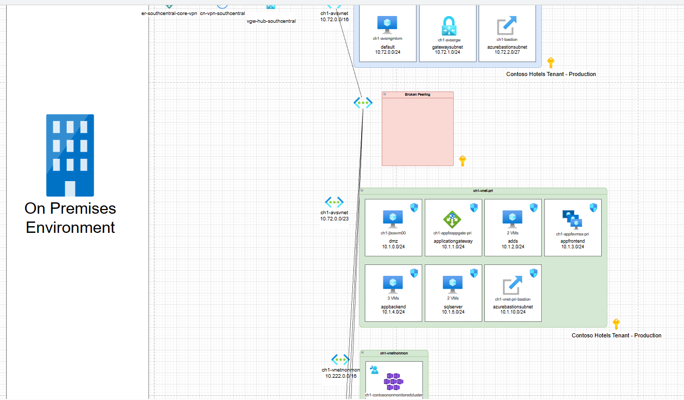
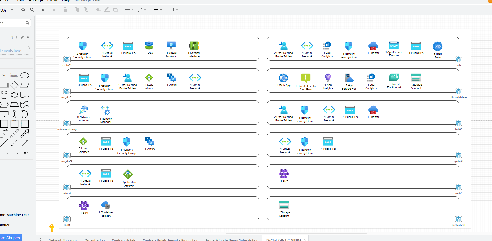
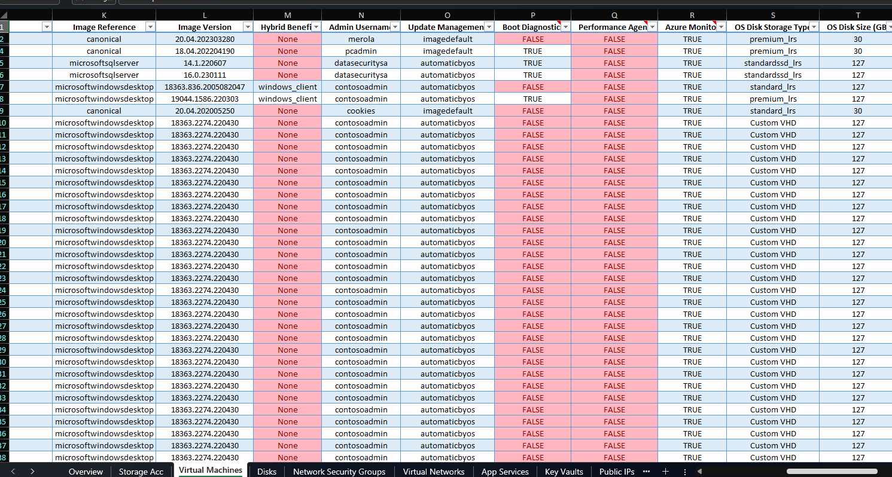

---
categories:
- analysis
- automation
- cloud
- Azure
comments: true
Params:
  ShowReadingTime: true
ShowToc: true
TocOpen: false
cover:
  image: "overview.png"
  relative: true
date: "2025-02-26T12:00:00Z"
description: >
  Dive into Azure Resource Inventory (ARI) - an in-depth, practical guide to auditing and optimizing your entire Azure footprint. Learn best practices, implementation tips, and how to leverage ARI for governance, cost control, and multi-subscription visibility.
tags:
- Azure
- Azure Resource Inventory
- ARI
- governance
- cost optimization
- compliance
- technical analysis
title: "Azure Resource Inventory (ARI): Your Comprehensive Guide to Efficient Cloud Management"
---

## Introduction: Why Azure Resource Inventory Matters

With Azure’s vast ecosystem of virtual machines, storage accounts, databases, networks, and countless other services, keeping track of all deployed resources can be challenging. Azure Resource Inventory (ARI) addresses this problem head-on, collecting details from multiple subscriptions and generating an Excel workbook that breaks down each resource type - complete with security recommendations, cost insights, and more. This single consolidated report is a game-changer for cloud administrators, helping them govern infrastructure, optimize costs, and streamline audits.

In this article, we’ll explore:

1. **Core Concepts & Key Tools** for creating an Azure Resource Inventory.  
2. **Step-by-Step Implementation** using ARI.  
3. **Best Practices & Real-World Use Cases** to maximize the benefits.  
4. **Hands-On Examples** using PowerShell, Azure CLI, and ARM templates for a more automated approach.  

Let’s dive in.

## Core Concepts: Understanding ARI and Its Toolkit

### What is ARI?

[Azure Resource Inventory (ARI)](https://github.com/microsoft/ARI) is a community-driven, open-source PowerShell script that queries Azure Resource Graph, Azure REST APIs, and Azure CLI to enumerate resources across your subscriptions. It gathers everything - VMs, storage accounts, virtual networks, SQL databases, security and advisor recommendations - and writes them into an Excel file (one sheet per resource type).

### Why Is It Important?

1. **Centralized Visibility**: Access a single Excel file containing your entire Azure footprint.  
2. **Cost Optimization**: Identify unused or oversized resources.  
3. **Security & Compliance**: Pull in Azure Advisor and Security Center (Microsoft Defender for Cloud) findings.  
4. **Governance**: Simplify audits by showing resource configurations, tags, and usage details in one place.  
5. **Automation Ready**: Run it on a schedule using service principals to maintain an up-to-date asset catalog.

### Tools & Services Involved

- **Azure Resource Graph**: Enables high-performance queries against large sets of resources.  
- **Azure CLI**: Used by ARI for certain advanced data collection steps.  
- **PowerShell**: ARI itself is a PowerShell script, requiring modules like **ImportExcel** for Excel report generation.  
- **Optional**: ARM Templates or Bicep can help you create consistent resources to inventory, while ARI “documents” what exists.



## How to Implement an Azure Resource Inventory (Step-by-Step)

Let’s focus on the **Azure Resource Inventory (ARI)** script approach. Below is a simple walkthrough from installation to generating your first inventory report.

### 1. Prerequisites

1. **PowerShell 5.x+ or PowerShell Core 7+**:  
   - On Windows, open an elevated PowerShell session.  
   - On Linux/macOS, install [PowerShell Core](https://learn.microsoft.com/powershell/scripting/install/installing-powershell?view=powershell-7.2).

2. **Azure CLI**:  
   - [Install the Azure CLI](https://learn.microsoft.com/cli/azure/install-azure-cli) for your OS.  
   - Add the required extensions (e.g., `account`, `resource-graph`):

     ```bash
     az extension add --name account
     az extension add --name resource-graph
     ```

3. **ImportExcel PowerShell Module** (for creating the XLSX report):  

   ```powershell
   Install-Module -Name ImportExcel -Scope CurrentUser
   ```

   You may need `-Force` or to run as Administrator.

4. **ARI Script**:  
   - Clone or download the ARI script from the [official GitHub repository](https://github.com/cloudeteer/ARI-azureinventory) (the repo name or location might vary).  
   - Ensure your PowerShell execution policy allows running local scripts:

     ```powershell
     Set-ExecutionPolicy RemoteSigned -Scope CurrentUser
     ```

     (Adjust scope/policy as appropriate.)

### 2. Running the Inventory

1. **Sign in to Azure** (if you haven’t already):

   ```powershell
   az login
   ```

   Or simply let ARI prompt you for interactive login when you run the script.

2. **Execute the ARI Script**:

   ```powershell
   cd path\to\script
   .\AzureResourceInventory.ps1 -TenantID "<YourTenantID>" -QuotaUsage -Diagram
   ```

   Common parameters include:
   - `-TenantID "<GUID>"`: Scans all subscriptions in that tenant.  
   - `-SubscriptionID "<GUID>"`: Scans a specific subscription only.  
   - `-QuotaUsage`: Pulls Azure quotas vs. usage.  
   - `-Diagram`: (Windows-only) Generates a Draw.io diagram of network topology.  
   - `-ReportName "MyInventory"`: Custom Excel report name.  
   - `-AppId` / `-Secret`: For service principal logins (great for automation).

3. **Monitor Progress**:  
   - ARI systematically queries resource providers and writes them to memory.  
   - Once complete, it exports the data to an Excel file (plus optional diagram file).

4. **Inspect the Output**:  
   - By default, you’ll see an Excel file named something like `AzureResourceInventory_Report_2025-02-26_15_30.xlsx` in a folder named `\AzureResourceInventory\`.  
   - Open the workbook: the first tab is typically a summary/dashboard, followed by multiple sheets (e.g., VirtualMachines, StorageAccounts, Advisor, SecurityCenter, etc.).



### Example: Getting a Single Subscription’s Inventory

```powershell
.\AzureResourceInventory.ps1 -SubscriptionID "12345678-abcd-1234-efgh-1234567890ab" -QuotaUsage
```

> **Result**: An Excel file listing all resources in the specified subscription, including quota usage details.



## Best Practices for Effective ARI Usage

1. **Automate on a Schedule**  
   - Use a service principal with Reader permissions across all subscriptions you care about.  
   - Deploy the ARI script in a pipeline (e.g., Azure DevOps, GitHub Actions) or a scheduled task to generate monthly or quarterly snapshots for governance.

2. **Focus on Tags & Governance**  
   - ARI helps you see which resources lack essential tags (like `Owner`, `CostCenter`, `Environment`).  
   - Filter the Excel sheets to identify tagging gaps and maintain consistent governance.

3. **Combine with Azure Policy**  
   - Use ARI to find misconfigurations, then enforce them with [Azure Policy](https://learn.microsoft.com/azure/governance/policy/overview).  
   - For instance, if the StorageAccount sheet shows some accounts with unencrypted status, create or assign a policy to enforce encryption for new and existing accounts.

4. **Cost-Saving Tips**  
   - Check the VirtualMachines sheet for stopped or underutilized VMs (cross-reference with Azure Advisor sheet).  
   - Identify unattached disks or orphaned IPs from the Storage/Network sheets.  
   - Evaluate high-level SKU usage (e.g., “Premium SSD”) that might be overkill for certain workloads.

5. **Look Into Quotas**  
   - If you include `-QuotaUsage`, watch for subscriptions nearing resource limits (CPU cores, IP addresses).  
   - Conversely, large differences between usage and quotas might indicate potential cost optimization or the need for right-sizing.

6. **Version & Archive Your Reports**  
   - Keep historical XLSX files for compliance or trending.  
   - Store them in a secure location (e.g., an Azure Storage account or SharePoint) and label them by date.

## Real-World Use Cases

1. **Audit & Compliance**: A finance sector client runs ARI monthly to ensure no resources reside outside approved regions. The automatically generated Excel serves as a compliance artifact, satisfying internal and external auditors.

2. **Cost Optimization**: A dev/test subscription had dozens of running VMs that developers forgot to shut down. ARI flagged them instantly, saving the company thousands of dollars monthly when they either downsized or removed the VMs.

3. **Security Posture Checks**: Security teams leverage the integrated Security Center sheet to spot misconfigured VMs lacking threat protection or Key Vaults missing purge protection. They feed these findings into a security backlog for immediate remediation.

4. **Multi-Subscription Oversight**: Enterprises with multiple business units each hold different subscriptions. A centralized IT governance team runs ARI across the entire tenant, obtaining a unified view in one workbook - crucial for consistent policies and cost allocation.

## Bonus: ARM Templates for Consistency + ARI for Documentation

While ARI focuses on discovering what you already have, combining it with **ARM/Bicep** templates helps ensure new deployments align with your standards. For example:

### Sample ARM Template (Storage Account)

```json
{
  "$schema": "https://schema.management.azure.com/schemas/2019-04-01/deploymentTemplate.json#",
  "contentVersion": "1.0.0.0",
  "parameters": {
    "storageAccountName": {
      "type": "string"
    }
  },
  "resources": [
    {
      "type": "Microsoft.Storage/storageAccounts",
      "apiVersion": "2022-09-01",
      "name": "[parameters('storageAccountName')]",
      "location": "[resourceGroup().location]",
      "sku": {
        "name": "Standard_LRS"
      },
      "kind": "StorageV2",
      "properties": {
        "supportsHttpsTrafficOnly": true
      }
    }
  ]
}
```

Deploy with Azure CLI:

```bash
az deployment group create \
  --resource-group MyResourceGroup \
  --template-file .\storageAccount.json \
  --parameters storageAccountName=mynewstorageacct
```

> **Then run ARI** to confirm the new storage account’s presence in your environment and verify its secure configuration (e.g., `supportsHttpsTrafficOnly` = `true`).

## Conclusion & Next Steps

**Azure Resource Inventory (ARI)** stands out as a must-have solution for anyone tasked with taming the complexity of a dynamic Azure environment. By automating the discovery and cataloging of resources into a user-friendly Excel file, ARI empowers you to:

- **Easily Identify** cost-saving opportunities.  
- **Enforce Security & Compliance** from a centralized overview.  
- **Maintain Consistent Governance** across subscriptions.  
- **Document & Audit** resources for management and stakeholders.

**Next Steps**:

1. **Try It**: Download ARI from GitHub, run it against your subscriptions, and see what you discover!  
2. **Automate**: Integrate ARI into your monthly governance cycles or CI/CD pipelines.  
3. **Extend**: Contribute to the ARI open-source community - add modules for services that aren’t covered yet, or refine the script to fit your organization.  
4. **Harden**: Combine ARI output with Azure Policy, RBAC, and other governance tools to strengthen your cloud posture.

Mastering ARI ultimately translates into smoother operations, lower costs, and heightened confidence in your Azure environment’s security and compliance. Give it a go, and prepare to impress your team with clarity and control over your cloud assets!

**References & Further Reading**  

- [Azure Resource Inventory GitHub](https://github.com/microsoft/ARI)  
- [Microsoft Docs: Azure Resource Graph Overview](https://learn.microsoft.com/azure/governance/resource-graph/overview)  
- [ImportExcel PowerShell Module](https://www.powershellgallery.com/packages/ImportExcel/)  
- [Azure CLI Installation Guide](https://learn.microsoft.com/cli/azure/install-azure-cli)  
- [Azure Policy Documentation](https://learn.microsoft.com/azure/governance/policy/overview)  

Feel free to explore these official Microsoft and community resources. They’ll help you customize, troubleshoot, and enhance your Azure Resource Inventory strategy for long-term success.
