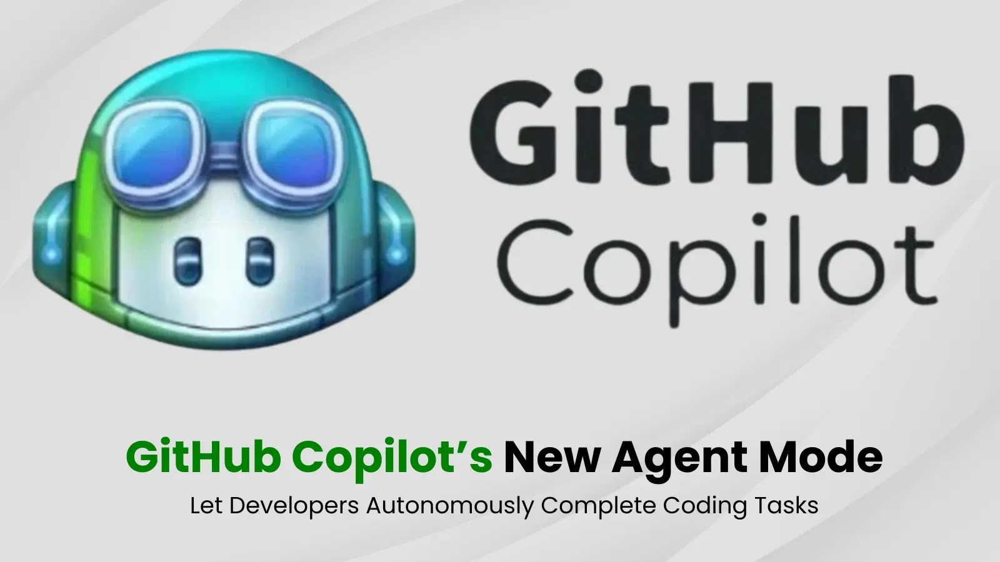
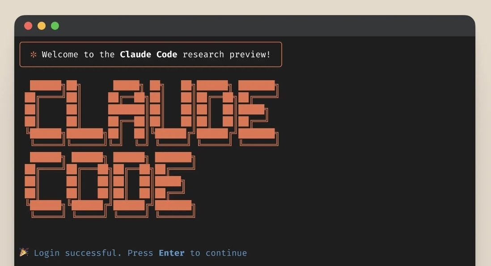

---
categories:
  - AI Coding Assistants
  - Software Development Tools
  - AI Agents
  - Code Generation
comments: true
date: "2025-03-12T10:00:00Z" 
description: >
  An in-depth comparison of Claude Code and GitHub Copilot Agent, two cutting-edge AI coding assistants. Explore their features, performance, pricing, and ecosystem integration to determine which tool best suits your development needs.
cover:
  image: "claude_copilot_comparison.png" 
  relative: true
ShowToc: true
TocOpen: false
ShowReadingTime: true
tags:
  - Claude Code
  - GitHub Copilot Agent
  - AI Pair Programmer
  - Code Completion
  - Autonomous Agents
  - Software Engineering
  - Developer Productivity
  - Anthropic
  - OpenAI
title: "Claude Code vs GitHub Copilot Agent: A Deep Dive Comparison of AI-Powered Coding Assistants"
---

The advent of AI coding assistants has marked a paradigm shift in modern software development, transforming the coding process from a purely manual endeavor to a collaborative effort between human ingenuity and artificial intelligence. Initially emerging as sophisticated autocomplete tools, these assistants have rapidly evolved into intelligent “pair programmers,” significantly enhancing developer productivity and workflow efficiency. GitHub Copilot, launched in 2021, spearheaded this revolution by seamlessly integrating AI directly into developers’ Integrated Development Environments (IDEs), providing context-aware code suggestions and completions. By 2023, Copilot had become an indispensable tool for many, reportedly generating an average of 46% of developers’ code in enabled files and contributing to productivity gains of up to 55%. Building upon this foundation, early 2025 witnessed the arrival of a new generation of agentic coding assistants, designed to offer even more autonomous and proactive support: Claude Code and GitHub Copilot Agent. GitHub Copilot’s “agent mode,” introduced as a preview in February 2025, expanded Copilot’s capabilities beyond reactive suggestions to encompass more proactive and multi-step coding assistance. Concurrently, on February 24, 2025, Anthropic unveiled Claude Code, a “supervised coding agent” engineered to actively participate in comprehensive software development workflows. These near-simultaneous launches signify a pivotal moment, ushering in an era where AI can autonomously manage multi-stage development tasks and deeply integrate with complex codebases.

Both Claude Code and Copilot Agent stand at the forefront of AI-assisted coding, yet they stem from distinct technological ecosystems. GitHub Copilot Agent, an integral component of GitHub’s Copilot suite, backed by the combined power of OpenAI and Microsoft, extends the familiar Copilot experience within popular IDEs like Visual Studio Code. Conversely, Claude Code, developed by Anthropic, an AI research company supported by Google and others, is presented as a standalone, open-source tool operating directly within the developer’s terminal. The significance of these advanced tools is profound: they promise to alleviate the burden of routine coding tasks, minimize context-switching, and even tackle intricate refactoring or code generation challenges with a degree of autonomy. As GitHub’s CEO aptly noted, development teams are poised to be “joined by teams of intelligent, increasingly advanced AI agents that act as peer-programmers for everyday tasks”. This article provides a comprehensive, in-depth comparison of Claude Code and Copilot Agent, meticulously examining their core functionalities, underlying AI models, performance benchmarks, practical use cases, and their evolving role in shaping both current and future software development paradigms. By dissecting their strengths, limitations, and unique approaches, we aim to provide developers and technology leaders with a clear understanding of these transformative tools and their potential to revolutionize software creation.

## Core Functionality and Interface Differences

A fundamental divergence between Claude Code and GitHub Copilot Agent lies in their user interface and operational environment. GitHub Copilot Agent is architected for deep integration within the Integrated Development Environment (IDE), specifically Visual Studio Code, while Claude Code adopts a terminal-centric approach, operating directly from the command line. This interface distinction profoundly influences how developers interact with each tool and the types of workflows they best support.

### GitHub Copilot Agent: IDE-Integrated Autonomous Assistance

GitHub Copilot Agent represents an evolution of the original Copilot's code suggestion capabilities, transforming it into what is described as an "autonomous peer programmer". Operating seamlessly within Visual Studio Code, Copilot Agent is invoked through natural language prompts entered in a chat panel or the "Copilot Edits" interface within the editor. This IDE integration is not merely superficial; it's deeply embedded, allowing Copilot Agent to leverage the full context of the development environment. Upon receiving a user command, such as "Create a REST API endpoint in Flask with unit tests," Copilot Agent initiates a multi-step process.  It begins by analyzing the current codebase, intelligently identifying relevant files and project structure to understand the existing context.  Subsequently, it autonomously proposes code edits directly within the editor window, often highlighting suggested changes inline with visual cues.  Crucially, Copilot Agent can also execute terminal commands, such as compiling code, running tests, or installing dependencies, all orchestrated from within the IDE.  This capability extends to monitoring the output of these commands, including compile and lint errors, and test results, allowing it to automatically react to issues and iteratively refine the code. This iterative loop of code generation, execution, and error correction continues until the agent deems the user's prompt fulfilled, or until it requires further user guidance.

The user interface within VS Code is designed to maintain developer oversight and control. Copilot Agent presents proposed code changes inline, often using green highlighting to denote additions, and provides interactive elements like "Keep" or "Undo" buttons for each suggested edit.  Furthermore, actions such as running tests or executing terminal commands are presented as prompts within the IDE, requiring explicit user approval before execution.  Figure 1 (as described in the prompt example) illustrates this interface, showcasing inline code additions and a prompt to run tests, emphasizing the agent's proactive nature while ensuring user confirmation at critical junctures. This tight IDE integration aims to create a fluid and uninterrupted development experience, where AI assistance is woven directly into the coding workflow.

### Claude Code: Terminal-Based Collaborative Coding

In contrast to Copilot Agent's IDE-centric approach, Claude Code operates through a terminal-based interface, invoked via the command-line using the `claude` command. This terminal-centric design positions Claude Code as a versatile and potentially more universally applicable coding assistant.  Developers interact with Claude Code through text-based chat within the terminal, issuing commands and receiving responses in a conversational manner.  To initiate assistance within a project, a developer points Claude Code to the project directory, enabling it to analyze the codebase and understand the project's context.  Claude Code then functions as an "active collaborator," capable of performing a wide array of coding tasks directly from the terminal.  These tasks include searching and reading code files, editing files in place, writing and executing tests, managing Git operations such as committing and pushing code, and utilizing various command-line tools.  A key feature of Claude Code is its proactive project understanding, exemplified by its initialization process which involves creating a `CLAUDE.md` file within the project repository. This file summarizes key project details, including technologies used, setup instructions, and other relevant context, aiding Claude Code in maintaining a holistic understanding of the codebase and optimizing token usage.  Claude Code also supports slash commands for controlling its behavior, such as `/init` for project indexing and `/bug` for issue reporting, and even offers a "bash mode" for direct shell command execution through the agent.

Interaction with Claude Code in the terminal emphasizes user oversight and step-by-step confirmation.  Before executing actions that modify code or run external commands, Claude Code typically presents a detailed plan or a diff of proposed changes in the terminal, explicitly requesting user confirmation before proceeding.  For instance, before running a command like `npm install`, Claude Code will prompt the user with "Is it okay to run `npm install`?", allowing for explicit approval or denial. Similarly, code edits are presented as diffs, file by file, requiring user confirmation before application. This granular approval process, coupled with the terminal-based interaction, provides a sense of transparency and control, which some users find reassuring compared to more opaque, fully automated agents.

## Comparative Analysis: IDE vs. Terminal and Workflow Implications

The interface dichotomy between Copilot Agent and Claude Code reflects distinct philosophies regarding developer interaction and workflow integration. Copilot Agent's IDE integration offers a seamless and visually rich experience within the coding environment. Its strength lies in its ability to augment the active coding process directly within the editor, facilitating rapid iteration, in-context assistance, and a streamlined workflow for tasks performed during development.  However, this tight coupling to VS Code (initially) and IDEs may limit its flexibility for developers who prefer other editors or need to work outside of a GUI-based IDE environment.

Claude Code's terminal-based approach, conversely, prioritizes flexibility and broad applicability. By operating from the command line, it transcends IDE boundaries, potentially integrating with any editor, development environment, or even remote server accessible via a terminal session. This approach is particularly advantageous for DevOps-oriented tasks, codebase-wide operations, and workflows that extend beyond the confines of a single IDE.  While lacking the visual richness and inline GUI elements of Copilot Agent, Claude Code's terminal interface offers a familiar and scriptable environment for developers comfortable with command-line tools.  The choice between these interfaces ultimately depends on a developer's preferred workflow, tool ecosystem, and the specific use cases they prioritize.  A developer deeply embedded in the VS Code ecosystem and focused on interactive, in-IDE coding tasks might find Copilot Agent's seamless integration more appealing.  Conversely, a developer who values platform independence, command-line proficiency, and needs an AI assistant capable of managing broader project workflows across diverse environments might gravitate towards Claude Code's terminal-based flexibility.  In practice, the optimal approach might even involve leveraging both tools synergistically, capitalizing on Copilot Agent's IDE prowess for focused coding tasks and Claude Code's terminal versatility for project-level operations and DevOps automation.

### Interface and Functionality at a Glance

| Feature                 | GitHub Copilot Agent               | Claude Code                      |
|--------------------------|------------------------------------|-----------------------------------|
| **Primary Interface**    | IDE (Visual Studio Code)           | Terminal / Command Line          |
| **Environment**          | VS Code and compatible IDEs       | Any terminal environment         |
| **Interaction Style**    | GUI-driven, Inline Prompts         | Command-line chat, Text-based    |
| **Workflow Focus**       | In-IDE coding, Iterative Dev      | Project-wide tasks, DevOps       |
| **User Control**         | Inline confirmations, GUI elements | Terminal prompts, Text confirmations|
| **Intended Use Cases**   | Rapid Prototyping, Refactoring, Debugging within IDE | Codebase Exploration, Refactoring, DevOps Automation |

## AI Models and Technical Foundations

The capabilities of Claude Code and GitHub Copilot Agent are fundamentally underpinned by the sophisticated large language models (LLMs) that power them. While both tools leverage the advancements in AI to assist with coding tasks, they differ in their choice of models and the technical architectures they employ to integrate these models into the development workflow.

### GitHub Copilot Agent: A Multi-Model Approach

GitHub Copilot Agent builds upon the foundation laid by earlier versions of Copilot, which initially relied primarily on OpenAI’s Codex and GPT series models. However, a significant evolution in Copilot's architecture is its embrace of a multi-model strategy. By 2025, GitHub Copilot has transitioned to support a diverse range of underlying AI models, moving beyond a single provider to offer developers greater choice and flexibility.  As of recent updates, Copilot users can select from a suite of cutting-edge models, including Anthropic’s Claude 3.7 Sonnet, Google’s Gemini 1.5 Pro, and OpenAI’s advanced models, often referenced internally with code names like “o1-preview” and “o1-mini”. This multi-model approach allows GitHub to leverage the unique strengths of different AI architectures and potentially optimize performance for various coding tasks or user preferences. For instance, a developer might choose to utilize Claude 3.7 Sonnet for tasks requiring strong reasoning and natural language understanding, while opting for an OpenAI model for tasks where code completion speed and familiarity with specific coding styles are paramount.

This model diversification is facilitated by GitHub’s underlying service architecture, which orchestrates communication between the IDE plugin (Copilot Agent within VS Code, for example) and these cloud-hosted models.  When a user initiates a request, Copilot Agent dynamically selects an appropriate model (based on user configuration or internal algorithms) and streams relevant code context from the editor to the chosen model.  This context, while subject to certain token limits, provides the AI with the necessary information to understand the user's intent and generate relevant code suggestions or actions.  To address the inherent latency in cloud-based model inference, GitHub has implemented technical optimizations such as “speculative decoding”. This technique essentially pre-computes and prefetches model suggestions, enabling faster delivery of code edits and a more responsive user experience within the IDE.  This intricate backend infrastructure is crucial for seamlessly integrating powerful LLMs into a real-time, interactive coding environment.

### Claude Code: Powered by Anthropic's Claude 3.7 Sonnet

In contrast to Copilot Agent’s multi-model approach, Claude Code is currently powered exclusively by Anthropic’s Claude 3.7 “Sonnet” model. Claude 3.7 Sonnet represents Anthropic’s latest generation of large language models, often considered to be on par with or even surpassing previous Claude iterations in coding-related capabilities.  This model is characterized by several notable technical features that are particularly relevant to its application in Claude Code:

* **Large Context Window:** Claude 3.7 boasts an exceptionally large context window, capable of processing up to 128,000 tokens in its extended mode. This extensive context capacity is a significant advantage for coding tasks, as it allows Claude Code to ingest and reason over substantial portions of a codebase, potentially including multiple files or even entire modules, within a single session. This broad contextual awareness enables more coherent and project-aware code generation and refactoring, reducing the need for manual file navigation and context switching.
* **Hybrid Reasoning Modes:** A distinctive technical innovation in Claude 3.7 is its ability to dynamically adjust its reasoning approach. It can operate in a “standard mode,” delivering rapid, responsive assistance akin to Claude 3.5 in performance. Alternatively, it can engage an “extended thinking” mode, allocating more computational resources to perform deeper reasoning and self-reflection before generating a response. This trade-off between speed and thoroughness is exposed to developers via the API, allowing for granular control over the model’s reasoning depth for specific queries. While Claude Code likely employs a balanced default setting, the option to invoke “extended thinking” could be particularly beneficial for complex refactoring or debugging tasks where meticulous analysis is paramount.
* **Constitutional AI and Tool Use:** Claude models are trained using Anthropic’s “Constitutional AI” techniques, emphasizing helpfulness, harmlessness, and adherence to ethical principles. This training methodology not only mitigates the generation of unsafe or biased code but also fosters a model that is adept at following instructions, providing clear explanations, and engaging in natural language interactions related to code. Claude Code leverages this to offer features beyond code generation, such as explaining complex code architectures or providing rationales for suggested changes in plain English.
* **Model Context Protocol (MCP) Support:**  A notable technical distinction of Claude Code is its support for the Model Context Protocol (MCP), an open standard designed to facilitate the integration of large language models with external data sources. MCP enables Claude Code to access and incorporate information from diverse sources, such as project documentation, databases, or knowledge repositories, in a structured and standardized manner. This modular design allows Claude Code to potentially leverage a broader range of contextual information beyond the immediate codebase, enhancing its ability to understand project-specific nuances and requirements.

### Comparative Analysis: Model Strengths and Technical Implications

The choice of underlying AI models and technical architectures significantly shapes the capabilities and characteristics of Claude Code and GitHub Copilot Agent. Copilot Agent’s multi-model approach offers adaptability and the potential to optimize performance by leveraging the strengths of different models for various tasks.  Its sophisticated infrastructure for context streaming and speculative decoding contributes to a responsive and seamless IDE integration. However, the complexity of managing multiple models and ensuring consistent performance across them presents its own set of technical challenges.

Claude Code’s reliance on Anthropic’s Claude 3.7 Sonnet provides a focused and technically advanced foundation. Claude 3.7’s exceptionally large context window offers a distinct advantage in handling large codebases and maintaining project-wide awareness. The hybrid reasoning modes provide a unique capability to balance speed and thoroughness, while Constitutional AI principles contribute to a model that is both helpful and ethically aligned.  Support for MCP further enhances Claude Code’s potential for integration with external knowledge sources, positioning it as a versatile tool capable of leveraging a broader ecosystem of information.

In terms of reasoning and autonomy, both tools embody the concept of AI agents capable of utilizing tools to accomplish coding tasks. Copilot Agent leverages tools within the IDE environment, such as the code editor, terminal, and test runners, to execute multi-step workflows. Claude Code orchestrates file operations and shell commands from the terminal, and can also integrate external tool outputs into its reasoning process.  While both systems are built upon cutting-edge LLMs with strong natural language understanding and code generation capabilities, Claude 3.7 Sonnet has demonstrated particularly strong performance in agentic coding benchmarks, suggesting a potential edge in tasks requiring autonomous navigation and modification of codebases. However, the continuous evolution of AI models and the rapid pace of innovation in this field mean that the performance landscape is constantly shifting.  The presence of Claude models within Copilot's model selection further blurs the lines, as users of Copilot Agent can also leverage Claude 3.5 (and potentially 3.7 in the future) within the Copilot interface.  Ultimately, the choice between these tools may hinge on factors beyond just the raw model capabilities, such as interface preference, ecosystem integration, and pricing models, which will be explored in subsequent sections.

## Pricing and Accessibility

Understanding the pricing models and accessibility of Claude Code and GitHub Copilot Agent is crucial for developers and organizations considering adopting these AI coding assistants.  The two tools diverge significantly in their commercial strategies, impacting cost predictability, scalability, and overall value proposition.

### GitHub Copilot Agent: Subscription-Based Model with Tiered Access

GitHub Copilot operates on a subscription-based model, offering various tiers designed to cater to different user needs and organizational scales. For individual developers, GitHub Copilot is available at a flat monthly fee of $10, or an annual subscription of $100, providing unlimited usage within supported editors. This subscription encompasses all Copilot features, including the advanced Copilot Agent mode, granting subscribers access to the full suite of AI-powered coding assistance capabilities.  GitHub also provides a free trial period, typically 60 days for Copilot, allowing new users to evaluate the tool's benefits before committing to a paid subscription.  Furthermore, GitHub extends free Copilot access to specific user groups, such as verified students and maintainers of popular open-source projects, promoting broader adoption within the developer community.

For organizations, GitHub offers Copilot for Business, priced at $19 per user per month. This business tier builds upon the individual subscription by adding enterprise-grade features, including centralized license management, organizational policy controls, and the option to leverage on-premises model hosting via Azure for enhanced data privacy and compliance.  A key characteristic of Copilot's pricing model is its "all-you-can-eat" approach to usage.  Subscribers pay a fixed monthly or annual fee, regardless of their intensity of usage. While implicit rate limits may be in place to safeguard backend infrastructure and ensure fair resource allocation, there are no direct per-token or per-use charges beyond the subscription fee.  This predictable cost structure simplifies budgeting and eliminates concerns about unexpected usage-based expenses, making Copilot financially accessible for both individual developers and organizations of various sizes.

From an accessibility standpoint, GitHub Copilot enjoys broad availability in most regions where GitHub services are accessible.  Users require a GitHub account and a stable internet connection to utilize Copilot, as it relies on cloud-based AI models.  The initial setup process is streamlined, typically involving installing a plugin or extension for the preferred IDE and authenticating with a GitHub account.  During the preview phase of Copilot Agent mode, access was initially limited to users of VS Code Insiders builds, but broader availability across supported IDEs is anticipated following general release, further enhancing accessibility for developers using different coding environments.

### Claude Code: Usage-Based Pricing with Pay-as-You-Go Flexibility

In contrast to GitHub Copilot's subscription model, Claude Code adopts a token-based, pay-as-you-go pricing structure.  The Claude Code command-line tool itself is open-source and freely available for download and use from platforms like GitHub.  However, accessing the AI-powered coding assistance functionalities necessitates utilizing an LLM API, which typically incurs usage-based charges.  Anthropic's Claude models are accessible through Anthropic's direct API, as well as via cloud platform partners such as Amazon Bedrock and Google Cloud Vertex AI.  Pricing for Anthropic's API (for previous Claude models like Claude 1 and 2) has been reported to be in the range of approximately $1.63 per million input tokens and $5.51 per million output tokens for Claude 2.  It's important to note that pricing for Claude 3.7 Sonnet, the model powering Claude Code, may differ, and specific pricing structures may apply when accessing Claude through platforms like Bedrock or Vertex.

The usage-based pricing model of Claude Code offers a degree of flexibility, as users are only charged for the actual tokens consumed during their interactions with the AI.  However, this model also introduces cost variability and potential for unpredictable expenses, particularly for users who engage in intensive or extensive coding sessions.  Industry reports and user feedback suggest that typical daily usage of Claude Code could range from $5 to $10 per developer.  This estimate implies a daily token consumption in the order of 1 to 2 million tokens in a typical workflow.  Extrapolating this to a monthly basis, heavy users of Claude Code could potentially incur costs significantly exceeding the fixed subscription fee of GitHub Copilot, potentially reaching $100 to $200 or more per developer per month.  Conversely, developers who utilize Claude Code more sparingly, or primarily for targeted tasks, may experience lower overall costs compared to a continuous Copilot subscription.

Accessibility to Claude's API has historically been more restricted compared to GitHub Copilot.  Initially, access to Anthropic's API was invite-only, gradually becoming more open over time.  While access has expanded, obtaining an API key from Anthropic or setting up access through platforms like AWS Bedrock or Google Cloud Vertex AI may still involve a more involved onboarding process compared to Copilot's straightforward plugin installation and subscription activation.  Currently, Anthropic does not offer a broad free tier for Claude's API comparable to Copilot's free access for students and open-source maintainers.  While limited free usage may be available through the Claude.ai chat interface, Claude Code specifically requires API access, necessitating a paid account or cloud platform integration.

### Comparative Analysis: Cost-Effectiveness and Accessibility Trade-offs

The pricing models of GitHub Copilot Agent and Claude Code present distinct trade-offs in terms of cost-effectiveness and accessibility.  To summarize these differences more clearly, the table below provides a comparative overview:

| Feature                 | GitHub Copilot Agent                                  | Claude Code                                         |
|-------------------------|-------------------------------------------------------|------------------------------------------------------|
| **Pricing Model**       | Subscription-based (monthly/annual flat fee)          | Usage-based (pay-as-you-go token consumption)         |
| **Cost Predictability** | High - fixed monthly/annual cost                       | Low - variable, depends on usage intensity            |
| **Cost for Heavy Use**  | Remains fixed at subscription price                    | Potentially high, can scale with token consumption     |
| **Cost for Light Use**  | Fixed subscription cost, may be less cost-effective     | Potentially low, pay only for what you use              |
| **Free Tier/Trial**     | Free trial available, free for students/OSS maintainers | No broad free tier for API, limited free chat interface |
| **Accessibility**       | Broad, easy setup via plugin/extension                | API access required, potentially more complex setup   |
| **Target User**         | Regular/heavy users, teams, organizations              | Occasional users, users valuing usage-based flexibility |

In terms of overall accessibility, GitHub Copilot currently offers a more streamlined and user-friendly onboarding experience, with broader geographical availability and straightforward subscription activation.  Claude Code, while open-source and freely available as a tool, requires obtaining and configuring API access to Claude models, which may involve a more complex setup process and potential geographical or platform limitations depending on the chosen API provider.  For individual developers on a budget and organizations prioritizing predictable costs and ease of deployment, GitHub Copilot's subscription model presents a compelling value proposition.  Claude Code's usage-based model may be more appealing to users who value flexibility, have infrequent usage patterns, or already have access to Claude APIs through existing cloud platform agreements.  Ultimately, the optimal choice depends on a careful assessment of individual or organizational usage patterns, budget considerations, and preferences for cost predictability versus usage-based flexibility.

## Real-World Performance and Capabilities

Moving beyond theoretical specifications, evaluating the real-world performance and capabilities of Claude Code and GitHub Copilot Agent necessitates examining user experiences, case studies, and available benchmark data. This section delves into practical insights gleaned from developer feedback and comparative analyses to provide a nuanced understanding of each tool's strengths, limitations, and overall effectiveness in assisting with software development tasks.

### Claude Code: User Experiences and Practical Insights

Early adopters of Claude Code frequently highlight its impressive autonomy and potential for significant productivity gains. The case study from Thoughtworks engineers, who tested Claude Code on their internal CodeConcise tool, provides a compelling example.  In implementing Python support for CodeConcise, a task typically estimated to require 2-4 weeks of effort from two developers and a subject matter expert, Claude Code remarkably completed the core implementation in approximately half a day.  The engineers reported being "pretty pleased with the results" and "mind blown" by the potential, noting that Claude Code "produced mind-blowing outcomes" for certain tasks. This success underscores Claude Code's ability to rapidly generate functional code and integrate it into existing systems, achieving substantial time savings.  However, the Thoughtworks team's experience also revealed inconsistencies in Claude Code's performance across different programming languages.  When attempting to implement JavaScript support for CodeConcise, using a similar approach, Claude Code "failed utterly" after three attempts, producing unusable code.  The team observed that Claude Code hallucinated libraries and made incorrect assumptions, leading them to conclude that the effectiveness of AI coding agents is significantly influenced by factors such as codebase structure, code documentation quality, and the specific programming language and its ecosystem.  They hypothesized that the Python success may be attributed to the availability of a standard Abstract Syntax Tree (AST) module, simplifying Claude Code's parsing and code generation tasks, while the JavaScript task, potentially requiring more creative problem-solving and reliance on external libraries, proved more challenging and prone to errors.

Beyond performance on specific tasks, user feedback also points to considerations regarding token usage and associated costs.  Some developers caution that utilizing Claude Code extensively can rapidly consume API tokens, potentially leading to unexpectedly high expenses.  Open-ended instructions on large repositories, in particular, can trigger Claude Code to process numerous files and generate verbose outputs, accumulating significant token consumption.  Therefore, users need to be mindful of token usage, potentially guiding Claude Code to focus on specific project sections or implementing token budgets to manage costs effectively.

On the positive side, users commend Claude Code's flexibility and integration capabilities.  Its terminal-based nature allows seamless integration into diverse development environments, as emphasized by an Anthropic team member on Hacker News, stating that "you can bring it into any IDE (or server) you want!".  Developers have successfully utilized Claude Code within VS Code's integrated terminal and even in alternative editors like NeoVim, effectively achieving a Copilot-like experience powered by Claude's backend.  This adaptability highlights Claude Code's platform independence and potential for integration across various development workflows.

Real-world usage has also revealed certain limitations of Claude Code in its initial release.  It lacks direct internet access or external information retrieval beyond the analyzed codebase, restricting its ability to fetch information from web sources or online documentation.  Similarly, it does not natively handle images or graphical user interfaces, focusing primarily on code-centric tasks within the local development environment.  While Claude Code can sustain long interaction sessions, very extended conversations may lead to performance degradation or some loss of contextual focus due to context window limitations, although its large 100K token context mitigates this issue to a greater extent than models with smaller context windows.

Despite these limitations, developers generally praise Claude Code's reasoning capabilities and its adherence to complex instructions.  It tends to maintain consistency with its outlined plans and can provide detailed explanations for its actions and code changes when requested.  The Thoughtworks team concluded that Claude Code functions akin to a "supercharged junior developer," capable of executing tasks rapidly but requiring oversight to ensure code correctness and consistency.  They emphasize the importance of critically evaluating AI-generated code, underscoring that verification and testing remain essential steps in the development process.

### GitHub Copilot Agent: User Experiences and Practical Insights

Initial user feedback on GitHub Copilot Agent, while still emerging due to its relatively recent release and preview status, has been overwhelmingly enthusiastic.  One developer's sentiment encapsulates the general impression: "it's absolutely incredible… mind-blowing", while acknowledging that "the technology isn’t perfect yet".  The widely cited example of Copilot Agent generating a fully functional web application from a single command, as reported by multiple users, vividly illustrates its potential to automate complex, multi-file project creation.  Users express astonishment at Copilot Agent's ability to translate high-level specifications into complete, runnable applications, significantly reducing boilerplate setup and accelerating prototyping.

However, user experiences also highlight areas for improvement and potential challenges.  Rate limiting has emerged as a notable constraint for power users.  Some developers reported encountering usage limits after a burst of approximately 20 automated edits or commands, experiencing temporary pauses of several hours due to rate throttling.  This suggests that during the preview phase, GitHub implemented usage quotas to manage server load and potentially control costs.  While these limits are expected to be adjusted as the service scales, they currently represent a practical constraint for users engaging in intensive agent-driven workflows.

Users also acknowledge that Copilot Agent, like any AI system, is not infallible and can occasionally make missteps or deviate from intended paths.  Instances of misinterpreting instructions or proposing unintended code changes have been reported, highlighting the importance of careful prompt engineering and user oversight.  The GitHub team explicitly acknowledges that Copilot Agent can "sometimes make mistakes and go off track" and has incorporated undo functionalities and transparency features into the UI to facilitate user intervention and course correction.  Therefore, real-world usage may involve an iterative process of guiding the agent, reviewing its actions, and occasionally reverting steps when necessary.  Early adopters emphasize the importance of crafting clear and specific prompts to effectively guide Copilot Agent and minimize unintended outcomes, suggesting a learning curve associated with optimal prompt engineering for agent-based coding assistance.

Despite these limitations, users generally report a high degree of reliability and output quality from Copilot Agent.  The integrated execution and testing capabilities contribute to a higher likelihood of generating functional code that meets basic validation criteria.  The example of the one-command FastAPI web application, which reportedly ran successfully on the first attempt, exemplifies this end-to-end success.  Copilot Agent's ability to proactively address errors and iterate towards a working solution enhances user confidence in the AI-generated code, shifting the perception from a mere code suggestion tool to a more proactive and validation-aware coding partner.

### Benchmark Performance: Qualitative and Quantitative Insights

Direct, head-to-head benchmark comparisons between Claude Code and Copilot Agent are currently limited, as both tools are relatively new and rapidly evolving.  However, we can draw insights from available benchmark data for their underlying models and extrapolate from early performance evaluations.

According to Anthropic's reported benchmarks, Claude 3.7 Sonnet, the model powering Claude Code, demonstrates a performance advantage in complex coding tasks that necessitate agent-like behavior.  In Anthropic's internal SWE-Bench (Software Engineering Bench) and TAU-Bench (Tool-Augmented Usage Bench) tests, which likely assess the agent's ability to navigate, modify, and execute code within a software engineering context, Claude 3.7 outperformed OpenAI's models and other competing models.  This suggests that Claude Code may currently possess an edge in scenarios requiring autonomous codebase traversal and multi-step code modifications.

On more traditional coding benchmarks, such as solving algorithmic programming problems, both Claude models and OpenAI's GPT-4 exhibit top-tier performance.  GPT-4 has been reported to achieve high success rates on benchmarks like HumanEval, solving around 80-90% of problems.  While publicly reported HumanEval scores for Claude 3.7 are not yet widely available, Claude 2 demonstrated a score of approximately 71%, and Claude 3.7 is expected to show further improvements.  In practical terms, both tools are capable of correctly solving a wide range of routine coding tasks, although specific edge cases or intricate algorithmic challenges may still pose difficulties.

In terms of speed and efficiency, Copilot Agent mode, due to its multi-step task execution and iterative approach, tends to be slower per task compared to the original Copilot's autocomplete functionality.  Microsoft's VS Code team acknowledges that "Copilot agent mode may send multiple requests per prompt, so it won’t be as fast as regular edits mode".  Users may observe a step-by-step output generation process spanning several seconds or minutes for complex agent tasks, contrasting with the near-instantaneous code completions of standard Copilot.  While Copilot Agent's agentic capabilities introduce some latency, the overall time savings for complex tasks are still substantial compared to manual execution.  Furthermore, the reported rate limits on Copilot Agent usage may impact throughput for users engaging in prolonged, agent-intensive coding sessions.

Claude Code's performance speed is contingent on the chosen API and model settings.  Claude 3.7 is optimized for relatively fast response times in its standard mode, comparable to GPT-3.5 speeds for many queries, while the "extended reasoning" mode introduces slower but more thorough processing.  As Claude Code operates on a pay-per-token basis, there are no inherent "rate limits after X actions" beyond the API provider's general rate limits. However, practical usage may be constrained by cost considerations, as extensive use can accumulate token consumption rapidly.  While Claude Code can stream code suggestions at a reasonable pace, complex operations like repository-wide refactoring may require significant processing time due to sequential file reading and modification.

Regarding multi-file and large project handling, both agents demonstrate capabilities in managing complex codebases.  Claude Code's larger context window (up to 100K tokens) potentially offers an advantage in maintaining a holistic understanding of very large projects, allowing it to process and reason over more extensive code segments in a single session.  Copilot Agent mitigates its models' smaller context windows through intelligent context retrieval, selectively fetching relevant code portions for each task.  Developer experiences suggest that Claude Code excels at maintaining a broad project structure awareness, making it well-suited for tasks like architecture summarization or sweeping codebase modifications.  Copilot Agent also demonstrates strong performance in multi-file edits and refactoring, explicitly designed for cross-file operations and validated through internal testing.  The example of Copilot Agent generating a multi-file Python web application from scratch showcases its ability to coordinate and integrate code across multiple files effectively.

Error handling and reliability are critical aspects of agentic coding tools.  GitHub Copilot Agent incorporates a built-in feedback loop, "monitoring terminal and test output and auto-correcting in a loop until the task is completed".  This iterative error correction mechanism significantly enhances its success rate in tasks involving code execution and validation.  Copilot Agent can detect compilation errors, test failures, and other runtime issues, automatically adjusting the code and re-executing tests until a successful outcome is achieved.  Claude Code, in its current version, runs tests and code when explicitly instructed but does not automatically initiate iterative test-and-fix loops.  The Thoughtworks experiment highlighted this limitation, noting that Claude Code produced code with library dependencies that did not exist and did not autonomously detect this error.  The authors observed that "the agent lacks a stronger verification mechanism for the code it produces… it misses the feedback that a simple unit test could provide".  This suggests that Copilot Agent currently has an advantage in scenarios requiring continuous self-correction and automated error resolution.  However, it's important to note that Copilot's self-correction is limited to observable errors (e.g., console output), while Claude Code can always be instructed to run tests and address failures, albeit requiring explicit user prompting for each iteration.

### Quantitative Summary of Performance Insights

| Performance Aspect        | GitHub Copilot Agent                                  | Claude Code                                         |
|---------------------------|-------------------------------------------------------|------------------------------------------------------|
| **Coding Accuracy**       | High, proven on coding challenges, strong error handling | High, excels in agentic benchmarks, large context advantage |
| **Speed**                 | Slower for agent tasks (multi-step), rate limits possible | Speed depends on model mode, can be fast but large tasks take time |
| **Efficiency (Cost)**     | Subscription-based, predictable cost                   | Usage-based, cost can vary, potentially higher for heavy use |
| **Multi-file Handling**   | Strong, designed for cross-file refactoring            | Strong, large context for project-wide understanding  |
| **Error Handling**        | Iterative self-correction via test feedback loop       | Requires explicit prompting for testing and error fixing |
| **Overall Robustness**    | Higher chance of working solution due to self-debugging | High potential, but may require more guidance for error correction |

### Comparative Analysis: Real-World Effectiveness

In summary, both Claude Code and GitHub Copilot Agent represent the leading edge of AI coding assistance in terms of real-world performance and capabilities.  While direct benchmark comparisons are still evolving, user experiences and early evaluations reveal distinct strengths and nuances.  Copilot Agent's iterative approach and integrated error handling contribute to a higher likelihood of delivering functional solutions with minimal manual intervention, particularly for tasks within the IDE context.  Claude Code, leveraging the raw power of Claude 3.7 and its large context window, demonstrates exceptional potential for tackling complex, project-wide tasks and maintaining a holistic understanding of large codebases.  However, it may require more explicit user guidance and verification to ensure code correctness and error resolution, especially in scenarios where automated self-correction is critical.  The choice between these tools in practice will likely depend on the specific development workflows, project characteristics, and developer preferences, with Copilot Agent currently offering a more streamlined and robust experience for interactive, IDE-centric tasks, and Claude Code showcasing exceptional potential for project-level operations and tasks demanding broad contextual awareness.  The rapidly evolving nature of AI models and agentic capabilities suggests that the performance landscape will continue to shift, with both Anthropic and GitHub continuously refining their offerings and pushing the boundaries of AI-assisted software development.

## Integration and Ecosystem Considerations

The seamless integration of AI coding assistants into existing development ecosystems and workflows is paramount for their widespread adoption and practical utility. Claude Code and GitHub Copilot Agent, while both aiming to enhance developer productivity, adopt distinct approaches to integration, reflecting their underlying philosophies and target user bases. This section examines the integration characteristics of each tool, considering their ecosystem compatibility, interoperability, and implications for team collaboration and organizational adoption.

### GitHub Copilot Agent Integration: Deeply Embedded in the GitHub Ecosystem

GitHub Copilot Agent is designed as a natural extension of the broader GitHub ecosystem, leveraging its deep integration with IDEs, platforms, and developer workflows already centered around GitHub services.

* **IDE Support and Integration:** Copilot, in its base version, boasts extensive IDE support, encompassing popular editors such as VS Code, Visual Studio, JetBrains IDEs (IntelliJ, PyCharm, etc.), Neovim, and more. Copilot Agent mode, while initially launched as a preview within VS Code Insiders, is strategically positioned to extend its agentic capabilities to all IDEs supported by the core Copilot functionality. This broad IDE compatibility ensures accessibility for developers working across diverse coding environments, with VS Code currently serving as the primary and most deeply integrated platform for Copilot Agent. The tight integration with VS Code allows Copilot Agent to leverage VS Code's internal APIs for workspace analysis, task execution, and UI rendering, enabling a seamless and context-aware user experience.

* **GitHub Platform Synergy:** Copilot's inherent connection to GitHub accounts and services provides a natural synergy within the GitHub platform ecosystem. Copilot Agent, while currently focused on local editor-based operations, is poised for deeper integration with GitHub features in the future. Potential integrations include automated pull request generation for agent-driven code changes, seamless integration with GitHub Actions for CI/CD workflows, and enhanced collaboration features leveraging GitHub's code hosting and collaboration infrastructure. GitHub's existing features like Copilot for Pull Requests, which provides AI-powered suggestions for pull request descriptions and code reviews, foreshadow the direction of deeper ecosystem integration. GitHub's mention of "Copilot’s new autonomous agent, codenamed Project Padawan" further suggests a trajectory towards more repository-level autonomous capabilities, potentially extending beyond the confines of the local editor.

* **Microsoft Ecosystem Alignment:** As a Microsoft-backed product, GitHub Copilot Agent naturally aligns with the broader Microsoft development ecosystem. Its deep integration with VS Code, a Microsoft-owned IDE, and potential synergies with Azure DevOps and GitHub Enterprise, position it as a cohesive solution for organizations heavily invested in Microsoft technologies. For enterprises utilizing GitHub Enterprise Server, Copilot can be deployed behind firewalls with options for self-hosted model deployments, catering to organizations with stringent security and compliance requirements. GitHub's support for self-hosted model options, including Anthropic models via AWS, demonstrates a degree of flexibility within the Microsoft ecosystem, accommodating diverse cloud and on-premises infrastructure preferences.

* **Interoperability within the Ecosystem:** Within the Microsoft/GitHub ecosystem, Copilot Agent is expected to interoperate seamlessly with other related services and tools. Integration with Azure DevOps for project management and CI/CD pipelines, and GitHub Enterprise for organizational code management and collaboration, are anticipated future developments. GitHub's commitment to "developer choice" suggests a potential for broader interoperability with third-party tools and services over time, although the primary focus remains on deepening integration within the core GitHub ecosystem.

### Claude Code Integration: Openness and Platform Agnosticism

Claude Code adopts a fundamentally different integration philosophy, prioritizing openness, platform agnosticism, and flexibility in deployment and customization.

* **CLI and Toolchain Integration:** Claude Code's terminal-based nature inherently promotes broad integration with diverse development toolchains and environments. As a command-line tool, it can be invoked from any terminal environment, enabling integration with various IDEs, text editors, build scripts, and automation workflows. Developers have demonstrated the ability to run Claude Code within the terminal panes of IDEs like VS Code and even integrate it with alternative editors like NeoVim, effectively bringing Claude's AI capabilities into their preferred coding environments. This CLI-centric approach facilitates integration into build automation scripts, CI/CD pipelines, and remote server environments accessible via SSH, extending its utility beyond interactive IDE-based coding tasks.

* **API-Centric and Cloud Service Agnostic:** Claude Code's reliance on API access to LLM services, particularly Anthropic's Claude API and its availability through cloud platforms like AWS Bedrock and Google Cloud Vertex AI, fosters a degree of cloud service agnosticism. Organizations can choose to access Claude models through Anthropic's direct API or leverage their existing cloud platform relationships with AWS or Google Cloud, aligning Claude Code integration with their preferred cloud infrastructure and vendor relationships. This multi-provider support enhances integration flexibility, allowing organizations to leverage Claude Code within AWS-centric, GCP-centric, or multi-cloud environments. Furthermore, the open-source nature of the Claude Code CLI tool enables customization and extension. Organizations can potentially fork and modify the tool to add custom commands, integrate with internal systems, or tailor its behavior to specific organizational needs.

* **Git-Centric Workflow Integration:** Claude Code is explicitly designed to integrate seamlessly with Git-based development workflows. Its command set includes functionalities for managing Git operations, such as committing changes, creating branches, and potentially facilitating pull request creation. This Git-aware design enables Claude Code to participate directly in version control workflows, automating routine Git tasks and streamlining code management processes. In theory, Claude Code could be integrated into CI pipelines, functioning as an automated code quality bot that analyzes pull requests, suggests code improvements, or even automatically fixes certain types of issues, subject to human review and approval.

* **Ecosystem of Open AI Dev Tools:** Claude Code aligns with a growing ecosystem of open and interoperable AI development tools, often adhering to common standards and protocols like the Model Context Protocol (MCP). MCP, in particular, promotes interoperability by standardizing the way AI agents access and utilize external data sources. This ecosystem alignment suggests that Claude Code may potentially interoperate with other MCP-compliant tools and knowledge sources, fostering a more modular and extensible AI-assisted development landscape.

* **Privacy and Data Control:** Claude Code's architecture emphasizes data privacy and security by directly connecting to Anthropic's API without intermediary servers handling code, as highlighted in Anthropic's documentation. This direct API connection minimizes the attack surface and provides organizations with greater control over their code and data flow. Organizations concerned about data privacy and code security may find Claude Code's architecture more appealing, as code is transmitted directly to the chosen LLM provider (Anthropic, AWS, or GCP) without passing through additional intermediary services. Anthropic also explicitly states that Claude Code conversations are not used for model training, aligning with enterprise data privacy expectations. The self-hosted nature of the Claude Code agent (the CLI tool runs on the developer's machine) further enhances control over execution environment and data access, allowing for deployment in isolated or sensitive project environments.

### Comparative Analysis: Ecosystem Fit and Integration Strategies

The integration strategies of GitHub Copilot Agent and Claude Code reflect their distinct target audiences and development philosophies. GitHub Copilot Agent prioritizes seamless, deeply integrated experiences within established IDEs and the GitHub platform, catering to developers and organizations already invested in the Microsoft/GitHub ecosystem. Its strengths lie in its ease of adoption, streamlined workflow within VS Code, and potential for tight integration with GitHub services and enterprise features. However, its ecosystem focus may limit its flexibility for organizations utilizing diverse toolchains or preferring platform-agnostic solutions.

Claude Code, conversely, champions openness, platform independence, and interoperability. Its terminal-based nature and API-centric architecture enable integration across diverse IDEs, development environments, and cloud platforms. Its strengths lie in its flexibility, customizability, and potential for integration into broader DevOps workflows and open AI tool ecosystems. Organizations valuing platform choice, customization, and data privacy may find Claude Code's open and adaptable approach more compelling.

For organizations deeply entrenched in the Microsoft/GitHub ecosystem and prioritizing ease of use and seamless IDE integration, GitHub Copilot Agent offers a compelling and readily adoptable solution. For organizations seeking a more flexible, platform-agnostic, and customizable AI coding assistant, particularly those with diverse toolchains or specific data privacy requirements, Claude Code presents a powerful and versatile alternative. In practice, some organizations may even choose to strategically deploy both tools, leveraging Copilot Agent for IDE-centric development tasks and Claude Code for broader project-level operations and DevOps automation, capitalizing on the unique strengths of each within a complementary AI-assisted development strategy.

## Emerging Trends and Future Directions

The field of AI coding assistants is in a state of rapid flux, with Claude Code and GitHub Copilot Agent representing just the initial wave of a transformative shift in software development. Looking ahead, several key trends and future directions are poised to shape the evolution of these tools and their impact on the industry.

### Enhanced Autonomy and Proactive Assistance

Both Anthropic and GitHub are expected to progressively enhance the autonomy of their coding agents, moving beyond reactive assistance towards more proactive and self-directed capabilities. GitHub's "Project Padawan" alludes to future Copilot agents capable of handling entire feature implementations or complex bug fixes with minimal user intervention. Similarly, Claude Code's trajectory suggests a potential evolution towards less supervised operation for routine tasks, potentially proactively monitoring repositories for issues and suggesting preemptive fixes or improvements. However, this increased autonomy will likely be coupled with robust guardrails, including mandatory user approvals for critical actions, organizational policy controls, and comprehensive monitoring of AI agent activities to ensure safety, compliance, and alignment with development best practices. The integration of automated verification mechanisms, such as continuous testing of AI-generated code, will be crucial for enhancing the reliability and trustworthiness of these increasingly autonomous agents.

### Advancements in AI Models and Specialization

The underlying AI models powering coding assistants are undergoing continuous and rapid advancements. OpenAI, Anthropic, Google, and other AI research organizations are actively developing next-generation models with enhanced coding proficiencies, larger context windows, and improved reasoning capabilities. We can anticipate the emergence of more specialized AI models tailored for specific coding tasks, such as code generation, code analysis, refactoring, or security vulnerability detection. Future coding agents may leverage ensembles of specialized models, dynamically selecting the most appropriate model for each sub-task within a complex workflow. Techniques like "committee of models" and "reflexion," where multiple models critique and refine each other's outputs, may further enhance the quality and reliability of AI-generated code.

### Deeper IDE and Tooling Integration

GitHub Copilot Agent is expected to deepen its integration within IDE workflows, extending its reach into version control systems, issue trackers, and other development tools. We may see Copilot Agent functionalities for automated pull request creation, seamless integration with issue tracking systems (e.g., "Fix the bug referenced in JIRA-123"), and tighter integration with CI/CD pipelines. For Claude Code, future integration may involve the development of official IDE plugins, enabling tighter integration beyond terminal-based interactions. Both tools may increasingly leverage code databases, knowledge repositories, and online resources like Stack Overflow to augment their contextual awareness and provide more informed and comprehensive coding assistance, while carefully addressing potential copyright and licensing implications.

### Collaborative AI Pair Programming

A compelling future direction lies in leveraging AI agents to facilitate collaborative development workflows. Imagine scenarios where multiple developers can "pair program" with the same AI agent in a shared coding session, with the AI mediating interactions, providing context-aware assistance to all participants, and potentially synchronizing context across collaborators. Real-time collaborative coding platforms like VS Code Live Share could be enhanced with integrated AI agents, enabling distributed teams to leverage AI-powered assistance in a synchronized and collaborative manner. Furthermore, AI agents could learn project-specific conventions, coding styles, and architectural patterns from team interactions, proactively enforcing consistency and promoting best practices across collaborative projects.

### AI-Powered Code Review and Quality Assurance

AI coding assistants are poised to play an increasingly significant role in code review and quality assurance processes. GitHub has already introduced Copilot features for suggesting "next steps" in pull requests, such as automatically recommending tests or proposing code fixes based on review comments. This trend is expected to evolve towards more proactive AI-driven code review, with agents automatically analyzing every commit for potential issues, style violations, security vulnerabilities, and logical errors, providing automated feedback and improvement suggestions before human review. Claude Code, operating as an automated bot, could be triggered by new pull requests to perform comprehensive code analysis and provide detailed review comments, effectively functioning as an additional reviewer on development teams. AI-powered code review can significantly enhance code quality, accelerate the review process, and proactively identify potential issues early in the development lifecycle. Microsoft's emphasis on DevSecOps with AI indicates a future where AI agents will play a crucial role in security scanning, dependency management, and automated vulnerability remediation.

### Wider Industry Adoption and Competitive Landscape

The success of GitHub Copilot and Claude Code is catalyzing broader industry investment in AI coding tools, leading to a more competitive and diverse landscape. Amazon CodeWhisperer, Tabnine, Replit Ghostwriter, Google's Codey models, and numerous other AI-powered coding assistants are emerging, offering developers a wider range of choices and functionalities. Google's Gemini models, in particular, integrated into platforms like Google Colab and Cloud Code, are poised to become significant competitors. GitHub's embrace of Gemini models within Copilot signals a potential future where coding agents may dynamically select from a portfolio of models based on task requirements and performance characteristics. The proliferation of AI coding assistants may drive the emergence of industry standards and interoperability protocols, such as the Model Context Protocol (MCP), promoting a more open and interconnected AI-assisted development ecosystem. Developers may increasingly demand interoperability across different AI agents and development platforms, fostering a market driven by user choice and seamless integration.

### Personalization and Adaptive Learning

Future AI coding assistants are expected to become increasingly personalized and adaptive, learning from individual developer styles, project-specific codebases, and past interactions to provide more tailored and effective assistance. AI agents may build persistent knowledge bases of projects, storing code embeddings and leveraging vector databases to enhance contextual understanding and improve code generation accuracy over time. Adaptive learning capabilities may enable AI agents to tailor their assistance style to individual developer preferences, offering varying levels of detail in explanations, code suggestions, and interaction styles. Personalization could become a key differentiator, with AI agents evolving into highly customized and deeply integrated extensions of individual developer workflows.

### Addressing Complex Decision-Making and Long-Term Planning

While current AI coding assistants excel at tactical code generation and task automation, they remain limited in strategic decision-making and long-term project planning. Future advancements may extend AI capabilities to higher-level software architecture design, system decomposition, and requirements elicitation. AI agents may assist in designing complex systems from scratch, proposing architectural patterns, evaluating design trade-offs, and even generating initial system architectures based on high-level specifications. This evolution could blur the lines between traditional developer roles and AI assistance, with AI agents potentially contributing to tasks currently performed by system architects and technical leads.

### Multimodal Inputs and Outputs

The integration of multimodal AI models, such as Google's Gemini and OpenAI's GPT-4 with vision capabilities, may revolutionize the way developers interact with coding assistants. Future agents may accept multimodal inputs, such as UML diagrams, architecture sketches, or even voice commands, and generate corresponding code or visual outputs. Imagine scenarios where developers can input a UI mockup image and have the AI agent generate the corresponding UI code, or dictate code modifications via voice commands. Multimodal capabilities could broaden the scope of AI coding assistance beyond code generation to encompass a wider range of software development artifacts and interaction modalities.

### Evolution of Developer Roles and Practices

The increasing prevalence of AI coding assistants will inevitably reshape developer roles and development practices. Developers may transition from being primarily code writers to becoming "AI coaches" or "AI editors," guiding and refining the outputs of AI agents, focusing on higher-level problem-solving, system design, and creative innovation. New development methodologies and best practices may emerge, centered around effective collaboration between human developers and AI agents, optimized workflows for AI-assisted code review, and strategies for managing the division of labor between human and artificial intelligence. Prompt engineering for coding tasks may evolve into a critical skill, with organizations developing internal knowledge bases of effective AI prompts and best practices for leveraging AI coding assistance.

### Open Source and Democratization of AI Coding Tools

While current leading AI models are largely proprietary, the open-source AI landscape is rapidly evolving. Open-source models like Meta's Code Llama are demonstrating increasing code generation capabilities, potentially closing the performance gap with proprietary models over time. The rise of open-source AI models could democratize access to advanced AI coding assistance, reducing reliance on commercial APIs and subscription services. Tools like Claude Code, with their open-source nature, could facilitate the integration of these local, open-source models, enabling developers to leverage AI coding assistance in offline environments or with greater control over data privacy and model customization.

## Future Trajectories for Claude Code and GitHub Copilot Agent

Looking specifically at Claude Code and GitHub Copilot Agent, we can anticipate distinct but potentially converging future trajectories. Anthropic may further integrate Claude Code with its Claude chat interface, creating a unified platform for conversational AI and coding assistance. Enhanced versions of Claude models, specialized for coding tasks (e.g., Claude 4), are likely to emerge, further boosting Claude Code's capabilities. GitHub will likely continue to deepen Copilot's integration across the entire developer lifecycle, extending its reach beyond code writing to encompass project planning, testing, deployment, and continuous feedback loops. GitHub's vision of AI agent teams collaborating with human teams suggests a future where specialized AI agents, each focused on specific development tasks (e.g., testing, coding, deployment), will work in concert with human developers, creating a more collaborative and efficient software development ecosystem.

> In conclusion, the future of AI coding assistants is brimming with potential, promising to fundamentally transform software development practices and developer roles. Claude Code and GitHub Copilot Agent are at the vanguard of this revolution, driving innovation and shaping the trajectory of AI-assisted coding. As these tools continue to evolve, developers who embrace and adapt to working alongside AI agents will be best positioned to leverage their transformative power, unlocking unprecedented levels of productivity, creativity, and efficiency in software creation.

## Conclusion

In the burgeoning landscape of AI-assisted software development, Claude Code and GitHub Copilot Agent stand out as two pioneering implementations of AI pair programmers, each embodying a distinct approach and set of strengths. Claude Code emerges as an open, highly autonomous assistant, deeply rooted in the terminal environment, capable of engaging with the entirety of a codebase and the broader development workflow. Leveraging Anthropic’s advanced Claude models, renowned for their extensive context windows and robust reasoning capabilities, Claude Code transcends mere code generation, empowering developers to read, modify, test, and even commit code changes across entire projects. Its design philosophy excels in scenarios demanding comprehensive codebase understanding, intricate multi-file coordination, and seamless integration with DevOps toolchains, effectively functioning as a versatile junior engineer capable of handling a wide range of repository-level tasks. Conversely, GitHub Copilot Agent presents itself as a deeply integrated IDE assistant, building upon the familiar paradigm of Copilot’s in-editor suggestions. It extends the concept of AI-powered assistance to encompass multi-step task execution directly within the developer’s editing environment, intelligently planning and executing code modifications while maintaining developer oversight at each step. Copilot Agent truly shines in interactive development workflows: facilitating rapid prototyping, iterative debugging, and on-the-fly refactoring, all seamlessly integrated within the active coding process within an IDE.

In dissecting their core functionalities, Claude Code’s terminal interface prioritizes maximal flexibility, enabling compatibility with virtually any IDE and supporting direct shell commands and Git operations. This versatility comes with the trade-off of a purely text-based user experience, requiring developers to meticulously review diffs and console outputs. Copilot Agent, in contrast, offers a more visually rich and user-friendly interface, particularly for developers working within VS Code, featuring inline diff highlighting and interactive command prompts. However, its current iteration does not yet encompass certain workflow tasks, such as automated commit pushing. While both tools draw upon advanced AI models, their underlying architectures differ. GitHub Copilot leverages a multi-model approach, tapping into the strengths of OpenAI, Anthropic, and Google models, ensuring top-tier code generation capabilities. Claude Code, in its current form, is exclusively powered by Anthropic’s state-of-the-art Claude 3.7 model, specifically fine-tuned for coding tasks. A key differentiator lies in context handling: Claude’s exceptionally large context window (up to 100K tokens) provides a significant advantage in comprehending and reasoning over entire codebases, a capability that Copilot’s models, with their comparatively smaller context windows, cannot directly match. However, Copilot Agent mitigates this limitation through intelligent context selection and iterative processing, further enhanced by model optimizations like speculative decoding that contribute to its responsiveness within the IDE.

Performance evaluations reveal impressive capabilities in both tools. Copilot Agent demonstrates the ability to generate functional multi-component applications and deliver bug fixes that pass tests on the first attempt, showcasing its robustness and practical utility. Claude Code, when operating within its optimal domain, can achieve remarkable productivity gains, as evidenced by the Thoughtworks case study where weeks of work were condensed into hours. However, both tools exhibit limitations and inconsistencies. Claude Code has shown variability in performance across different languages and tasks, sometimes requiring human intervention for error correction. Copilot Agent, while generally robust, may occasionally require user guidance when prompts are ambiguous or when the agent’s planned actions deviate from the intended course. User experiences highlight Claude Code’s autonomy and control, albeit with a need for vigilant token usage monitoring and output verification. Copilot Agent users appreciate its seamless integration and workflow efficiency, even if occasional rate limits or imperfect suggestions are encountered.

From an integration and workflow perspective, the optimal choice often hinges on a developer’s preferred environment and specific needs. For developers deeply invested in the VS Code and GitHub ecosystem, Copilot Agent presents a seamless and highly effective enhancement, streamlining development workflows and offering predictable, subscription-based pricing. Conversely, Claude Code appeals to developers who prioritize an open toolchain, require platform independence across diverse environments (local IDEs, remote servers, cloud VMs), or seek greater customization and extensibility. Its usage-based cost model offers flexibility, potentially advantageous for sporadic usage or burst-oriented workflows, but may become less cost-effective for heavy, continuous use due to accumulated API charges.

Based on these considerations, practical recommendations for tool selection can be drawn:

* **For solo developers or small teams seeking straightforward productivity gains and seamless IDE integration:** GitHub Copilot (with agent mode) emerges as a compelling choice. Its ease of use, broad language and editor support, and proven track record of accelerating coding tasks make it an accessible and highly effective all-in-one assistant.
* **For teams working on large, complex codebases or DevOps-intensive workflows:** Claude Code offers a potentially superior fit. Its ability to navigate and modify entire repositories, manage cross-cutting concerns, and integrate with DevOps tooling in a cohesive manner can yield substantial time savings in maintenance and coordination tasks.
* **For developers prioritizing data privacy or requiring self-hosted solutions:** Claude Code’s architecture, with its direct API connection and open-source nature, provides greater control and flexibility, potentially enabling deployment in isolated environments and alignment with stringent data privacy requirements.
* **For educational purposes and learning:** Both tools offer valuable learning opportunities. Copilot Agent’s integrated guidance and error correction can be particularly beneficial for novice developers, while Claude Code’s detailed explanations and reasoning capabilities can enhance understanding of complex code architectures.

Ultimately, the most effective approach may involve a complementary utilization of both tools, leveraging Copilot Agent for day-to-day interactive coding tasks within the IDE and strategically employing Claude Code for large-scale refactoring, codebase analysis, or DevOps automation.

The advent of AI-assisted coding is undeniably transforming software development. Early adoption data reveals significant productivity gains, with millions of developers already leveraging tools like Copilot to generate a substantial portion of their code. Claude Code and Copilot Agent represent a significant leap forward, extending AI assistance beyond code completion to encompass broader software development workflows. Developers who proactively embrace these tools, while maintaining critical oversight and validation, stand to gain a competitive edge, accelerating iteration cycles and focusing their human ingenuity on higher-level problem-solving and creative innovation. As AI coding assistants continue to mature, the distinctions between tools like Claude Code and Copilot Agent are likely to blur, with capabilities converging and expanding, ushering in a future where software creation becomes less about manual keystrokes and more about orchestrating and collaborating with intelligent AI agents. The recommendation, therefore, is to strategically leverage these tools based on specific needs, experiment with their evolving features, and adapt development practices to effectively harness the transformative power of AI in the coding era.
