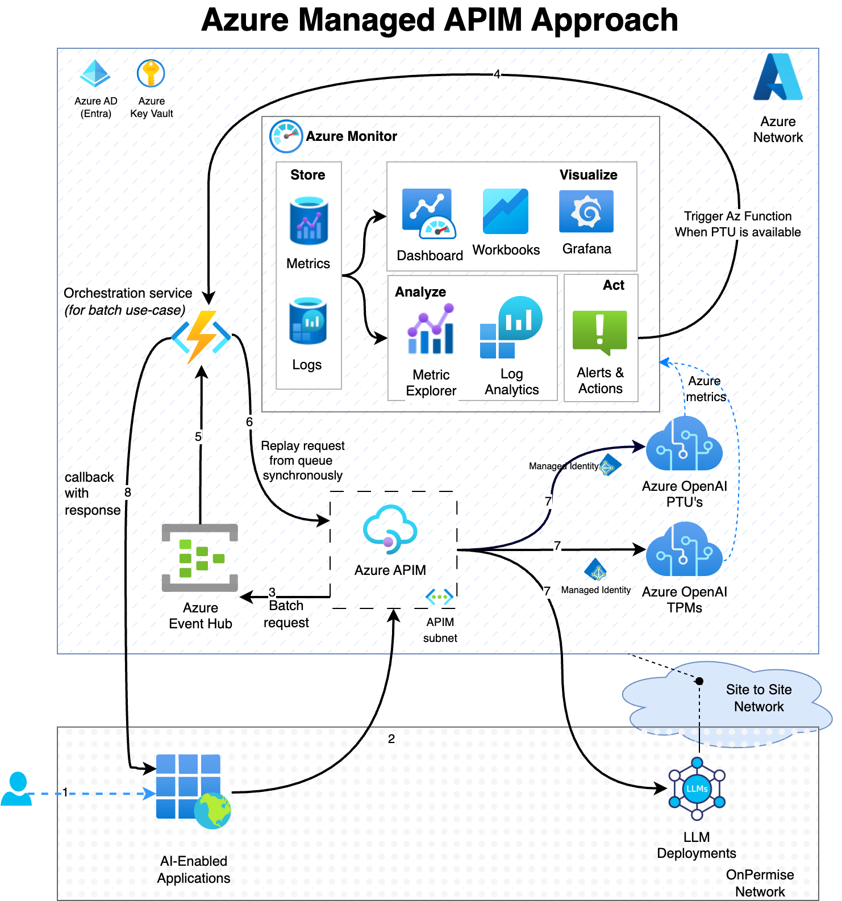

---
categories:
  - Cloud Computing
  - Azure
  - API Management
  - AI Platform
  - Generative AI
comments: true
date: "2025-04-03T11:00:00Z" 
description: >
  A  technical and strategic analysis of Azure's AI Gateway capabilities within Azure API Management (APIM). Explores architecture, specialized policies (token limits, semantic caching), deployment via IaC, security best practices, FinOps for cost control, monitoring, and tiered governance for enterprise AI workloads using Azure OpenAI.
cover:
  image: "ai-gateway.gif" 
  relative: true
ShowToc: true
TocOpen: false
ShowReadingTime: true
tags:
  - Azure
  - API Management
  - APIM
  - Azure OpenAI
  - AI Gateway
  - Generative AI
  - LLM Ops
  - FinOps
  - Cloud Architecture
  - Security
  - Governance
title: "Mastering Enterprise AI: A Deep Dive into Azure AI Gateway"
---

Generative AI is revolutionizing business, offering incredible potential. Yet, for many enterprises, adopting powerful models like those in Azure OpenAI feels like navigating the Wild West. How do you unleash innovation without facing runaway costs, complex security threats, inconsistent usage, and the immense challenge of governing AI responsibly at scale? The answer lies in establishing robust, centralized control.

Enter the **Azure AI Gateway**.

It’s absolutely critical to understand this: **Azure AI Gateway is *not* a standalone product.** Instead, it refers to a powerful set of **capabilities integrated directly into Azure API Management (APIM)**. Microsoft leverages the mature, battle-tested foundation of APIM to provide a centralized control plane, purpose-built for the unique demands of managing Generative AI workloads within the enterprise. Forget deploying separate gateway software; Azure builds this intelligence into the platform you may already use for API management.

This article provides an exhaustive technical and strategic analysis of Azure's native AI Gateway implementation via APIM. We'll dissect its architecture, policies, deployment methodologies, and its indispensable role in security, FinOps, monitoring, and governance – offering a definitive guide for technical leaders based *exclusively* on Azure's integrated approach.

## Architecture: The APIM Bedrock for AI Control

At its heart, the Azure AI Gateway pattern employs Azure API Management as a **reverse proxy**, strategically positioned between your applications and backend AI services like Azure OpenAI ([as introduced by Microsoft here](https://techcommunity.microsoft.com/t5/azure-integration-services-blog/introducing-genai-gateway-capabilities-in-azure-api-management/ba-p/4146525#:~:text=leaving%20other%20apps%20with%20no)). This fundamental design ensures *every single API call* passes through a central point of control, yielding immediate strategic advantages:

1. **Abstraction & Enhanced Security:** Client applications communicate *only* with the APIM endpoint, completely shielded from the underlying AI service details. This means sensitive Azure OpenAI keys remain protected within the gateway, drastically mitigating security risks associated with key exposure.
2. **Centralized Policy Enforcement:** APIM acts as the single enforcement point for all AI usage policies, guaranteeing consistency across diverse applications and development teams.

Let's explore the key architectural components that define Azure's AI Gateway capabilities within APIM:

* **Policy-Driven Request Pipeline:** APIM's core strength is its sophisticated policy engine. Using XML-based rules, you inject custom logic directly into the API request/response flow. The AI Gateway leverages this extensively to layer AI-specific controls – like token counting, semantic caching, and content safety checks – without requiring any changes to client applications or the AI models themselves.
* **Granular Token Quota Enforcement:** A cornerstone feature is the precise management of token consumption. Specialized APIM policies, like the [`llm-token-limit` policy](https://learn.microsoft.com/en-us/azure/api-management/llm-token-limit-policy#:~:text=The%20%60llm), meticulously track and enforce tokens-per-minute (TPM) limits and broader quotas (e.g., monthly token budgets) for each consuming application or team (typically identified by an APIM subscription key).
  * **Use Case:** Imagine preventing a single experimental application from accidentally consuming the entire departmental token budget for the month. The gateway enforces the pre-agreed limit, returning a clear `403 Forbidden` once the quota is hit.
  * **Cost-Saving:** The gateway can even *pre-calculate* prompt tokens and reject overly large requests *before* they incur costs with the AI service, saving both money and compute resources.
* **Intelligent Load Balancing & High Availability:** Enterprises frequently utilize multiple Azure OpenAI instances for resilience or cost optimization (e.g., regional pairs, mixing Provisioned Throughput Units (PTUs) with Pay-as-you-go). APIM's [backend pool management](https://techcommunity.microsoft.com/t5/azure-integration-services-blog/introducing-genai-gateway-capabilities-in-azure-api-management/ba-p/4146525#:~:text=With%20support%20for%20round) excels here.
  * **Use Case:** Configure APIM to route traffic primarily to your cost-effective PTUs (using priority-based routing). Only when PTU capacity is fully utilized during peak demand spikes will traffic automatically overflow to the more expensive Pay-as-you-go models.
  * **Resilience:** Its built-in **circuit breaker** automatically detects backend failures (like OpenAI rate limits or service unavailability) or intelligently respects `Retry-After` headers, seamlessly diverting traffic to healthy instances, maximizing application uptime. Examples can be found in the [AI-Gateway Samples Repo](https://github.com/Azure-Samples/AI-Gateway/blob/main/labs/finops-framework/main.bicep#:~:text=%27Server%20errors%27).
* **Cost-Saving Semantic Caching:** Traditional API caching offers limited value for dynamic AI prompts. Azure APIM introduces **semantic caching**, leveraging policies like [`azure-openai-semantic-cache-lookup`](https://learn.microsoft.com/azure/api-management/azure-openai-semantic-cache-lookup-policy#:~:text=Use%20the%20%60azure) and [`azure-openai-semantic-cache-store`](https://learn.microsoft.com/en-us/azure/api-management/azure-openai-semantic-cache-store-policy#:~:text=The%20%60azure). By integrating with an external vector database (like Azure Cache for Redis Enterprise) and an embeddings model, APIM understands the *meaning* of prompts.
  * **Use Case:** Consider a customer support chatbot. After the first user asks "How do I reset my password?", subsequent queries like "Password reset help" or "Forgot my password, what now?" (if deemed semantically similar enough by the configured threshold) can be served directly from the APIM cache, bypassing the expensive LLM call entirely and drastically reducing token consumption. [See semantic caching details](https://techcommunity.microsoft.com/t5/azure-integration-services-blog/introducing-genai-gateway-capabilities-in-azure-api-management/ba-p/4146525#:~:text=Our%20semantic%20caching%20mechanism%20leverages).
* **Future-Proof Model Support:** The gateway's architecture is inherently model-agnostic. Operating at the HTTP layer, APIM seamlessly proxies requests to advanced multi-modal models like [GPT-4o](https://github.com/Azure-Samples/AI-Gateway#:~:text=GPT), handling diverse payloads (text, images, audio) within the standard request/response flow. The same governance policies apply consistently.
* **Streamlined Function & Agent Integration:** Modern AI often involves function calling or interaction with external tools (e.g., for Retrieval-Augmented Generation - RAG). APIM can serve as an intelligent orchestration hub, routing requests not only to Azure OpenAI but also triggering [Azure Functions or other APIs](https://github.com/Azure-Samples/AI-Gateway#:~:text=%E2%9E%95%20the%20Streaming%20%20tool) as part of a unified AI workflow, simplifying client application logic.

## Policies: The Precise Instruments of Governance

APIM policies are the operational core of the Azure AI Gateway, providing the fine-grained control necessary for enterprise governance. Microsoft provides specific "GenAI policies" alongside the standard APIM toolkit:

* **[`llm-token-limit`](https://learn.microsoft.com/en-us/azure/api-management/llm-token-limit-policy#:~:text=The%20%60llm):** The foundation of FinOps. Enforces strict token-based rate limits (TPM) and usage quotas per consumer.
* **[`llm-emit-token-metric`](https://learn.microsoft.com/en-us/azure/api-management/llm-emit-token-metric-policy#:~:text=The%20%60llm):** Essential for observability. Captures detailed token counts and streams them as [custom metrics to Application Insights](https://techcommunity.microsoft.com/t5/azure-integration-services-blog/introducing-genai-gateway-capabilities-in-azure-api-management/ba-p/4146525#:~:text=This%20policy%20captures%20prompt%2C%20completions%2C).
* **[`azure-openai-semantic-cache-lookup`](https://learn.microsoft.com/azure/api-management/azure-openai-semantic-cache-lookup-policy#:~:text=Use%20the%20%60azure) / [`store`](https://learn.microsoft.com/en-us/azure/api-management/azure-openai-semantic-cache-store-policy#:~:text=The%20%60azure):** Enables the powerful semantic caching feature.
* **Authentication & Authorization Policies:** Leverages standard APIM capabilities ([`validate-jwt`](https://learn.microsoft.com/en-us/azure/api-management/validate-jwt-policy), subscription key checks) to secure incoming requests. For backend calls to Azure OpenAI, it utilizes **[Managed Identity](https://techcommunity.microsoft.com/t5/azure-integration-services-blog/introducing-genai-gateway-capabilities-in-azure-api-management/ba-p/4146525#:~:text=We%20streamline%20the%20onboarding%20process)** (recommended) or securely managed secrets.
* **Comprehensive Logging & Monitoring Policies:** Enables detailed logging via policies like `<log-to-eventhub>` or native diagnostics settings, streaming request/response data to monitoring platforms like Application Insights or potentially [databases for audit](https://github.com/Azure-Samples/AI-Gateway#:~:text=Message%20storing).
* **Proactive Content Filtering & Modification:** Policies can integrate seamlessly with **[Azure AI Content Safety](https://github.com/Azure-Samples/AI-Gateway#:~:text=Playground%20to%20try%20integrating%20Azure)**. This allows checking prompts *before* they reach the model (e.g., [blocking disallowed topics](https://github.com/Azure-Samples/AI-Gateway#:~:text=offensive%2C%20risky%2C%20or%20undesirable%20content)) and detecting [prompt injection attacks](https://github.com/Azure-Samples/AI-Gateway#:~:text=Playground%20to%20try%20Prompt%20Shields), enforcing Responsible AI standards directly at the gateway.
  * **Use Case:** Automatically block prompts containing specific confidential project codenames or PII patterns before they are processed by the LLM, enforcing company data handling policies.

These policies are designed to be layered and applied strategically across different scopes (globally, per product, per API), allowing organizations to build a sophisticated, declarative governance framework. (*Note: Utilizing advanced policies may require specific APIM pricing tiers.*)

## Deployment: Consistency Through Code and Accelerators

Microsoft champions deploying the Azure AI Gateway using Infrastructure as Code (IaC), ensuring consistency, reliability, and maintainability:

* **Reference Architectures & Solution Accelerators:** The **[AI Hub Gateway Landing Zone Solution Accelerator](https://github.com/Azure-Samples/ai-hub-gateway-solution-accelerator#:~:text=About)** provides a production-grade blueprint and deployment guide, often packaged with a ["one-click deploy"](https://github.com/Azure-Samples/ai-hub-gateway-solution-accelerator#:~:text=Image%3A%20one) experience using the Azure Developer CLI (azd). This significantly accelerates enterprise adoption.
* **Rich Bicep & Terraform Templates:** The official **[Azure-Samples/AI-Gateway](https://github.com/Azure-Samples/AI-Gateway)** GitHub repository is an invaluable resource, offering numerous labs complete with Bicep and/or Terraform templates ([example for load balancing](https://github.com/Azure-Samples/AI-Gateway#:~:text=Backend%20pool%20load%20balancing%20,with%20%2099%20and%20Terraform)).
* **Fully Automated Configuration:** These IaC templates automate the entire setup: provisioning APIM, importing Azure OpenAI APIs ([see Bicep example](https://github.com/Azure-Samples/AI-Gateway/blob/main/labs/finops-framework/main.bicep#:~:text=value%3A%20%27https%3A%2F%2Fraw.githubusercontent.com%2FAzure%2Fazure)), configuring secure backends ([using Managed Identity](https://github.com/Azure-Samples/AI-Gateway/blob/main/labs/finops-framework/main.bicep#:~:text=roleDefinitionId%3A%20cognitiveServicesOpenAIUserRoleDefinitionID)), applying policies ([from XML files](https://github.com/Azure-Samples/AI-Gateway/blob/main/labs/finops-framework/main.bicep#:~:text=resource%20apiPolicy%20%27Microsoft.ApiManagement%2Fservice%2Fapis%2Fpolicies%402024)), establishing logging, and even deploying auxiliary resources like [Logic Apps for automation](https://github.com/Azure-Samples/AI-Gateway/blob/main/labs/finops-framework/main.bicep#:~:text=resource%20updateSubscriptionWorkflow%20%27Microsoft.Logic%2Fworkflows%402019).
  * **Use Case:** Deploy a complete FinOps solution, including the APIM token limit policies and the automated Logic App workflow for disabling over-budget subscriptions, using a single, version-controlled Bicep template from the [FinOps Framework lab](https://github.com/Azure-Samples/AI-Gateway#:~:text=This%20playground%20leverages%20the%20FinOps).

This strong emphasis on IaC ensures the AI Gateway can be reliably deployed, updated, and managed using standard DevOps CI/CD practices.

## Security: A Centralized Fortress for AI Workloads

Implementing the AI Gateway pattern via APIM dramatically strengthens the security posture surrounding your AI investments:

* **Superior Credential Protection:** Primary Azure OpenAI keys are *never* exposed to client applications ([a key benefit](https://techcommunity.microsoft.com/t5/azure-integration-services-blog/introducing-genai-gateway-capabilities-in-azure-api-management/ba-p/4146525#:~:text=leaving%20other%20apps%20with%20no)). APIM manages backend authentication securely, preferably using [Azure Managed Identities](https://techcommunity.microsoft.com/t5/azure-integration-services-blog/introducing-genai-gateway-capabilities-in-azure-api-management/ba-p/4146525#:~:text=We%20streamline%20the%20onboarding%20process).
* **Ironclad Authentication & Authorization:** Enforces rigorous client authentication using standard APIM subscription keys or, for enhanced security, OAuth 2.0 tokens validated against Azure AD ([see Access Controlling lab](https://github.com/Azure-Samples/AI-Gateway#:~:text=Access%20controlling)).
  * **Use Case:** Restrict access to a sensitive, finance-specific fine-tuned model exclusively to users authenticated via Azure AD and possessing the 'FinanceAIUser' application role claim in their token.
* **Robust Network Isolation:** APIM instances can be securely deployed within Azure Virtual Networks (VNets), and communication with Azure OpenAI services can leverage Private Endpoints, ensuring sensitive traffic remains off the public internet if required.
* **AI-Specific Content Security:** Proactively integrates with [Azure AI Content Safety](https://github.com/Azure-Samples/AI-Gateway#:~:text=Playground%20to%20try%20integrating%20Azure) to filter potentially harmful content and detect malicious [prompt injection techniques](https://github.com/Azure-Samples/AI-Gateway#:~:text=Playground%20to%20try%20Prompt%20Shields) *before* they compromise model integrity or violate usage policies.
* **Secure Multi-Tenancy:** APIM's inherent Product and Subscription model provides natural isolation for usage limits, policies, and metrics between different teams or applications ([preventing noisy neighbors](https://github.com/Azure-Samples/AI-Gateway#:~:text=This%20playground%20leverages%20the%20FinOps,subscriptions%20that%20exceed%20cost%20quotas)).
* **Comprehensive Auditability & Compliance:** Centralized, detailed logging creates an unimpeachable audit trail of all AI interactions, crucial for meeting compliance mandates. Standard Azure RBAC ensures only authorized personnel can manage the gateway's configuration.

## FinOps: Taming Runaway AI Costs

Uncontrolled token consumption is a significant barrier to enterprise AI adoption. The Azure AI Gateway delivers powerful, integrated FinOps capabilities:

* **Unparalleled Cost Visibility:** The [`llm-emit-token-metric`](https://learn.microsoft.com/en-us/azure/api-management/llm-emit-token-metric-policy#:~:text=The%20%60llm) policy provides precise token usage data, broken down by team or application (via subscription key), directly within [Application Insights](https://techcommunity.microsoft.com/t5/azure-integration-services-blog/introducing-genai-gateway-capabilities-in-azure-api-management/ba-p/4146525#:~:text=This%20policy%20captures%20prompt%2C%20completions%2C), enabling accurate cost allocation (showback/chargeback) and trend analysis ([addressing key challenges](https://techcommunity.microsoft.com/t5/azure-integration-services-blog/introducing-genai-gateway-capabilities-in-azure-api-management/ba-p/4146525#:~:text=,go)).
* **Ironclad Budget Enforcement:** The [`llm-token-limit`](https://learn.microsoft.com/en-us/azure/api-management/llm-token-limit-policy#:~:text=The%20%60llm) policy allows setting *hard* token quotas (e.g., monthly budgets per team). Once a limit is reached, the gateway automatically blocks further usage ([returning 403 Forbidden](https://learn.microsoft.com/en-us/azure/api-management/llm-token-limit-policy#:~:text=spikes%20on%20a%20per%20key)), preventing unexpected budget overruns.
* **Inherent Cost Optimization:** Features like [priority-based load balancing](https://techcommunity.microsoft.com/t5/azure-integration-services-blog/introducing-genai-gateway-capabilities-in-azure-api-management/ba-p/4146525#:~:text=Define%20priorities%20within%20the%20load) (preferring cheaper PTUs) and [semantic caching](https://techcommunity.microsoft.com/t5/azure-integration-services-blog/introducing-genai-gateway-capabilities-in-azure-api-management/ba-p/4146525#:~:text=Our%20semantic%20caching%20mechanism%20leverages) (eliminating redundant calls) are designed to actively reduce AI operational costs.
* **Automated Financial Guardrails:** A powerful pattern demonstrated in the [FinOps Framework lab](https://github.com/Azure-Samples/AI-Gateway#:~:text=This%20playground%20leverages%20the%20FinOps) involves linking Azure Monitor alerts (triggered by token metrics [querying Log Analytics](https://github.com/Azure-Samples/AI-Gateway/blob/main/labs/finops-framework/main.bicep#:~:text=allOf%3A%20)) to Azure Logic Apps ([via Action Groups](https://github.com/Azure-Samples/AI-Gateway/blob/main/labs/finops-framework/main.bicep#:~:text=logicAppReceivers%3A%20)).
  * **Use Case:** Automatically disable an APIM subscription via a Logic App call to the Azure Management API the moment its associated project exceeds its allocated monthly token budget, preventing catastrophic overspending and notifying the project owner.
* **Data-Driven Efficiency Decisions:** Centralized logs and metrics provide the necessary data to optimize prompt engineering, select the most cost-effective models for specific tasks, and accurately forecast future AI expenditures.
  * **Use Case:** Generate monthly Power BI reports directly from Application Insights data showing token consumption broken down by project code or business unit, facilitating accurate internal billing and identifying high-cost usage patterns for optimization.

## Monitoring: Full Observability into AI Operations

Effective monitoring is non-negotiable for managing production AI systems. The gateway leverages Azure's mature monitoring suite:

* **Rich, Centralized Telemetry:** APIM streams comprehensive logs and metrics – including the vital custom token counts – directly into [Application Insights](https://github.com/Azure-Samples/AI-Gateway#:~:text=Built) ([configured via Loggers](https://github.com/Azure-Samples/AI-Gateway/blob/main/labs/finops-framework/main.bicep#:~:text=match%20at%20L2782%20resource%20apimLogger)). This provides a single pane of glass for analyzing usage patterns, tracking performance (latency, error rates), and understanding system dependencies.
* **Proactive Health Monitoring:** Built-in metrics track backend health, circuit breaker events, cache hit rates, and overall API success rates, enabling the proactive detection and diagnosis of operational issues.
* **Deep Diagnostics with Tracing:** APIM's [request tracing capability](https://github.com/Azure-Samples/AI-Gateway#:~:text=%2A%20Tracing%20%20) offers invaluable step-by-step insights into policy execution, essential for debugging complex interactions.
  * **Use Case:** Diagnose intermittent high latency issues by enabling tracing for specific requests. The trace log will reveal exactly which policy (e.g., a slow external call for content filtering) or backend response is causing the delay.
* **Integrated Alerting & Visualization:** All collected data feeds seamlessly into Azure Monitor, enabling the creation of rich dashboards (visualizing usage trends, model performance comparisons) and configurable alerts for operational incidents or critical FinOps thresholds.

## Governance: Enabling Responsible AI Innovation at Scale

Ultimately, the Azure AI Gateway serves as the **central governance nerve center** for enterprise AI usage. It empowers organizations to implement a robust governance framework, often progressively, following a maturity model ([inspired by labs like Zero-to-Production](https://github.com/Azure-Samples/AI-Gateway#:~:text=Playground%20to%20create%20a%20combination)):

1. **Foundation:** Start by centralizing access through APIM, establishing basic routing, and enabling initial visibility into usage.
2. **Operational Excellence:** Layer in load balancing, automated failover, and potentially basic caching policies to ensure reliability and performance.
3. **Visibility & Accountability:** Implement detailed token metrics ([`llm-emit-token-metric`](https://techcommunity.microsoft.com/t5/azure-integration-services-blog/introducing-genai-gateway-capabilities-in-azure-api-management/ba-p/4146525#:~:text=Azure%20OpenAI%20enables%20you%20to)) and comprehensive logging to enable chargeback models and foster cost awareness across teams.
4. **Control & Enforcement:** Roll out strict token quotas ([`llm-token-limit`](https://learn.microsoft.com/en-us/azure/api-management/llm-token-limit-policy#:~:text=The%20%60llm)), rate limits, and strong security policies (like OAuth 2.0 validation) to enforce usage contracts and prevent abuse.
5. **Compliance & Automation:** Integrate advanced controls like mandatory [content safety checks](https://github.com/Azure-Samples/AI-Gateway#:~:text=Playground%20to%20try%20integrating%20Azure), automated [budget enforcement actions](https://github.com/Azure-Samples/AI-Gateway#:~:text=This%20playground%20leverages%20the%20FinOps), potentially enabling [semantic caching](https://techcommunity.microsoft.com/t5/azure-integration-services-blog/introducing-genai-gateway-capabilities-in-azure-api-management/ba-p/4146525#:~:text=Our%20semantic%20caching%20mechanism%20leverages), and establish formal processes for managing model lifecycles and versions ([using APIM versions/revisions](https://github.com/Azure-Samples/AI-Gateway#:~:text=%E2%9B%B5%20Roll)).

    * **Use Case (Tiered Rollout):** An organization might start by simply centralizing access (Tier 1). Once basic usage patterns are understood via monitoring (Tier 3), they can then confidently implement appropriate token quotas (Tier 4) and layer on content safety checks (Tier 5) as required by corporate policy.

This structured approach allows enterprises to scale their AI initiatives confidently, ensuring usage remains secure, compliant, cost-effective, and firmly aligned with both business objectives and overarching Responsible AI principles.

## Conclusion: The Strategic Enabler for Enterprise AI

Azure's native AI Gateway strategy, intelligently built upon the robust foundation of Azure API Management, is not just a technical convenience – it's a **strategic imperative** for any organization serious about leveraging Generative AI at scale. It provides the essential control plane needed to navigate the complexities of AI deployment, transforming potential chaos into managed innovation.

By centralizing access, enforcing security, controlling costs, ensuring reliability, and enabling comprehensive governance, the Azure AI Gateway empowers enterprises to unlock the transformative power of AI responsibly and efficiently. With readily available resources like the **[AI Hub Gateway Solution Accelerator](https://github.com/Azure-Samples/ai-hub-gateway-solution-accelerator)** and the invaluable labs within the **[Azure-Samples/AI-Gateway repository](https://github.com/Azure-Samples/AI-Gateway)**, Azure provides the blueprints and tools needed to implement this critical capability today, paving the way for sustainable and impactful AI adoption. Start exploring these resources to architect your enterprise AI future on Azure.
