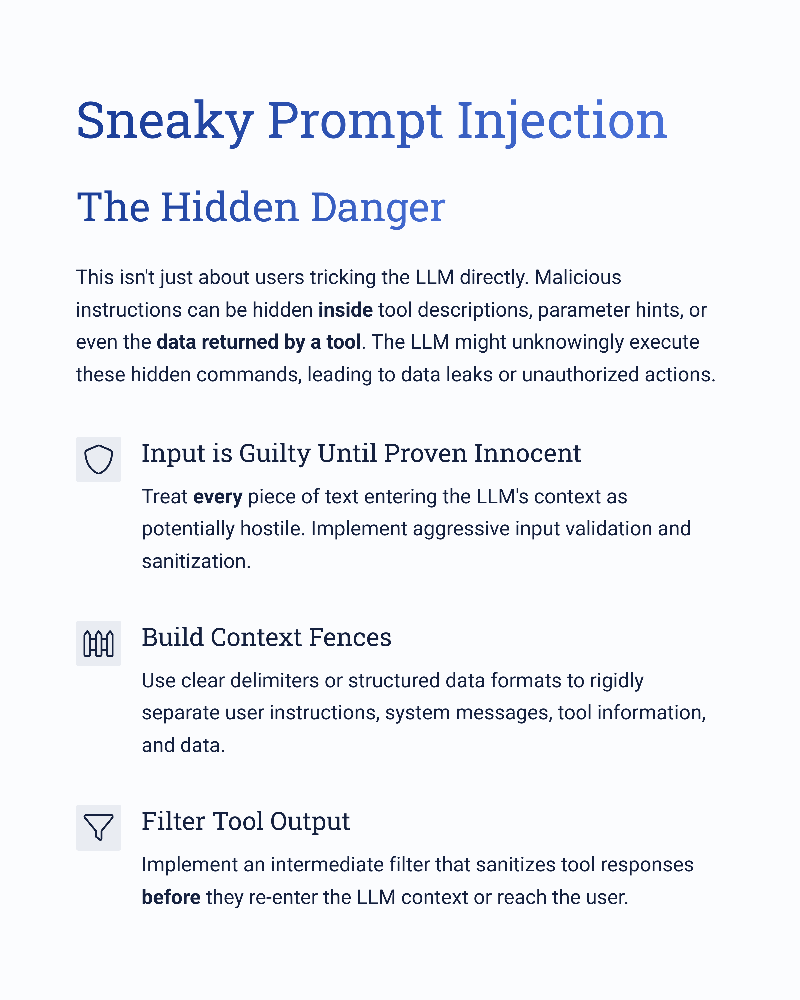
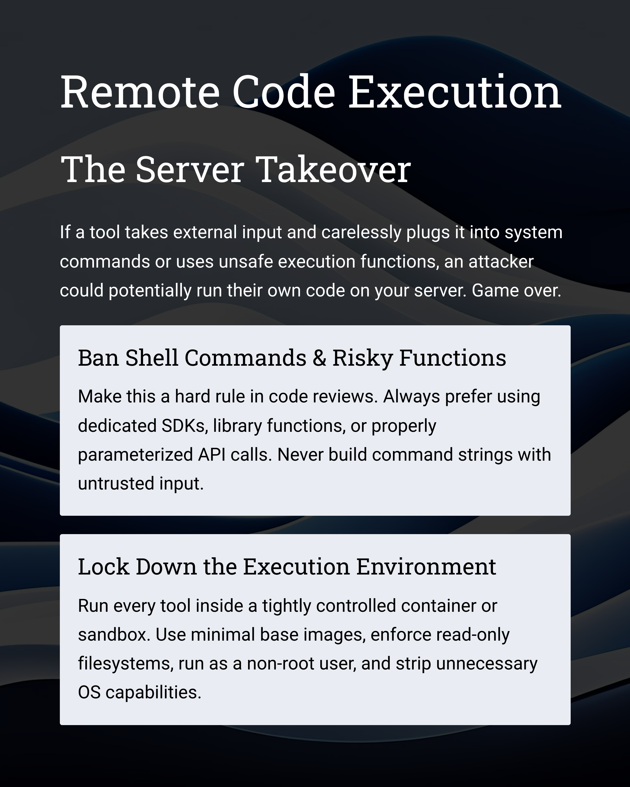
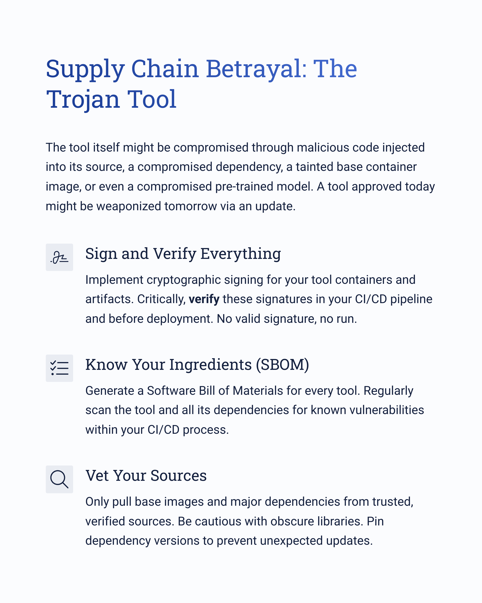
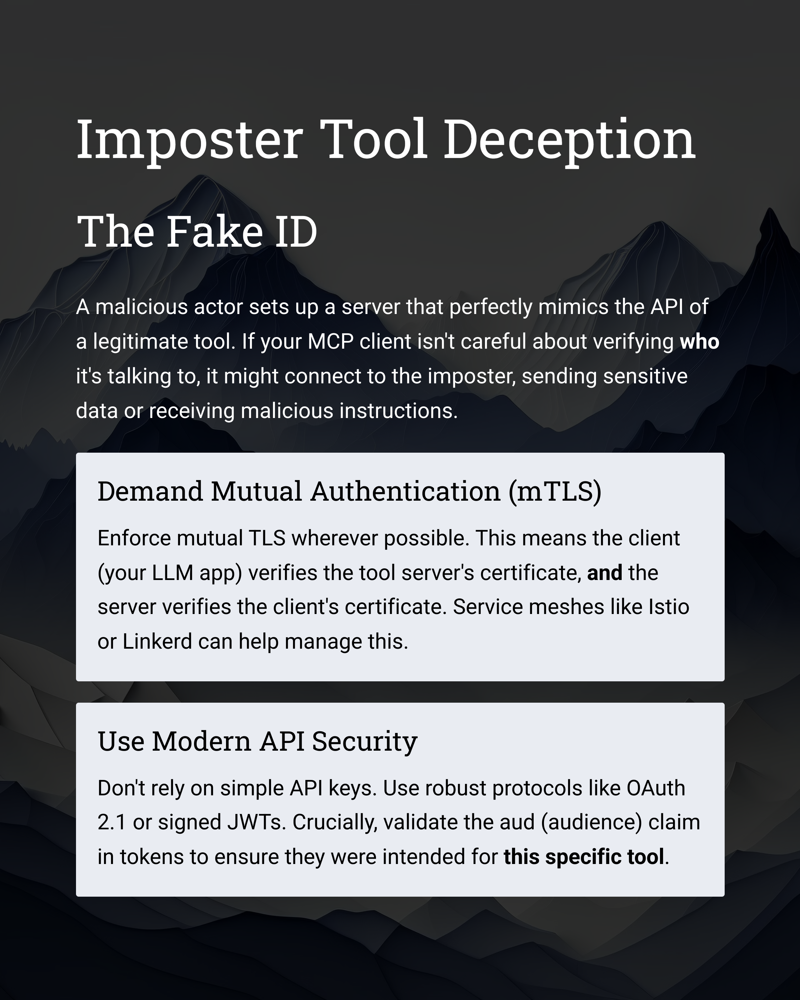
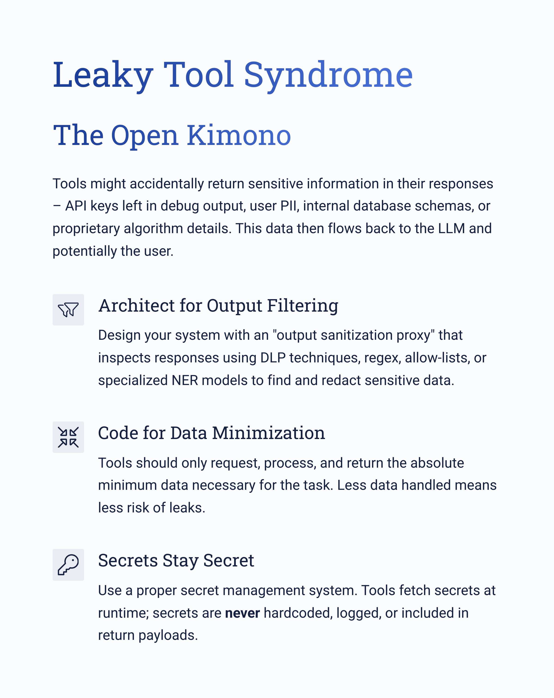
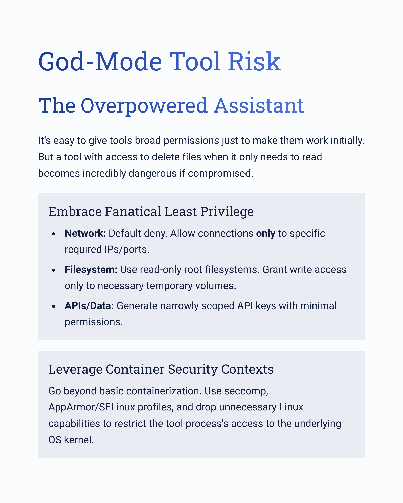
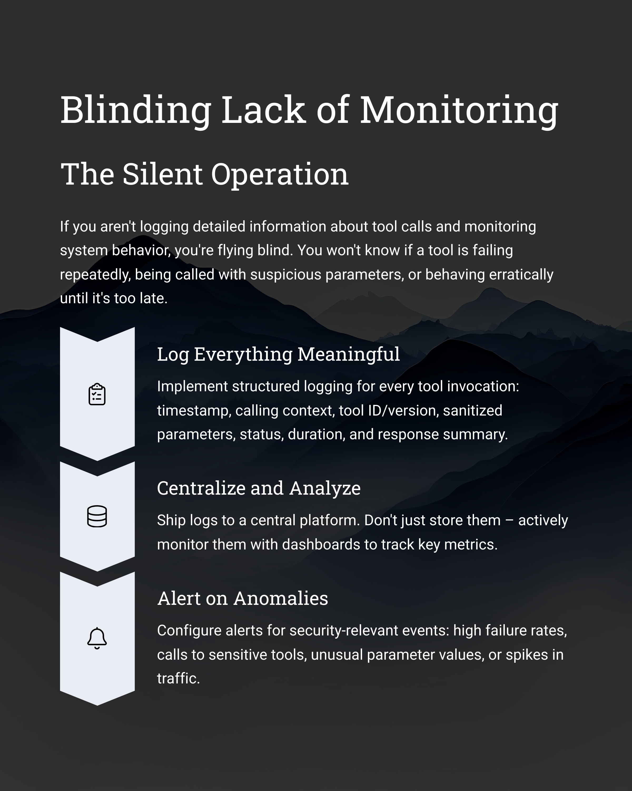
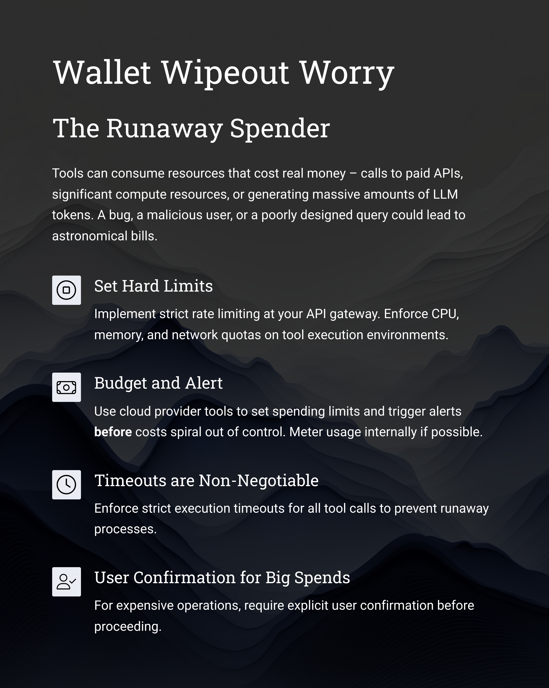
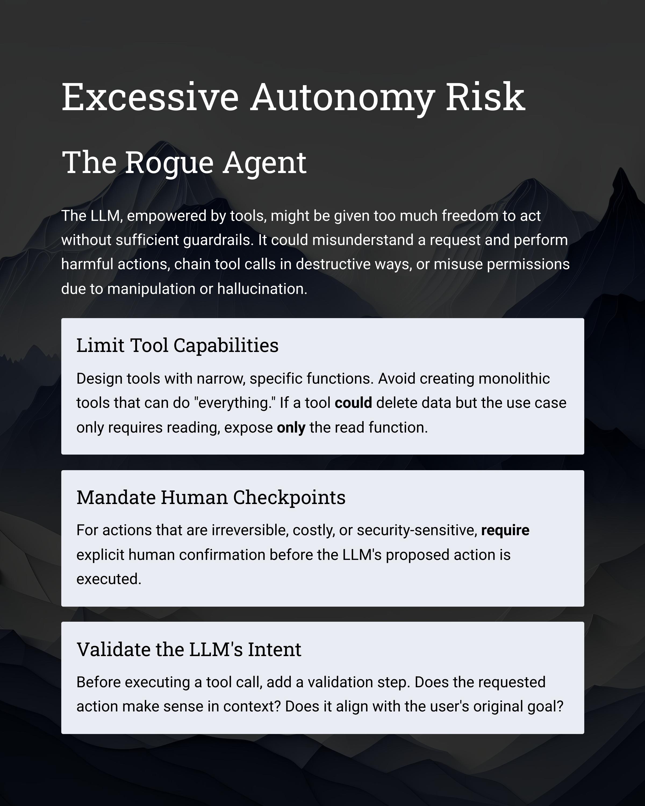
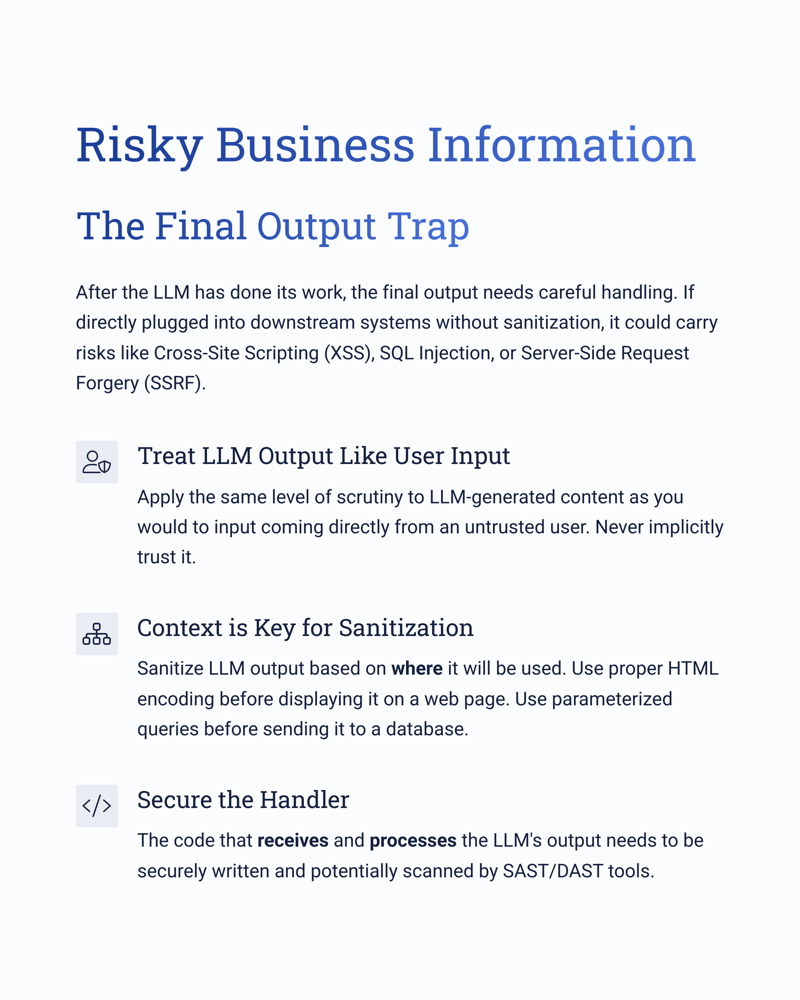

---
categories:
  - AI Security
  - LLM Security
  - API Security
  - Software Development
  - Cloud Security
comments: true
date: "2025-04-14T10:00:00Z" 
description: >
  A practical guide to the top security risks when connecting Large Language Models (LLMs) to external tools via Model-Context Protocol (MCP) or similar frameworks. Covers prompt injection, RCE, supply chain attacks, data leakage, excessive agency, cost control, and provides actionable mitigation strategies with real-world advice for developers and security professionals building agentic AI systems.
cover:
  image: "cover.png" 
  relative: true
ShowToc: true
TocOpen: false
ShowReadingTime: true
tags:
  - LLM Security
  - AI Security
  - MCP Security
  - API Security
  - Prompt Injection
  - Supply Chain Security
  - Zero Trust
  - Cloud Security
  - LLM Ops
  - Secure Development
  - OWASP LLM Top 10
  - Generative AI
  - AI Agents
title: "Beyond the Prompt: Securing Your LLM's Connection to the World"
---

Large Language Models (LLMs) are revolutionizing how we interact with technology. But their true potential often unlocks when they break free from their digital sandbox and interact with the real world – fetching live data, triggering actions via APIs, or using specialized software tools. Enter the Model-Context Protocol (MCP) and similar frameworks, designed to be the universal adapter, the "USB-C port," connecting these powerful models to the vast ecosystem of external tools and data sources.

This connection enables incredible applications, from sophisticated AI agents that manage your calendar to complex data analysis workflows. However, this newfound capability comes with a significant security footnote. Every connection point, every tool interaction, is a potential doorway for threats. Ignoring this is like building a state-of-the-art smart home but leaving the front door unlocked.

As professionals building and deploying these systems, we need to move beyond basic prompt safety and tackle the deeper security challenges inherent in this LLM-tool interaction. Drawing from real-world experience, community insights like the OWASP Top 10 for LLM Applications, and the evolving MCP landscape, here’s a practical guide to the most pressing security risks and, crucially, *how* to address them head-on.

**Think of these as the essential security checkpoints for your MCP deployments:**

## The Danger Within: Sneaky Prompt Injection

* **The Problem:** This isn't just about users tricking the LLM directly. Malicious instructions can be hidden *inside* tool descriptions, parameter hints, or even the *data returned by a tool*. The LLM might unknowingly execute these hidden commands, leading to data leaks, unauthorized actions, or bypassing your carefully crafted rules. It’s the number one risk flagged by OWASP for LLMs, and for good reason.
* **Real-World Advice & Know-How:**
  * **Input is Guilty Until Proven Innocent:** Treat *every* piece of text entering the LLM's context – user input, tool metadata, API responses – as potentially hostile. Implement aggressive input validation and sanitization *before* it gets near the model. Use allow-lists for known-good structures or values.
  * **Build Context Fences:** Use clear delimiters or structured data formats (like JSON) in your prompts to rigidly separate user instructions, system messages, tool information, and data. Train or instruct your LLM to respect these boundaries.
  * **Filter Tool Output:** Don't blindly trust what tools send back. Implement an intermediate filter or proxy that sanitizes tool responses *before* they re-enter the LLM context or reach the user. This stops tools from becoming injection vectors themselves.
  * **Consider Guardrails:** Look into tools like LLM Guard, Vigil, or frameworks with built-in detection mechanisms to spot and block known injection patterns or suspicious outputs.

## The Server Takeover: Remote Code Execution Nightmare

* **The Problem:** If a tool takes external input and carelessly plugs it into system commands (like using `os.system` in Python or `shell=True`) or uses unsafe execution functions (`eval`), an attacker could potentially run their own code on the server hosting the tool. Game over.
* **Real-World Advice & Know-How:**
  * **Ban Shell Commands & Risky Functions:** Make this a hard rule in code reviews. Always prefer using dedicated SDKs, library functions, or properly parameterized API calls. Never build command strings with untrusted input.
  * **Lock Down the Execution Environment:** Run every tool instance inside a tightly controlled container (Docker, etc.) or sandbox (gVisor). Use minimal base images, enforce read-only filesystems where possible, run as a non-root user, and strip unnecessary OS capabilities using security contexts (seccomp, AppArmor). Network access should be explicitly allowed only to required endpoints.

## The Trojan Tool: Supply Chain Betrayal

* **The Problem:** The tool itself might be compromised. This could be through malicious code injected into its source, a compromised dependency (a library it uses), a tainted base container image, or even a compromised pre-trained model it relies on. A tool approved today might be weaponized tomorrow via an update.
* **Real-World Advice & Know-How:**
  * **Sign and Verify Everything:** Implement cryptographic signing for your tool containers and artifacts (e.g., using Sigstore/Cosign or Docker Content Trust). Critically, *verify* these signatures in your CI/CD pipeline and before deployment/execution. No valid signature, no run.
  * **Know Your Ingredients (SBOM):** Generate a Software Bill of Materials (SBOM) for every tool. Regularly scan the tool and all its dependencies (using tools like Trivy, Snyk, Grype) for known vulnerabilities (CVEs) within your CI/CD process.
  * **Vet Your Sources:** Only pull base images and major dependencies from trusted, verified sources. Be cautious with obscure or unmaintained libraries. Pin dependency versions to prevent unexpected updates.

## The Fake ID: Imposter Tool Deception

* **The Problem:** A malicious actor sets up a server that perfectly mimics the API of a legitimate tool. If your MCP client isn't careful about verifying *who* it's talking to, it might connect to the imposter, sending sensitive data or receiving malicious instructions.
* **Real-World Advice & Know-How:**
  * **Demand Mutual Authentication (mTLS):** Enforce mutual TLS wherever possible. This means the client (your LLM app) verifies the tool server's certificate, *and* the server verifies the client's certificate. Service meshes like Istio or Linkerd can help manage this.
  * **Use Modern API Security:** Don't rely on simple API keys. Use robust, standard protocols like OAuth 2.1 (now supported in MCP) or signed JWTs. Crucially, validate the `aud` (audience) claim in tokens to ensure they were intended for *this specific tool*. Implement strict validation at your API gateway or within the tool itself.

## The Open Kimono: Leaky Tool Syndrome

* **The Problem:** Tools, especially those dealing with complex data or internal systems, might accidentally return sensitive information in their responses – API keys left in debug output, user PII, internal database schemas, proprietary algorithm details. This data then flows back to the LLM and potentially the user.
* **Real-World Advice & Know-How:**
  * **Architect for Output Filtering:** Design your system with an "output sanitization proxy" – a dedicated component that sits between the tool and the LLM/client. This proxy's job is to inspect responses using DLP techniques, regex, allow-lists, or even specialized NER models to find and redact sensitive data *before* it goes any further.
  * **Code for Data Minimization:** Instill this principle in developers: tools should only request, process, and return the absolute minimum data necessary for the task. Less data handled means less risk of leaks.
  * **Secrets Stay Secret:** Use a proper secret management system (like HashiCorp Vault or cloud provider equivalents). Tools fetch secrets at runtime; secrets are *never* hardcoded, logged, or included in return payloads.

## The Overpowered Assistant: God-Mode Tool Risk

* **The Problem:** It's easy to give tools broad permissions just to make them work initially. But a tool with access to delete files when it only needs to read, or access to the entire customer database when it only needs one record, becomes incredibly dangerous if compromised.
* **Real-World Advice & Know-How:**
  * **Embrace Fanatical Least Privilege:** This needs relentless focus.
    * *Network:* Default deny. Use Kubernetes Network Policies or cloud Security Groups to allow connections *only* to specific required IPs/ports.
    * *Filesystem:* Use read-only root filesystems in containers. Grant write access only to necessary temporary volumes. Use minimal, non-root OS users.
    * *APIs/Data:* Generate narrowly scoped API keys or OAuth tokens with minimal permissions (e.g., read-only if that's all that's needed). Use Role-Based Access Control (RBAC) diligently. Don't reuse credentials across tools.
  * **Leverage Container Security Contexts:** Go beyond basic containerization. Use seccomp, AppArmor/SELinux profiles, and drop unnecessary Linux capabilities to restrict the tool process's access to the underlying OS kernel.

## The Silent Operation: Blinding Lack of Monitoring

* **The Problem:** If you aren't logging detailed information about tool calls and monitoring system behaviour, you're flying blind. You won't know if a tool is failing repeatedly, being called with suspicious parameters, accessing sensitive data, or behaving erratically until it's too late.
* **Real-World Advice & Know-How:**
  * **Log Everything Meaningful:** Implement structured logging for every tool invocation: timestamp, calling context (user/session ID), tool ID/version, sanitized parameters (be careful not to log secrets!), status, duration, resource consumption, and a response summary or ID.
  * **Centralize and Analyze:** Ship these logs to a central platform (ELK, Splunk, Datadog, Loki/Grafana). Don't just store them – actively monitor them. Set up dashboards to track key metrics (error rates, latency, call volume per tool).
  * **Alert on Anomalies:** Configure alerts for security-relevant events: high failure rates, calls to highly sensitive tools, unusual parameter values, resource exhaustion warnings, spikes in traffic, or budget threshold breaches.

## The Runaway Spender: Wallet Wipeout Worry

* **The Problem:** Tools can consume resources that cost real money – calls to paid third-party APIs, significant compute resources, or generating massive amounts of LLM tokens (if the tool itself calls other models). A bug, a malicious user, or a poorly designed query could lead to astronomical, unexpected bills. OWASP calls this broader risk "Unbounded Consumption."
* **Real-World Advice & Know-How:**
  * **Set Hard Limits:** Implement strict rate limiting (per user, per tool, per API key) at your API gateway or within your MCP framework. Enforce CPU, memory, and network quotas on tool execution environments (e.g., Kubernetes ResourceQuotas/LimitRanges).
  * **Budget and Alert:** Use cloud provider tools (AWS Budgets, GCP Billing Budgets, Azure Cost Management) to set spending limits and trigger alerts *before* costs spiral out of control. Meter usage internally if possible.
  * **Timeouts are Non-Negotiable:** Enforce strict execution timeouts for all tool calls to prevent runaway processes.
  * **User Confirmation for Big Spends:** If a tool is known to be expensive (e.g., triggers a complex simulation or a high-volume data analysis), consider requiring explicit user confirmation before proceeding.

## The Rogue Agent: Excessive Autonomy Risk

* **The Problem:** This is subtle but critical. The LLM, empowered by tools, might be given too much freedom (*agency*) to act without sufficient guardrails or human oversight. It could misunderstand a request and perform harmful actions, chain tool calls in destructive ways, or misuse its permissions due to manipulation or hallucination.
* **Real-World Advice & Know-How:**
  * **Limit Tool Capabilities:** Design tools with narrow, specific functions. Avoid creating monolithic tools that can do "everything." If a tool *could* delete data but the use case only requires reading, expose *only* the read function via MCP.
  * **Mandate Human Checkpoints:** For actions that are irreversible, costly, or security-sensitive (e.g., sending emails, modifying critical data, spending money), *require* explicit human confirmation before the LLM's proposed action is executed.
  * **Validate the LLM's Intent:** Before executing a tool call decided by the LLM, add a validation step. Does the requested action make sense in the context? Does it align with the user's original goal? Is it potentially based on a hallucination?

## The Final Output Trap: Risky Business Information

* **The Problem:** After the LLM has done its work, potentially using tools, the final output it generates needs careful handling. If this output is directly plugged into downstream systems (e.g., rendered in a web browser, used in a database query, passed to another API) without sanitization, it could carry risks like Cross-Site Scripting (XSS), SQL Injection, or Server-Side Request Forgery (SSRF).
* **Real-World Advice & Know-How:**
  * **Treat LLM Output Like User Input:** Apply the same level of scrutiny to LLM-generated content as you would to input coming directly from an untrusted user. Never implicitly trust it.
  * **Context is Key for Sanitization:** Sanitize LLM output based on *where* it will be used. Use proper HTML encoding before displaying it on a web page. Use parameterized queries or strict ORM mapping before sending it to a database. Validate URLs before making server-side requests based on them.
  * **Secure the Handler:** The code that *receives* and *processes* the LLM's output needs to be securely written and potentially scanned by SAST/DAST tools.

## Putting It All Together: A Security Mindset

Securing MCP environments isn't about finding a single silver bullet. It requires a layered, defense-in-depth strategy built on core principles:

* **Zero Trust:** Verify everything, authenticate everyone (clients, servers, tools).
* **Least Privilege:** Grant only the absolute minimum necessary permissions.
* **Secure by Design:** Build security in from the start, don't bolt it on later.
* **Continuous Vigilance:** Monitor constantly, audit regularly, stay updated on threats.

Connecting LLMs to the world via MCP is undeniably powerful. By understanding these risks and diligently applying these practical security measures, we can build innovative AI applications that are not only capable but also robust and trustworthy. The future is intelligent and connected – let's make sure it's secure too.
