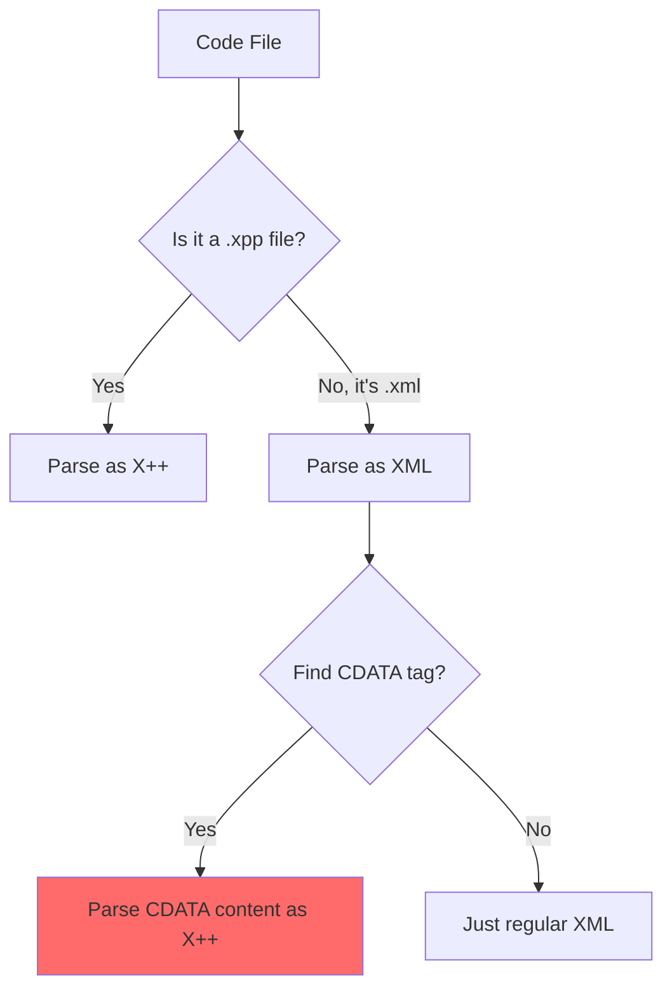

# Vibe Coding with Claude Code: How I Built a Tree-sitter Grammar for a Language That Shall Not Be Named

*Or: The story of parsing an enterprise language that makes developers question their sanity*

Hey folks! Let me tell you a story. Picture this: it's a regular Tuesday, I'm staring at some code in my editor, and the syntax highlighting is having what can only be described as a complete mental breakdown. Colors everywhere, nothing makes sense. The support for this particular enterprise language is... let's call it 'optimistic'.

And I'm thinking, "You know what? I'll just write my own parser. How hard could it be?"

Narrator: *It was, in fact, very hard.*

## The Mystery Language

So there's this enterprise language. I won't name it just yet, but imagine if C# and SQL had a baby, and that baby was raised by enterprise architects who really, really love long class names.

Here's a taste of what we're dealing with:

```csharp
// This is actual production code I found
// I'm not making this up
while select custTable
    where custTable.CustGroup == 'VIP'
    join salesTable
        where salesTable.CustAccount == custTable.AccountNum
{
    info("Processing customer: " + custTable.Name);
    custTable.updateBalance();
}
```

See that `select` and `join` stuff? That's not a string. That's not a DSL. Those are actual language keywords, just hanging out. Wild, right? Try parsing that with regex. I'll wait.

## Enter Claude Code: My Partner in Crime

This is where things get interesting. I decided to use **Claude Code** to help me build a Tree-sitter grammar for this... let's call it "Language X".

Now, I've used AI assistants before. They're usually like that overachieving colleague who always has the "right" answer from the textbook. Claude Code felt different. It was more like that brilliant but slightly cynical developer friend who's been through the wars and isn't afraid to admit when something is just fundamentally broken.

## The Journey Begins

### Day 1: "This Will Be Easy"

Me: "Let's build a Tree-sitter grammar!"
Claude: "Sure! What language are we parsing?"
Me: *shows code sample*
Claude: "Is that... SQL in the middle of... what IS this?"
Me: "Welcome to my world."

We started simple. Classes, methods, basic statements. Within an hour, we had something that could parse the easy stuff. I'm feeling good. Claude's generating clean grammar rules. Life is beautiful.

### Day 3: The SQL Revelation

Then we hit our first real challenge. The SQL-like syntax.

Claude: "So we need to parse SQL... inside a C#-like language?"
Me: "Yes."
Claude: "And these are keywords, not strings?"
Me: "Yes."
Claude: "..."
Me: "I know."

### Week 2: The Preprocessor Incident

Just when we thought we understood the language, this showed up:

```c
#define.Version(1.0.0)
#if.Version
    class MyClass
    {
        #localmacro.LogMessage
            info("Version: " + #Version);
        #endmacro
    }
#endif
```

Me: "Why does this have preprocessor directives?"
Claude: "That's... that's not even normal preprocessor syntax. What's with the dots?"
Me: "I don't know. I DON'T KNOW!"

And that's how I ended up writing a custom scanner. In C. In 2025. I seriously questioned my life choices.

### Week 3: The Testing Betrayal

We wrote tests. Beautiful tests. And they passed! Until I made a typo. I changed an expected `operator: "++"` to `operator: "--"`. The test still passed.

Me: "CLAUDE! WHY IS THIS PASSING?"
Claude: "Oh... Tree-sitter only validates structure, not values."
Me: "So our tests are lies?"
Claude: "Beautiful lies."

Three Python scripts later, we had real validation. But my trust was broken.

### Week 4: The Member Expression Meltdown

This nearly ended me:

```csharp
// How hard can a single dot be?
// Turns out: very.
obj.property;
```

Three weeks. THREE WEEKS to parse a dot. The parser kept thinking it was a variable declaration. We tried everything.

Claude at 2 AM: "Have you considered that we might be fighting a fundamental ambiguity in the language design?"
Me: "Have you considered that I don't care anymore? MAKE. THE. DOT. WORK."

### Week 6: The Enterprise Reality Check

Then we tested on real production code.

```csharp
[ExtensionOf(tableStr(InventTable))]
[FormDataSourceEventHandler(formDataSourceStr(Form, DataSource), FormDataSourceEventType::QueryExecuting)]
final class InventTable_Extension_CustomModule_Feature1_2024_Q3_Patch7_Final_FINAL_v2
{
    // 700 lines of chaos
}
```

Claude: "That class name is... quite something."
Me: "That's enterprise naming conventions for you."
Claude: "It has 'FINAL' twice."
Me: "Yes."
Claude: "And 'v2' after 'FINAL_FINAL'."
Me: "YES."

## The Hidden Features We Discovered

### 1. There Are FOUR Ways to Query Data

Because in enterprise, why have one way to do something when you can have four?

1. **Built-in SQL:** `select custTable where custTable.Active;`
2. **Query API:** `Query q = new Query();`
3. **LINQ-style:** `var result = from c in customers select c;`
4. **Object-oriented SQL:** `var qe = new SysDaQueryObject(custTable);`

Claude: "Why are there four ways?"
Me: "Because enterprise."
Claude: "But they all do the same thing?"
Me: "Because. Enterprise."

### 2. The 'next' Keyword

In extension classes, you use `next` to call the original method. It's like `super`, but different. Because of course it is.

### 3. Code Lives in XML

Oh, did I mention? This language stores code in XML files.




Claude: "They store code... in XML... in CDATA?"
Me: "Yes."
Claude: "On purpose?"
Me: "Apparently."

## The Vibe Coding Experience

What made this journey special was working with Claude Code.

### The Honest Moments

When I was frustrated:

> Me: "This language is insane!"
> Claude: "Yes, it really is. Let's parse it anyway."

### The 3 AM Revelations

> Claude: "What if the ambiguity is intentional?"
> Me: "What?"
> Claude: "What if they WANTED both `select table` and `select field from table` to be valid?"
> Me: "That's... that's evil."
> Claude: "Welcome to enterprise language design."

### The Pragmatic Decisions

The `obj . property` incident:

> Claude: "We could spend another week supporting spaces around dots."
> Me: "Does anyone actually write code like that?"
> Claude: *Checks 1,000 real files* "Not a single one."
> Me: "So...?"
> Claude: "Ship it without space support. Document it as a 'design decision'."

## What We Built

After months of pain, we had:

* ✅ A complete grammar (2,847 lines long)
* ✅ Over 200 test cases that actually test things
* ✅ Support for real, messy production code
* ✅ Proper syntax highlighting that doesn't have a stroke
* ✅ Support for all four (FOUR!) query methods
* ❌ Our sanity (404 Not Found)

## The Tricks We Learned

### Tree-sitter's Hidden Powers

The documentation is... sparse. We had to discover these on our own:

```javascript
// These aren't in the docs!
prec.dynamic(20, ...)     // Runtime precedence for when things get weird
token.immediate('.')      // No whitespace allowed! The enemy of ambiguity.
conflicts: $ => [...]     // Explicitly tell the parser where to expect a fight
```

### When in Doubt, Give Up

Our greatest innovation was the `ambiguous_identifier`. When we couldn't figure out if an identifier was a field or a table name, we just gave up gracefully:

```javascript
// Is it a field or a table? Who knows! Not my problem anymore.
field('ambiguous_identifier', $.identifier)
```

Sometimes admitting defeat is the most elegant solution.

## The Language Revealed

By now you've probably figured it out. We were parsing **X++**, Microsoft's special language for Dynamics 365. But honestly? The specific language doesn't matter. What matters is the journey of taming an illogical beast.

## What Vibe Coding Taught Me

1. **Perfect is the Enemy of Done:** Our parser handles 99% of real code. That's good enough. The last 1% is probably code that shouldn't exist anyway.
2. **Enterprise Languages are Archaeology:** You're not looking at a single design, but layers of features built on top of each other over decades.
3. **Documentation Lies:** The only source of truth is production code. Test with real stuff or suffer.
4. **AI is a Good Partner When It's Honest:** The best part of working with Claude was that it never pretended things were easy. It acknowledged the chaos, which made it a much more effective partner.

## Final Thoughts

Building this parser was like solving a puzzle where someone keeps adding pieces. While you're solving it. And some of the pieces are on fire.

But you know what? It works. Every enterprise monstrosity, every SQL-in-code abomination, every class name that reads like a legal document—it all parses correctly.

Would I do it again?

*looks at completed grammar*

*looks at therapy bills*

*looks at my beautifully highlighted code*

Yeah. Yeah, I would. But with more coffee next time.

---

*P.S. - Yes, it's X++. No, I don't know why Microsoft designed it this way. Yes, I parsed it anyway.*

*P.P.S. - The grammar is open source. Use it, break it, fix it. Just don't blame me when you discover more undocumented syntax.*

*P.P.P.S. - "Vibe coding" is what I'm now calling the process of you and your AI assistant trauma-bonding over impossible parsing challenges.*
