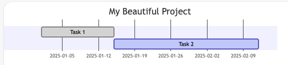
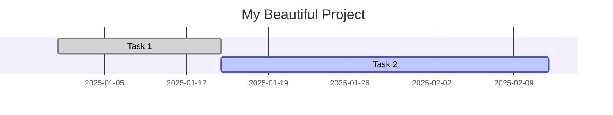

---
categories:
- Python
- Software Development
- Project Management
- AI-Assisted Development
- Data Visualization
tags:
- roadmapper
- python
- mermaid-js
- gantt-chart
- project-roadmap
- data-visualization
- developer-tooling
- ai-workflow
- developer-productivity
- uv
- claude-ai
title: "From Mermaid Gantt to Enterprise Roadmaps: A Journey Through Python and Procrastination"
date: "2025-08-25T00:00:00Z"
comments: true
Params:
  ShowReadingTime: true
  ShowToc: true
  TocOpen: true
cover:
  image: "cover.png"
  relative: true
---

Hey folks! So, picture this: it's a regular day, and someone drops a Mermaid Gantt diagram in my lap. "Can you make this... prettier?" they ask. "You know, for the executives. Make it look professional."

I look at this ASCII-art-meets-timeline monstrosity and think: how hard could it be?

Narrator: *It was about to become a whole journey.*

## The Problem: When Gantt Charts Aren't Gantt-y Enough

You know Mermaid, right? That thing where you write text and it becomes diagrams? It's great for documentation. Throw some code in your markdown, boom - instant diagram. But here's the thing: Mermaid Gantt charts look like... well, they look like what a developer thinks executives want to see.





It's functional. It's correct. It's also about as exciting as reading server logs on Friday evening.

My client wanted something that screams "enterprise ready" and whispers "we know what we're doing." You know the type - gradient colors, clean lines, proper milestones. The kind of roadmap that makes VPs nod approvingly during quarterly reviews.

## The Discovery: Enter Roadmapper

After spending exactly 3 minutes googling "python roadmap generator pretty" (yes, that was my actual search), I found this thing called [roadmapper](https://github.com/csgoh/roadmapper). Some legend named [csgoh](https://github.com/csgoh) built a Python library that creates actual good-looking roadmaps.

## The Journey: From Skepticism to "Oh, This Actually Works"

### Round 1: Setting Up (Where Everything Usually Falls Apart)

So I'm thinking, great, another Python package that requires 47 dependencies and a PhD in virtual environments. But no:

```bash
uv init roadmap_project --python 3.11
uv add roadmapper
```

That's it. Two commands. I was suspicious. Nothing is ever this easy in Python land.

Plot twist: it actually was that easy.

### Round 2: The First Attempt (aka "Let's Just Copy-Paste")

My first instinct? Just throw the Mermaid data at it and see what happens:

```python
from roadmapper.roadmap import Roadmap
from roadmapper.timelinemode import TimelineMode

roadmap = Roadmap(1600, 800)  # Random numbers, seemed reasonable
roadmap.set_title("Some Framework Implementation Plan")
# ... add some tasks ...
roadmap.save("please_work.png")
```

The result? Well, it worked. But the text was overflowing like my coffee cup on Monday mornings. Task names were having parties outside their boxes. Milestones were playing hide and seek.

Good times.

### Round 3: The Context Manager Revelation

Here's where things got interesting. Turns out, roadmapper supports context managers. You know, the `with` statement thing that Python developers pretend to understand.

```python
with Roadmap(2000, 1000, auto_height=True) as roadmap:
    with roadmap.add_group("Establish Semantic Clarity") as group:
        with group.add_task("Charter Taxonomy WG", "2025-08-18", "2025-09-01") as task:
            task.add_milestone("✅ Done", "2025-09-01")
```

It's like Russian dolls, but for project management. And somehow, it makes sense?

## The Hidden Gems Nobody Tells You About

### 1. Parallel Tasks (The Real MVP)

You know when you have tasks that happen at the same time? In Mermaid, you just... deal with it. In roadmapper:

```python
task.add_parallel_task("Define RACI", "2025-08-18", "2025-09-01")
```

Boom. Two tasks, same timeline, no overlap. It's beautiful. I might have shed a tear.

### 2. The Current Date Marker

```python
Roadmap(2000, 1000, show_marker=True)
```

This little flag adds a marker showing today's date. You know what executives love more than roadmaps? Roadmaps that show "we are HERE." It's like GPS for project management.

### 3. Auto-Height (For When You Can't Math)

```python
auto_height=True
```

Because calculating pixel heights based on task count is what? Manual labor? We're developers, not accountants.

## The Mermaid Migration: A Tale of Translation

Here's the thing about converting Mermaid Gantt to roadmapper - it's not just syntax translation. It's like translating poetry. You need to understand the intent, not just the words.

### The Original Beast

```
section Establish Clarity
Charter Working Group :done, 1.1, 2025-08-18, 2w
Develop & Publish Central Glossary :1.2, after 1.1, 4w
```

### The Translation Process

1. **Sections become Groups** - But shorter names, because text overflow is real
2. **":done" becomes milestones** - With ✅ emojis, because we're professionals
3. **"after" relationships** - Calculate the actual dates (yes, I counted weeks on my fingers)
4. **Task names** - Abbreviate everything. "Working Group" → "WG", "Product Managers" → "PMs"

It's like code golf, but for project management.

## The Vibe Coding Experience

You know that feeling when code just... flows? When you and your AI assistant are in perfect sync? That happened here.

Me: "Make the text fit"
AI: *shortens all task names*

Me: "It's still ugly"
AI: *changes color theme to DEFAULT*

Me: "The timeline goes into 2026"
AI: *adjusts to 5 months*

It wasn't debugging. It was more like... roadmap feng shui. Moving things around until the energy felt right.

## Best Practices (That I Learned the Hard Way)

### Canvas Size Matters

- **Too small (1600x800)**: Text has claustrophobia
- **Too big (3000x2000)**: Looks empty, like my motivation on Fridays
- **Just right (2000x1000)**: Professional without being extra

### Theme Selection

```python
colour_theme="DEFAULT"  # Blue/gray, safe, boring, perfect
colour_theme="ORANGEPEEL"  # When you want to seem creative
colour_theme="BLUEMOUNTAIN"  # Corporate approved™
```

### Task Naming Convention

- Original: "Formally Define Roles & Responsibilities (RACI)"
- What fits: "Define RACI"
- What executives see: Professional brevity

## The Gotchas (Because There Are Always Gotchas)

### 1. The Missing Dependency Surprise

```bash
ModuleNotFoundError: No module named 'rich'
```

Turns out roadmapper needs `rich` but doesn't always install it. Classic Python.

### 2. SVG Support (Or Lack Thereof)

```python
roadmap.save("my_roadmap.svg")
# Error: unknown file extension: .svg
```

It says it supports SVG. The error message disagrees. We saved as PNG and moved on with our lives.

### 3. Date Math Is Hard

"After 1.1, 4w" in Mermaid means start after task 1.1 ends, then run for 4 weeks. Not "end 4 weeks after 1.1 starts." Yes, I got this wrong. Yes, the client noticed.

## The Result: From Gantt to Glory

After our journey through Python packages, context managers, and executive expectations, we ended up with a roadmap that:

- Actually fits on a slide
- Has colors that don't hurt your eyes
- Shows parallel work streams clearly
- Makes it obvious what's done (✅) and what's in progress
- Looks like it was made by a "professional consulting firm"

The client was happy. The executives were impressed. I learned way too much about task management visualization.

## The Real Magic: It Just Works

Here's the thing about roadmapper that surprised me most - it just works. No Docker containers. No npm installing half the internet. No "works on my machine" mysteries.

```python
uv run python ai_roadmap.py
```

And you get a PNG. A beautiful, enterprise-ready PNG.

Is it perfect? No. Could the text fitting algorithm be better? Sure. Would I use it again? Absolutely.

Because at the end of the day, we're not here to build perfect tools. We're here to ship roadmaps that make stakeholders happy. And roadmapper does exactly that.

---

*P.S. - Yes, I know there are enterprise tools like MS Project or Smartsheet or whatever. But sometimes you just need a Python script that turns a Gantt diagram into something that doesn't look like it was drawn by a developer. Don't overthink it.*