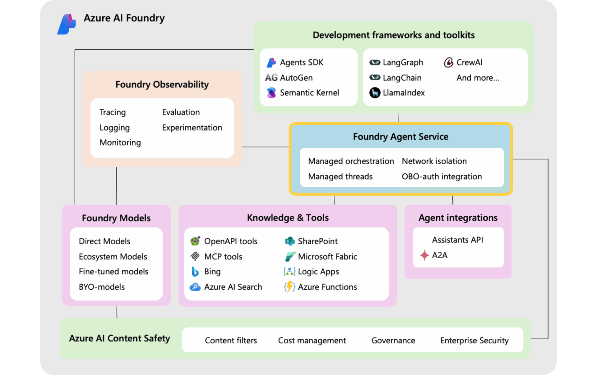
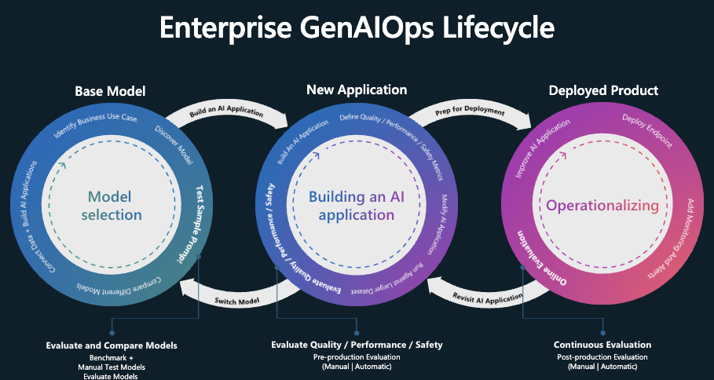
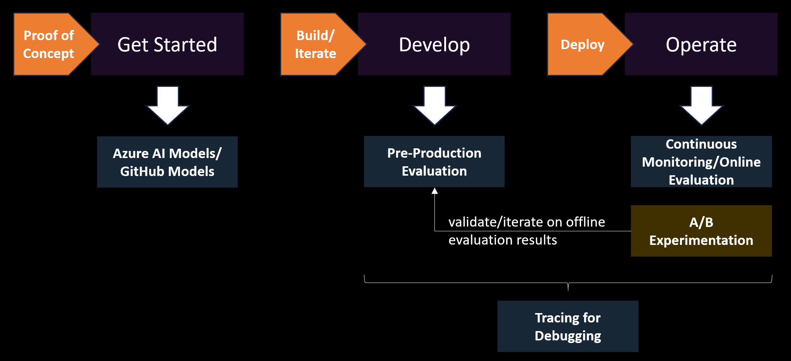
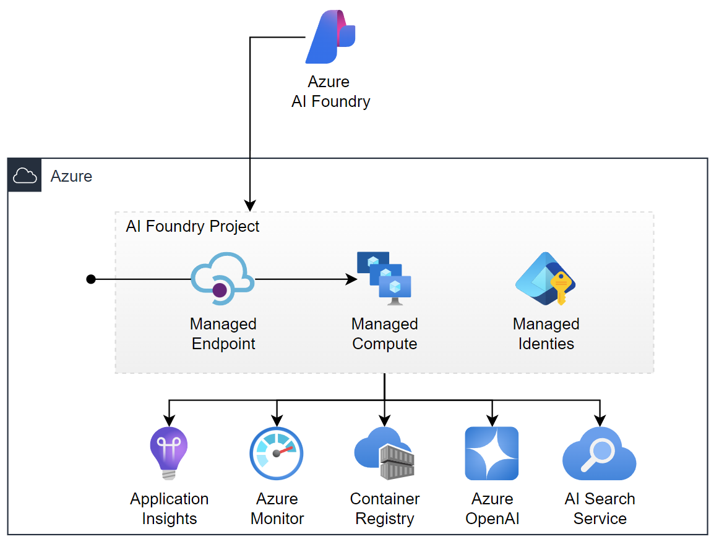
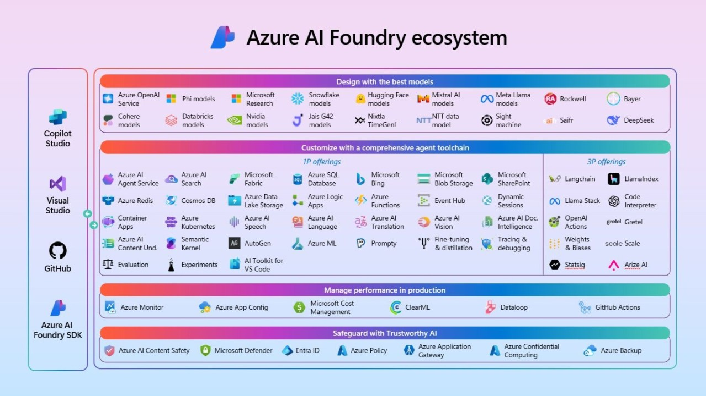

---
categories:
- AI
- Cloud Computing
- Software Architecture
- Enterprise Development
- Microsoft Azure
tags:
- azure-ai-foundry
- multi-agent-systems
- ai-orchestration
- semantic-kernel
- llm
- gpt-5
- observability
- cicd
- enterprise-ai
- agent-to-agent
- ai-agents
- azure
- machine-learning
- devops
- production-ai
title: "Azure AI Foundry: Building Multi-Agent Systems Without Losing Your Mind (Much)"
date: "2025-08-27T00:00:00Z"
comments: true
Params:
  ShowReadingTime: true
  ShowToc: true
  TocOpen: true
cover:
  image: "cover.png"
  relative: true
---

Hey folks! So, picture this: it's 3 AM, I'm staring at my fourth attempt to orchestrate multiple AI agents, and my code looks like someone tried to solve the traveling salesman problem with spaghetti. The agents are talking to each other... sometimes. When they feel like it. When Mercury is in retrograde.

And then Microsoft drops Azure AI Foundry and promises it'll solve all my multi-agent orchestration problems.

## The Problem With Building AI Agents (Or: Why I Started Drinking More Coffee)

Let me paint you a picture. You want to build an AI system that actually does something useful. Not just a chatbot that tells you the weather - we've all built that demo. I'm talking about real work. Multiple agents, each doing their specialized thing, talking to each other, handling errors, not hallucinating *too* much.

Here's what usually happens:

1. You start with one agent - works great
2. You add a second agent - still manageable  
3. You add a third agent - things get weird
4. You add a fourth agent - ???
5. Production crashes at 2 AM - suffering (always suffering)

The code ends up looking like this:

```python
# This is actual production code I found
# I'm not making this up
async def orchestrate_agents_please_work():
    try:
        result1 = await agent1.process()
        if result1 and not result1.is_hallucinating():
            result2 = await agent2.process(result1)
            if result2 and result2.makes_sense():
                # TODO: Question life choices
                result3 = await agent3.process(result2)
                # Why am I doing this at 3 AM?
                return result3
    except Exception as e:
        # This catches everything including my will to live
        logger.error(f"Something went wrong: {e}")
        return "Please try again later"
```

Fun times.

## Enter Azure AI Foundry (Or: Microsoft's Latest "It Just Works" Promise)

Alright, let's get technical. Azure AI Foundry is Microsoft's answer to "what if we made multi-agent orchestration not terrible?" It's like they looked at all of us struggling with agent coordination and thought, "Let's build an assembly line for AI agents."

And you know what? It's... actually good.

## Multi-Agent Orchestration (The Part Where Things Get Interesting)



So Azure AI Foundry gives you two ways to orchestrate agents:

### Connected Agents - The Simple Way

This is for when you want agents to delegate to each other without writing a PhD thesis in distributed systems. Check this out:

```python
from semantic_kernel import Kernel
from semantic_kernel.agents import Agent, MultiAgentOrchestrator

# Look ma, no spaghetti!
kernel = Kernel()
orchestrator = MultiAgentOrchestrator(kernel)

# Define specialized agents
research_agent = Agent(
    name="ResearchAgent",
    instructions="Research stuff. Don't make things up.",  # Important
    model="gpt-5",
    tools=["bing_search", "sharepoint_connector"]
)

analyst_agent = Agent(
    name="AnalystAgent", 
    instructions="Analyze the research. Try to be right.",
    model="gpt-5",
    tools=["azure_ai_search", "data_processor"]
)

# This actually works
orchestrator.register_agent(research_agent)
orchestrator.register_agent(analyst_agent)

# Execute and pray
result = await orchestrator.execute(
    task="Analyze quarterly market trends",
    context={"quarter": "Q4", "region": "North America"}
)
```

No manual state management. No callback hell. It just... works?

Plot twist: It actually does work. Most of the time.

### Multi-Agent Workflows - When You Need State

But wait, it gets better. What if you need agents to remember things? Like, actual stateful workflows? Azure AI Foundry has you covered:

```python
# This handles context, errors, and long-running processes
# You know, the stuff that usually makes you cry
workflow = MultiAgentWorkflow(
    name="loan_processing_workflow",
    agents=my_agents,
    orchestration_type="sequential_with_feedback"
)

# It maintains state across stages
# No more passing context through 17 function calls
result = workflow.execute_stage(
    agent="risk_assessment_agent",
    input=application_data,
    context={"previous_stage": triage_result}
)
```

The platform handles retries, error recovery, and state management. You just define what each agent does. It's like having a responsible adult supervising your code.

## Observability (Or: Finally Knowing WTF Is Going On)



Here's where things get really good. Remember trying to debug multi-agent systems? It's like trying to understand a conversation between people speaking different languages while blindfolded.

Azure AI Foundry gives you actual observability:

```python
# Enable tracing - see EVERYTHING
os.environ["AZURE_TRACING_GEN_AI_CONTENT_RECORDING_ENABLED"] = "true"

project_client.telemetry.enable(
    destination="application_insights",
    connection_string=os.environ["APPLICATIONINSIGHTS_CONNECTION_STRING"]
)

# Now when your agent does something weird at 2 AM
# You can actually see WHY
# Revolutionary, I know
```

You get:

- **Performance metrics** - Latency, throughput, token usage
- **Safety monitoring** - When your agent tries to go rogue
- **Quality metrics** - Groundedness, coherence (aka "is it making stuff up?")
- **Full execution traces** - Every decision, every tool call

It's like having X-ray vision for your AI system. Finally.

## A/B Testing Without The Pain



Want to test different prompts? Different models? Different temperatures? Usually this means building your own experimentation framework and then maintaining it forever.

Not anymore:

```python
class AgentABTester:
    def __init__(self, project_client):
        self.experiment = ABExperiment(
            name="prompt_optimization_q4",
            variants={
                "variant_a": {
                    "model": "gpt-5",
                    "system_prompt": "Be accurate.",
                    "temperature": 0.7
                },
                "variant_b": {
                    "model": "gpt-5",
                    "system_prompt": "Think step by step.",
                    "temperature": 0.8
                }
            }
        )
    
    # The platform handles experiment allocation
    # Statistical significance
    # Metric collection
    # You just define variants and go
```

No more Excel sheets with "Prompt_v17_final_FINAL_actually_final.xlsx". Just saying.

## CI/CD Integration That Actually Works



And here's the kicker - you can actually put this in your CI/CD pipeline without wanting to quit tech:

```yaml
# This is real Azure DevOps YAML that works
- task: AIAgentEvaluation@0
  inputs:
    azure-ai-project-endpoint: '$(PROJECT_ENDPOINT)'
    deployment-name: 'gpt-5'
    evaluators: |
      - FluencyEvaluator
      - GroundednessEvaluator  # aka "BS Detector"
      - ViolenceEvaluator      # Important for production
    output-path: '$(Build.ArtifactStagingDirectory)/evaluation_results'
```

Your agents get evaluated on every commit. Quality gates that actually gate. What a time to be alive.

## Real World Example (Healthcare, Because Why Not Go Big)

Let's say you're building a healthcare system. Because apparently, we're all building healthcare systems now. Here's how it looks with Azure AI Foundry:

```python
class HealthcareMultiAgentSystem:
    def initialize_specialized_agents(self):
        # Each agent has ONE job
        # Not "do everything and hope for the best"
        agents = {
            "triage_agent": Agent(
                name="TriageAgent",
                instructions="Assess symptoms. Don't diagnose cancer from a headache.",
                model="gpt-5",
                safety_config={"medical_accuracy": "strict"}
            ),
            
            "diagnostic_agent": Agent(
                name="DiagnosticAgent",
                instructions="Suggest diagnoses. Always require physician review.",
                model="gpt-5",
                safety_config={"require_physician_review": True}
            )
        }
        
        # The platform ensures HIPAA compliance
        # You don't have to become a compliance expert
        # (Thank god)
```

Stanford Medicine is actually using this. Not a demo. Real production. Real tumor board meetings.

Let that sink in.

## The Money Talk (Because Azure Ain't Free)

Look, this isn't cheap. Processing 100 trillion tokens costs money. But here's the thing - Azure AI Foundry has some tricks:

1. **Model Router** - Automatically picks the cheapest model that works
2. **Reserved Capacity** - Consistent pricing, no surprises
3. **Intelligent Caching** - Don't pay twice for the same query

```python
# The platform handles model selection
# Based on task complexity
cost_optimizer = ModelRouter(
    models=["gpt-5", "gpt-5-mini"],
    selection_criteria="best_value"  # Not "most expensive"
)
```

Your CFO will still cry, but less.

## What Actually Works (And What Doesn't)

After spending way too much time with this platform, here's the truth:

**The Good:**

- Multi-agent orchestration actually works
- Observability is genuinely useful
- A/B testing doesn't require a PhD
- CI/CD integration is real
- 1,400+ data connectors (they counted)

**The "Meh":**

- Documentation exists... sometimes
- Debugging can still be painful
- Cost adds up fast with complex workflows
- Some features are "preview" (aka "good luck")

**The Ugly:**

- When it breaks, it breaks mysteriously
- Error messages are still Microsoft-quality

## Should You Use It?

If you're building anything serious with multiple AI agents, then yes. The alternative is building all this orchestration, monitoring, and testing infrastructure yourself.

And trust me, you don't want to do that. I've tried. It's like building your own database engine because you need to store some data. Technically possible? Yes. Good idea? No.

## Conclusion (Or: What I Learned The Hard Way)



Azure AI Foundry is what happens when Microsoft actually listens to developers suffering with multi-agent systems. It's not perfect - nothing Microsoft makes ever is. But it's good enough that I've stopped building my own orchestration frameworks at 3 AM.

The platform handles the painful parts:

- Agent coordination without spaghetti code
- Observability that actually observes
- Testing that actually tests
- Security that actually secures

You focus on the business logic. Novel concept, I know.

Is it going to solve all your problems? No. Will you still debug weird agent behavior? Yes. But at least now you'll know *why* your agents are being weird, and you can fix it without rewriting everything.

---

*P.S. - Yes, I know you could build all this with open source tools and Kubernetes and probably save money. But then you'd be maintaining it forever. And debugging it. At 3 AM. Trust me on this one.*
