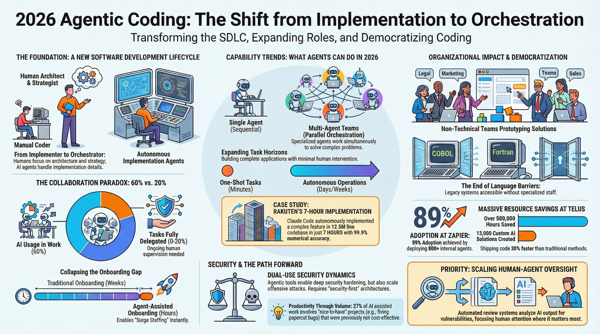

## Audio Version



[Play or download the audio overview](audio-overview.m4a)

## Executive Summary

In 2026, software teams are moving from AI-assisted coding to AI-orchestrated delivery. The winning pattern is not "humans out"; it is "humans at the highest-leverage layer" where architecture, decomposition, quality gates, and risk decisions happen.

This post synthesizes the NotebookLM research notebook `b4a11a4b-0e9f-4615-ad14-96d0c8bee177` and highlights eight shifts changing engineering strategy right now.

## The 8 Trends at a Glance

| # | Trend | What Changed | Example Impact |
| :--- | :--- | :--- | :--- |
| 1 | SDLC compression | Cycle time shifts from weeks to hours | Faster onboarding and dynamic staffing |
| 2 | Multi-agent coordination | Parallel specialist agents replace sequential single-agent flows | Faster screening and onboarding in hiring workflows |
| 3 | Long-running execution | Agents can sustain multi-hour or multi-day delivery tasks | Complex implementation runs complete with minimal interruption |
| 4 | Scaled oversight | Review itself becomes AI-assisted | Human attention moves to high-stakes decisions |
| 5 | Broader coding surface | Legacy stacks and non-traditional builders are now included | COBOL/Fortran modernization and domain-team automation |
| 6 | New economics of output | Value comes from higher output volume, not only speed | More previously "not-worth-it" tasks now get shipped |
| 7 | Organization-wide adoption | Teams outside engineering build useful tooling directly | Legal and design workflows accelerate through self-service |
| 8 | Security dual-use reality | Defensive hardening scales, but offensive capability also scales | Security-by-design and machine-speed defense become mandatory |

## 1. From Assistance to Orchestration

The biggest shift is role design. In 2025, AI tools were assistants for code snippets and tactical help. In 2026, the operating model is orchestration: humans define objectives, constraints, and quality bars, while agents execute broad implementation surfaces.

The practical implication is strategic: companies treating agentic coding as a workflow redesign initiative are pulling away from companies that treat it as a plugin.

## 2. The New Developer DNA

Engineering work is being reallocated:

- Less time on rote implementation.
- More time on problem framing and decomposition.
- More responsibility for architectural coherence.
- More emphasis on validation, governance, and system-level quality.

The observed collaboration pattern is important: teams use AI broadly, but only a smaller share of work can be fully delegated without verification. The bottleneck has moved from "can we generate code?" to "can we verify system behavior quickly and reliably?"

## 3. Capability Leap: Multi-Agent and Long-Running Systems

Single-agent interactions are giving way to orchestrated teams of specialized agents that run in parallel and exchange structured outputs. This increases throughput and lets organizations tackle larger, more fragmented work items without losing continuity.

Task horizons are also longer. Agents are now used for sustained sessions where they maintain state, process large repositories, and complete end-to-end implementation arcs that previously required many manual handoffs.

## 4. Democratization Beyond Engineering

Agentic coding is no longer confined to core engineering.

- Legal teams use AI to triage and automate repeatable review workflows.
- Design teams generate and iterate prototypes during live discovery.
- Domain experts create tactical tools directly, reducing queue dependency on engineering.

This does not eliminate engineering ownership. It changes it: platform teams become enablers and governors of safe, reusable automation capability.

## 5. The New Economics: Output Volume Beats Raw Speed

A key finding in the 2026 wave is that ROI is increasingly driven by **more shipped work**, not just faster completion of existing tasks. AI unlocks "latent backlog" work: fixes, automations, and experiments that were historically deprioritized.

That changes portfolio strategy. Teams can now justify initiatives that previously failed cost-benefit thresholds, especially when orchestration and review loops are standardized.

## 6. Security Paradox: Stronger Defense, Scaled Offense

The same tooling that helps teams harden systems also lowers the barrier for attackers to scale discovery and exploitation efforts. Security can no longer be a final-stage gate.

Security architecture must be embedded in agentic workflows from the start:

- Threat modeling before implementation delegation.
- Automated policy checks during generation.
- Continuous verification of outputs and dependencies.
- Faster detection-and-response loops aligned to machine-speed attack cycles.

## 7. Strategic Priorities for 2026

1. Build repeatable multi-agent orchestration patterns.
2. Standardize AI-assisted review for correctness, architecture, and security.
3. Enable domain teams with safe self-service automation rails.
4. Shift governance left: policy and security in workflow design, not post-facto review.

Organizations that do this well will not just ship faster; they will expand what they can ship.

## Visuals

## Downloadable Assets

- [Research data table (CSV)](trends-case-studies.csv)
- [Mind map (JSON)](mind-map.json)

## Study Assets

- [Quiz (Markdown)](/study/future-of-code-2026/quiz.md)
- [Quiz (HTML)](/study/future-of-code-2026/quiz.html)
- [Quiz (JSON)](quiz.json)
- [Flashcards (Markdown)](/study/future-of-code-2026/flashcards.md)
- [Flashcards (HTML)](/study/future-of-code-2026/flashcards.html)
- [Flashcards (JSON)](flashcards.json)

## Notebook

Source notebook: `notebook/b4a11a4b-0e9f-4615-ad14-96d0c8bee177`.
