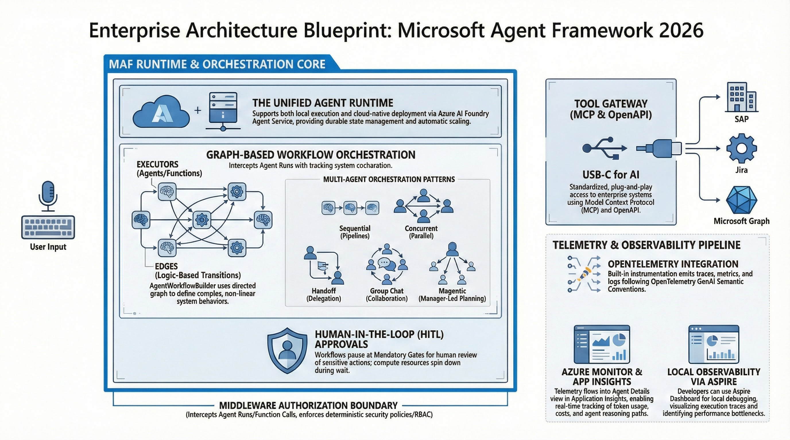
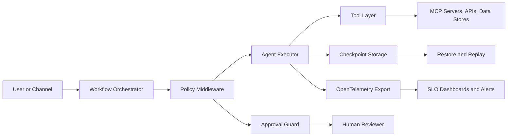
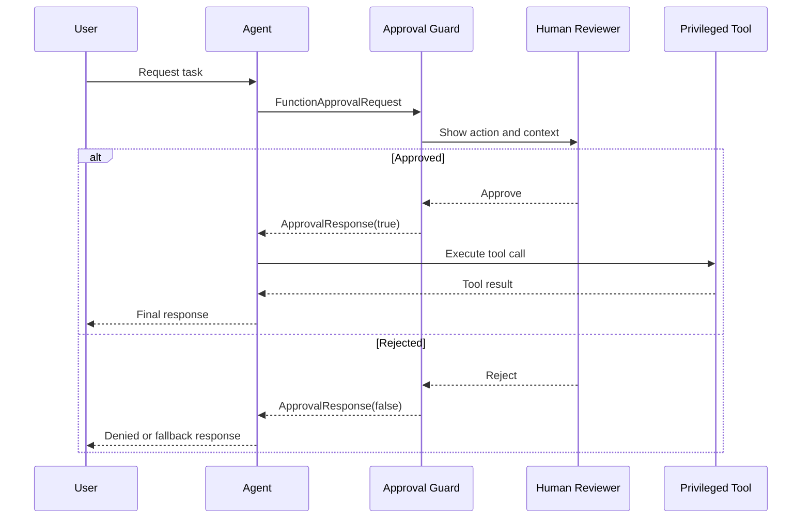
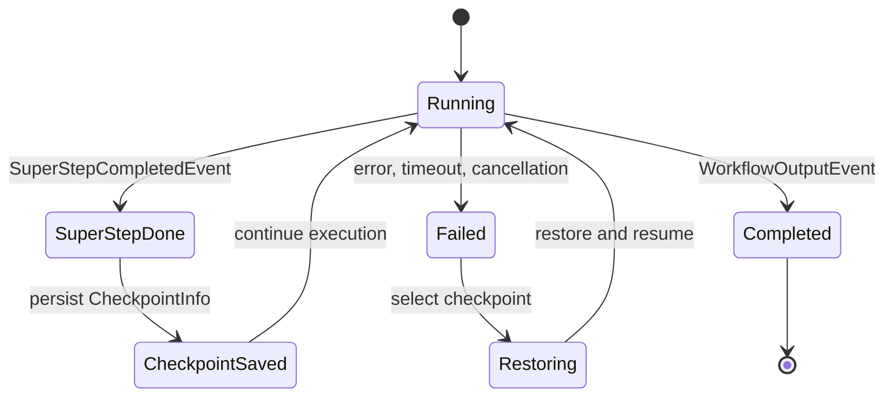
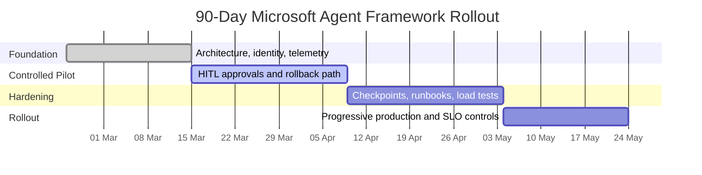

## Executive Summary

As of **March 1, 2026**, Microsoft Agent Framework is in **Release Candidate** status for both .NET and Python, positioned as the unified successor path for AutoGen + Semantic Kernel-style agent development. [S1](https://devblogs.microsoft.com/foundry/microsoft-agent-framework-reaches-release-candidate/) [S2](https://learn.microsoft.com/en-us/agent-framework/overview/)

The important shift for enterprise teams is operational, not cosmetic: move from prompt-centric prototypes to workflow-centric systems with explicit state, approvals, observability, and recovery strategies.

This update goes deeper than the original article and focuses on what teams need to actually ship in production.

## Visual Overview



## 1. What Changed Since Early 2026

### 1.1 Platform consolidation is now real

The RC announcement confirms API stabilization toward 1.0 and a single framework surface across .NET and Python. [S1](https://devblogs.microsoft.com/foundry/microsoft-agent-framework-reaches-release-candidate/)

### 1.2 Security moved from afterthought to first-class concern

Microsoft security guidance now frames agent autonomy as an expanded attack surface with specific exposure classes such as indirect prompt injection (XPIA), over-privileged tooling, and coordinator blast radius. [S3](https://www.microsoft.com/en-us/security/blog/2026/01/21/new-era-of-agents-new-era-of-posture/) [S4](https://www.microsoft.com/en-us/security/security-insider/emerging-trends/cyber-pulse-ai-security-report)

### 1.3 Documentation maturity improved

Core Learn docs now provide clearer implementation patterns for middleware, observability, human-in-the-loop, and workflow checkpoints (many pages updated in February 2026 metadata). [S5](https://learn.microsoft.com/en-us/agent-framework/agents/middleware/) [S6](https://learn.microsoft.com/en-us/agent-framework/agents/observability) [S7](https://learn.microsoft.com/en-us/agent-framework/workflows/human-in-the-loop) [S8](https://learn.microsoft.com/en-us/agent-framework/workflows/checkpoints)

## 2. Architecture Decision Model (Use This in Design Reviews)

| Scenario | Prefer | Why |
| :--- | :--- | :--- |
| Deterministic business rule | Traditional code/executor | Cheapest and most reliable |
| Open-ended reasoning/tool use | Agent | Dynamic planning + tool calling |
| Multi-step controlled process | Workflow orchestration | Explicit topology, events, checkpointability |
| High-risk side effects | Workflow + HITL/tool approval | Human control over privileged actions |
| Long-running async operations | Workflow + checkpoints | Resume/recovery without restarting end-to-end |

Back this with orchestration patterns guidance in Azure Architecture Center and Agent Framework workflow docs. [S9](https://learn.microsoft.com/en-us/azure/architecture/ai-ml/guide/ai-agent-design-patterns) [S10](https://learn.microsoft.com/en-us/agent-framework/workflows/)



## 3. Production Implementation Patterns with Code

> Note: APIs are RC and may evolve before GA. Keep SDK pinning + changelog review in your release process. [S1](https://devblogs.microsoft.com/foundry/microsoft-agent-framework-reaches-release-candidate/)

### 3.1 Running agents (streaming and non-streaming)

```csharp
// Non-streaming
Console.WriteLine(await agent.RunAsync("What is the weather like in Amsterdam?"));

// Streaming
await foreach (var update in agent.RunStreamingAsync("What is the weather like in Amsterdam?"))
{
    Console.Write(update);
}
```

```python
# Non-streaming
result = await agent.run("What is the weather like in Amsterdam?")
print(result.text)

# Streaming
async for update in agent.run("What is the weather like in Amsterdam?", stream=True):
    if update.text:
        print(update.text, end="", flush=True)
```

Source pattern from Running Agents docs. [S11](https://learn.microsoft.com/en-us/agent-framework/agents/running-agents)

### 3.2 Middleware for policy enforcement and audit hooks

```csharp
var middlewareEnabledAgent = originalAgent
    .AsBuilder()
        .Use(runFunc: CustomAgentRunMiddleware, runStreamingFunc: CustomAgentRunStreamingMiddleware)
        .Use(CustomFunctionCallingMiddleware)
    .Build();

async Task<AgentResponse> CustomAgentRunMiddleware(
    IEnumerable<ChatMessage> messages,
    AgentSession? session,
    AgentRunOptions? options,
    AIAgent innerAgent,
    CancellationToken cancellationToken)
{
    Console.WriteLine(messages.Count());
    var response = await innerAgent.RunAsync(messages, session, options, cancellationToken).ConfigureAwait(false);
    Console.WriteLine(response.Messages.Count);
    return response;
}
```

```python
async def logging_agent_middleware(context: AgentContext, next: Callable[[AgentContext], Awaitable[None]]) -> None:
    print("[Agent] Starting execution")
    await next(context)
    print("[Agent] Execution completed")
```

Use middleware to enforce out-of-band authorization and audit controls, not prompt-only policy checks. [S5](https://learn.microsoft.com/en-us/agent-framework/agents/middleware/)

### 3.3 Observability with OpenTelemetry

```csharp
var instrumentedChatClient = new AzureOpenAIClient(new Uri(endpoint), new DefaultAzureCredential())
    .GetChatClient(deploymentName)
    .AsIChatClient()
    .AsBuilder()
    .UseOpenTelemetry(sourceName: "MyApplication", configure: (cfg) => cfg.EnableSensitiveData = false)
    .Build();

using var tracerProvider = Sdk.CreateTracerProviderBuilder()
    .AddSource("MyApplication")
    .AddSource("*Microsoft.Extensions.AI")
    .AddSource("*Microsoft.Extensions.Agents*")
    .AddAzureMonitorTraceExporter(options => options.ConnectionString = applicationInsightsConnectionString)
    .Build();
```

```python
from agent_framework.observability import configure_otel_providers

# Reads OTEL_EXPORTER_OTLP_* vars
configure_otel_providers()
```

Important operational note: avoid enabling sensitive telemetry in production unless explicitly governed; prompts and tool arguments can leak data. [S6](https://learn.microsoft.com/en-us/agent-framework/agents/observability)

### 3.4 Tool approvals (HITL) for privileged actions

```csharp
AIFunction weatherFunction = AIFunctionFactory.Create(GetWeather);
AIFunction approvalRequiredWeatherFunction = new ApprovalRequiredAIFunction(weatherFunction);

AgentSession session = await agent.CreateSessionAsync();
AgentResponse response = await agent.RunAsync("What is the weather like in Amsterdam?", session);

var functionApprovalRequests = response.Messages
    .SelectMany(x => x.Contents)
    .OfType<FunctionApprovalRequestContent>()
    .ToList();

if (functionApprovalRequests.Any())
{
    var requestContent = functionApprovalRequests.First();
    var approvalMessage = new ChatMessage(ChatRole.User, [requestContent.CreateResponse(true)]);
    Console.WriteLine(await agent.RunAsync(approvalMessage, session));
}
```

```python
@tool(approval_mode="always_require")
def get_weather_detail(location: Annotated[str, "The city and state"]) -> str:
    return f"Detailed weather for {location}"

result = await agent.run("What is the detailed weather like in Amsterdam?")
if result.user_input_requests:
    user_input_needed = result.user_input_requests[0]
    approval_message = Message(role="user", contents=[user_input_needed.create_response(True)])
```

This is a practical bridge between autonomous tool use and enterprise control requirements. [S12](https://learn.microsoft.com/en-us/agent-framework/agents/tools/tool-approval) [S7](https://learn.microsoft.com/en-us/agent-framework/workflows/human-in-the-loop)



### 3.5 Sequential orchestration (pipeline style)

```csharp
var workflow = AgentWorkflowBuilder.BuildSequential(translationAgents);

StreamingRun run = await InProcessExecution.StreamAsync(workflow, messages);
await run.TrySendMessageAsync(new TurnToken(emitEvents: true));

await foreach (WorkflowEvent evt in run.WatchStreamAsync().ConfigureAwait(false))
{
    if (evt is AgentResponseUpdateEvent e)
    {
        Console.WriteLine($"{e.ExecutorId}: {e.Data}");
    }
    else if (evt is WorkflowOutputEvent outputEvt)
    {
        break;
    }
}
```

```python
workflow = SequentialBuilder(participants=[writer, reviewer]).build()

async for event in workflow.run_stream("Write a tagline for a budget-friendly eBike."):
    if event.type == "output":
        output_evt = event
```

Use this pattern when order and dependency are explicit; do not overuse handoff/group-chat for deterministic chains. [S13](https://learn.microsoft.com/en-us/agent-framework/workflows/orchestrations/sequential) [S9](https://learn.microsoft.com/en-us/azure/architecture/ai-ml/guide/ai-agent-design-patterns)

### 3.6 Checkpointing and restore for long-running reliability

```csharp
var checkpointManager = new CheckpointManager();
var checkpoints = new List<CheckpointInfo>();

Checkpointed<StreamingRun> checkpointedRun = await InProcessExecution
    .StreamAsync(workflow, input, checkpointManager)
    .ConfigureAwait(false);

await foreach (WorkflowEvent evt in checkpointedRun.Run.WatchStreamAsync().ConfigureAwait(false))
{
    if (evt is SuperStepCompletedEvent superStepCompletedEvt)
    {
        CheckpointInfo? checkpoint = superStepCompletedEvt.CompletionInfo!.Checkpoint;
        if (checkpoint != null) checkpoints.Add(checkpoint);
    }
}

// Restore from saved checkpoint
CheckpointInfo savedCheckpoint = checkpoints[5];
await checkpointedRun.RestoreCheckpointAsync(savedCheckpoint, CancellationToken.None).ConfigureAwait(false);
```

```python
checkpoint_storage = InMemoryCheckpointStorage()
# ... build workflow with checkpoint storage ...
checkpoints = await checkpoint_storage.list_checkpoints()

saved_checkpoint = checkpoints[5]
async for event in workflow.run_stream(checkpoint_id=saved_checkpoint.checkpoint_id):
    ...
```

This is the key reliability primitive for resumability, replay debugging, and safe interruption handling. [S8](https://learn.microsoft.com/en-us/agent-framework/workflows/checkpoints)



### 3.7 MCP tool integration

```csharp
var mcpTools = await mcpClient.ListToolsAsync().ConfigureAwait(false);

AIAgent agent = new AzureOpenAIClient(new Uri(endpoint), new DefaultAzureCredential())
     .GetChatClient(deploymentName)
     .AsAIAgent(
         instructions: "You answer questions related to GitHub repositories only.",
         tools: [.. mcpTools.Cast<AITool>()]);
```

```python
async with (
    MCPStdioTool(name="calculator", command="uvx", args=["mcp-server-calculator"]) as mcp_server,
    Agent(chat_client=OpenAIChatClient(), name="MathAgent", instructions="You are a helpful math assistant.") as agent,
):
    result = await agent.run("What is 15 * 23 + 45?", tools=mcp_server)
```

Treat MCP servers as external trust boundaries; inventory and gate them like any privileged integration. [S14](https://learn.microsoft.com/en-us/agent-framework/agents/tools/local-mcp-tools)

## 4. Security Hardening Checklist (Production Minimum)


1. Enforce least-privilege identity for runtime credentials.
2. Keep authorization checks in middleware/policy layers, not prompts.
3. Require approvals on high-risk tools (payments, writes, destructive ops).
4. Segment tool networks and maintain explicit allowlists.
5. Log every side effect with actor, tool, arguments hash, and result.
6. Run red-team scenarios for indirect prompt injection and tool abuse.

Security posture rationale and threat model patterns: [S3](https://www.microsoft.com/en-us/security/blog/2026/01/21/new-era-of-agents-new-era-of-posture/) [S4](https://www.microsoft.com/en-us/security/security-insider/emerging-trends/cyber-pulse-ai-security-report)

## 5. SLOs and KPIs That Actually Matter

| Domain | Metric | Why |
| :--- | :--- | :--- |
| Reliability | Workflow success rate | Core business continuity indicator |
| Latency | P95 end-to-end run latency | User-facing responsiveness |
| Cost | Cost per successful run | Real economic efficiency |
| Safety | Approval-required action reject rate | Guardrail quality and policy fit |
| Quality | Human rework rate after agent output | Signal for prompt/tool/workflow drift |
| Operations | Mean time to recover failed run (checkpoint restore) | Resilience maturity |

Use OpenTelemetry traces plus workflow events to compute these consistently. [S6](https://learn.microsoft.com/en-us/agent-framework/agents/observability) [S8](https://learn.microsoft.com/en-us/agent-framework/workflows/checkpoints)

## 6. High-Impact Anti-Patterns (Seen Repeatedly)

1. Using adaptive orchestrators where sequential workflows are enough.
2. Letting concurrent participants mutate shared state without conflict rules.
3. No max-turn or max-tool-call budget in conversational loops.
4. Enabling sensitive telemetry in production by default.
5. Deploying with `DefaultAzureCredential` fallback behavior unreviewed in prod.

Practical guidance appears directly in middleware and observability docs warnings. [S5](https://learn.microsoft.com/en-us/agent-framework/agents/middleware/) [S6](https://learn.microsoft.com/en-us/agent-framework/agents/observability)

## 7. 90-Day Delivery Plan (Detailed)


| Phase | Timeline | Deliverables | Exit Criteria |
| :--- | :--- | :--- | :--- |
| Foundation | Days 1-20 | Baseline architecture, identity model, telemetry baseline, initial pilot workflow | Traces + logs + metrics visible end-to-end |
| Controlled pilot | Days 21-45 | One workflow with HITL tool approvals and rollback path | No uncontrolled side effects in pilot scope |
| Hardening | Days 46-70 | Checkpoint restore, incident runbooks, policy middleware, load tests | Recovery drill passes and policy tests green |
| Rollout | Days 71-90 | Progressive prod rollout with SLO dashboards and cost alerts | SLOs met for two consecutive release cycles |



## Conclusion

The fastest way to lose momentum with agents in 2026 is to optimize prompts before you optimize systems.

Microsoft Agent Framework is now mature enough that architecture discipline is the differentiator: explicit workflows, enforced approvals, durable recovery, and observable execution.

If your team can answer "what happened, why, and how to safely resume" for any run, you are on the right trajectory.

## Source Mapping

- **S1**: [Microsoft Agent Framework Reaches Release Candidate](https://devblogs.microsoft.com/foundry/microsoft-agent-framework-reaches-release-candidate/)
- **S2**: [Microsoft Agent Framework Overview](https://learn.microsoft.com/en-us/agent-framework/overview/)
- **S3**: [A new era of agents, a new era of posture (Microsoft Security)](https://www.microsoft.com/en-us/security/blog/2026/01/21/new-era-of-agents-new-era-of-posture/)
- **S4**: [Cyber Pulse: An AI Security Report](https://www.microsoft.com/en-us/security/security-insider/emerging-trends/cyber-pulse-ai-security-report)
- **S5**: [Agent Middleware](https://learn.microsoft.com/en-us/agent-framework/agents/middleware/)
- **S6**: [Observability](https://learn.microsoft.com/en-us/agent-framework/agents/observability)
- **S7**: [Human-in-the-Loop Workflows](https://learn.microsoft.com/en-us/agent-framework/workflows/human-in-the-loop)
- **S8**: [Workflows - Checkpoints](https://learn.microsoft.com/en-us/agent-framework/workflows/checkpoints)
- **S9**: [AI Agent Orchestration Patterns (Azure Architecture Center)](https://learn.microsoft.com/en-us/azure/architecture/ai-ml/guide/ai-agent-design-patterns)
- **S10**: [Microsoft Agent Framework Workflows](https://learn.microsoft.com/en-us/agent-framework/workflows/)
- **S11**: [Running Agents](https://learn.microsoft.com/en-us/agent-framework/agents/running-agents)
- **S12**: [Using function tools with human in the loop approvals](https://learn.microsoft.com/en-us/agent-framework/agents/tools/tool-approval)
- **S13**: [Workflows Orchestrations - Sequential](https://learn.microsoft.com/en-us/agent-framework/workflows/orchestrations/sequential)
- **S14**: [Using MCP Tools with Agents](https://learn.microsoft.com/en-us/agent-framework/agents/tools/local-mcp-tools)
