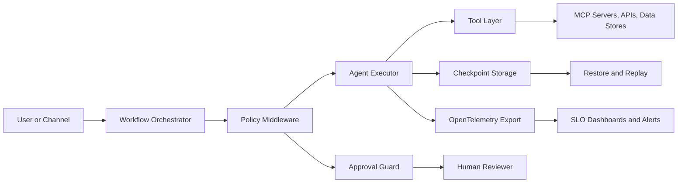
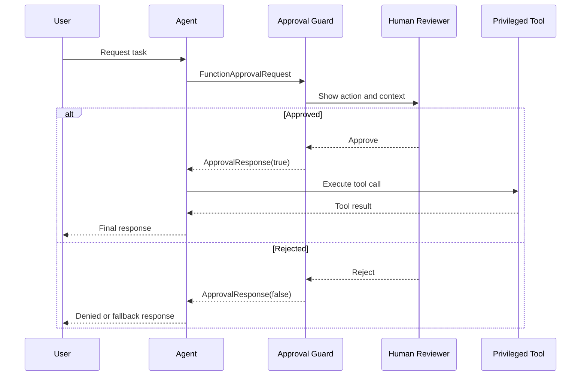
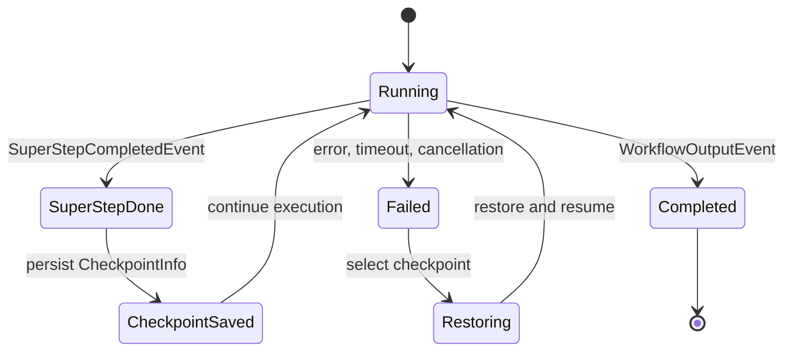
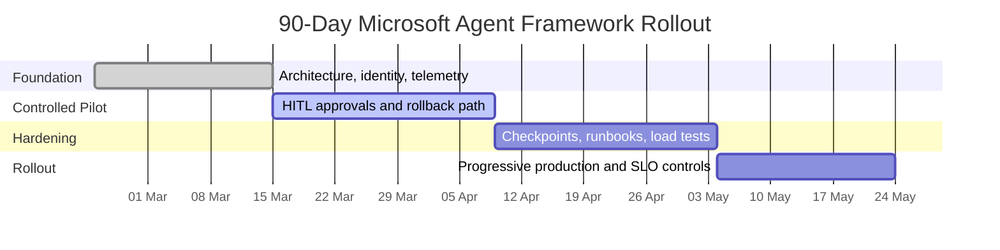

**Reading time: ~45 min** | **Audience**: platform leads, principal engineers, AI architects, security teams | **Primary goal**: build agent systems that stay stable under real enterprise pressure

---

## Preface: Why I Wrote This Version

Quick context on why this exists.

I have read too many agent posts that sound convincing and then collapse in real enterprise environments. Usually they miss one of three things:

1. They stop at demos.
2. They show code without operations.
3. They draw architecture without incident behavior.

This version is for teams that already shipped something and now need clear answers in design review, security review, and on-call:

- What if a privileged tool call is wrong?
- What is our safe resume path at step 14 of 20?
- Can we prove controls without hand-waving?
- Why did cost jump this week while quality stayed flat?

If those are your questions, this playbook is for you.

## Reality Check: Where Microsoft Agent Framework Stands (March 1, 2026)

There is enough public signal to treat MAF as a serious enterprise candidate, but not enough to skip disciplined release hygiene.

- Microsoft announced Release Candidate on **February 19, 2026**. [S1](https://devblogs.microsoft.com/foundry/microsoft-agent-framework-reaches-release-candidate/)
- Core Learn docs for workflows, middleware, observability, approvals, and checkpoints were refreshed in **February 2026** windows.
- Workflow framework guidance explicitly documents orchestration options (sequential, concurrent, handoff, and group-chat style patterns) and workflow concepts such as supersteps and event-driven execution.
- The Workflows overview page itself shows a **last updated** stamp on **February 13, 2026**, which is useful for release-readiness discussions with stakeholders. [S2](https://learn.microsoft.com/en-us/agent-framework/overview/) [S5](https://learn.microsoft.com/en-us/agent-framework/agents/middleware/) [S6](https://learn.microsoft.com/en-us/agent-framework/agents/observability/) [S7](https://learn.microsoft.com/en-us/agent-framework/workflows/human-in-the-loop/) [S8](https://learn.microsoft.com/en-us/agent-framework/workflows/checkpoints/) [S10](https://learn.microsoft.com/en-us/agent-framework/workflows/overview)

My practical read for enterprise teams:

1. Treat APIs as stable enough for controlled production pilots.
2. Pin versions and test upgrades with replay/restore, not just unit tests.
3. Keep framework upgrades and business logic changes in separate release trains.

## What This Playbook Covers (and What It Does Not)

### It covers

- Decision frameworks for orchestration patterns.
- Policy design for privileged tools.
- Reliability design with checkpoint and restore.
- Observability patterns for debugging, safety, and economics.
- Rollout sequencing that works in enterprise organizations.

### It does not cover

- Prompt engineering basics.
- Introductory LLM concepts.
- Generic "hello world" demos.

Those are easy to find and not where projects fail.

## The Core Thesis

The hardest part of agent adoption in 2026 is not getting a model to produce good text. The hardest part is building a system where:

1. **Autonomy is bounded**.
2. **Risk is explicit**.
3. **Failures are recoverable**.
4. **Operations are explainable**.

If you cannot explain, in plain language, why a run took an action and how to safely resume from failure, your architecture is not production-ready yet.

---

## 1. Why "One Smart Agent" Breaks in Enterprise Workloads

Teams usually start the same way: one powerful agent, broad instructions, and many tools.

It works in demos.

Then real traffic hits, weird edge cases appear, and confidence drops fast.

Here is why, based on recurring implementation reviews:

### Failure Pattern A: Policy-in-prompt architecture

Authorization and business controls are expressed as instructions instead of enforced controls. The system appears compliant until the first edge case.

### Failure Pattern B: Unbounded execution

No hard limits for tool calls, turn count, or run duration. Cost and latency volatility follows.

### Failure Pattern C: No resumability strategy

When a workflow fails at 80% progress, teams restart from zero. This is expensive and operationally painful.

### Failure Pattern D: Missing causality in telemetry

You have logs, maybe traces, but not enough correlation to answer who/what/why during incidents.

The fix is not better prompting. The fix is decomposition plus explicit control planes.

There is a subtle point in the official overview that is easy to ignore and expensive to learn the hard way: Microsoft explicitly positions agents for nondeterministic tasks where dynamic planning is needed, and workflows for deterministic process control. If you ignore that split and put deterministic business rules into unconstrained agent loops, you usually pay for it later in reliability and auditability. [S2](https://learn.microsoft.com/en-us/agent-framework/overview/)

---

## 2. The Four-Plane Operating Model



| Plane | Primary Question | Owner | Production Artifact |
| :--- | :--- | :--- | :--- |
| Orchestration | What should happen next? | platform engineering | workflow graph + budgets |
| Policy | What is allowed to happen? | security/platform | middleware policy + tool classes |
| Reliability | What if execution fails now? | SRE/platform | checkpoint + restore drill evidence |
| Observability | Can we explain this run quickly? | SRE/data | traces/events/SLO dashboards |

This model maps well to Azure orchestration guidance and, more importantly, keeps runtime governance out of prompt text where it does not belong. [S9](https://learn.microsoft.com/en-us/azure/architecture/ai-ml/guide/ai-agent-design-patterns/) [S10](https://learn.microsoft.com/en-us/agent-framework/workflows/overview)

### 2.1 Why this model changes team behavior

Without this split, one team owns everything and tradeoffs stay implicit. With this split:

1. Platform owns orchestration contracts and runtime budgets.
2. Security owns policy classes and approval boundaries.
3. SRE owns recoverability and observability quality gates.
4. Product owns value metrics and business acceptance criteria.

That point matters most during incidents, when clear ownership cuts debate time and speeds recovery.

### 2.2 Workflow framework concepts to put in your ADRs

When teams skip formal architecture decision records (ADRs) for workflow semantics, they end up with vague runbook language and ambiguous failure handling. At minimum, document:

1. **Superstep boundaries**: where checkpoints can be safely resumed.
2. **Event model**: which events are emitted, stored, and used for alerting.
3. **State ownership**: which node owns which fields and mutation rights.
4. **Termination conditions**: max turns, completion events, and timeout exits.

These concepts are directly reflected in framework docs and should not be treated as implementation trivia. They are your operational contract. [S10](https://learn.microsoft.com/en-us/agent-framework/workflows/overview) [S8](https://learn.microsoft.com/en-us/agent-framework/workflows/checkpoints/)

---

## 3. Pattern Selection: Choose Your Complexity Budget

Pattern choice is where many teams accidentally create future instability.

| Pattern | Start Here If | Hidden Cost | When to Upgrade |
| :--- | :--- | :--- | :--- |
| Sequential | process steps are known and ordered | can under-utilize parallelism | when independent branches emerge |
| Concurrent | independent steps can run safely | conflict resolution becomes necessary | when latency needs force parallelism |
| Handoff | specialist routing adds clear value | routing drift and loops | when taxonomy and router quality are mature |
| Group-chat / Magentic | task is exploratory or adversarial | hard governance and cost predictability | only for bounded high-value domains |

Two heuristics I use in design reviews:

1. If stakeholders ask for auditability first, start sequential.
2. If stakeholders ask for adaptability first, demand stronger guardrails before dynamic patterns.

[S9](https://learn.microsoft.com/en-us/azure/architecture/ai-ml/guide/ai-agent-design-patterns/) [S13](https://learn.microsoft.com/en-us/agent-framework/workflows/orchestrations/sequential)

### 3.1 Pattern selection checklist (what to decide before coding)

Before implementing any workflow graph, answer these questions in writing:

1. Is this workflow mostly deterministic or mostly adaptive?
2. Which steps can run in parallel without shared-state conflicts?
3. Which actions create side effects and therefore require approvals?
4. What is the acceptable blast radius for a wrong decision?
5. What are the stop conditions when model quality drops mid-run?

If these are unanswered, architecture discussions are premature; you are still in requirement discovery.

---

## 4. A Concrete 14-Day Pilot Plan

This plan is strict on purpose. Loose pilots create misleading confidence.

### Days 1-2: Define one workflow contract

- One business objective.
- One measurable quality metric.
- One owner who accepts or rejects output.
- One escalation path.

### Days 3-4: Define runtime budgets

- `max_turns`
- `max_tool_calls`
- `max_runtime_seconds`
- retry policy per step

These are not tuning suggestions. These are guardrails.

### Days 5-6: Implement policy middleware

- Tool class allowlist.
- Role-based action permissions.
- Explicit approval requirements for privileged classes.
- A single shared middleware policy path for both streaming and non-streaming execution.

### Days 7-8: Add approval UX and audit trail

- Reviewer sees enough context to decide safely.
- Reviewer identity and decision reason are logged.
- Rejected actions return useful fallback behavior.

### Days 9-10: Instrument observability and economics

- Run-level trace spans.
- Step-level workflow events.
- Tool invocation telemetry.
- Cost per successful run.

### Days 11-12: Add checkpoint and run failure drills

- Persist checkpoint at stable boundaries.
- Kill run intentionally.
- Restore from checkpoint and verify correctness.
- Verify side-effect idempotency for resumed steps.

### Days 13-14: Red-team and release review

- Prompt injection tests.
- Tool misuse tests.
- Data leakage checks.
- Security + SRE + product sign-off.

If any of these fail, do not scale traffic yet.

---

## 5. Implementation Patterns (Problem -> Fix)

### 5.1 Baseline execution APIs: useful but not sufficient

```python
# Non-streaming
result = await agent.run("What is the weather like in Amsterdam?")
print(result.text)

# Streaming
async for update in agent.run("What is the weather like in Amsterdam?", stream=True):
    if update.text:
        print(update.text, end="", flush=True)
```

```csharp
// Non-streaming
Console.WriteLine(await agent.RunAsync("What is the weather like in Amsterdam?"));

// Streaming
await foreach (var update in agent.RunStreamingAsync("What is the weather like in Amsterdam?"))
{
    Console.Write(update);
}
```

These APIs are your execution boundary, not your safety architecture. [S11](https://learn.microsoft.com/en-us/agent-framework/agents/running-agents/)

### 5.2 Middleware boundary: where governance should live

**Problem**: controls are hidden in prompts and easy to bypass accidentally.

**Fix**: enforce policy in middleware.

```python
async def policy_middleware(context: AgentContext, next: Callable[[AgentContext], Awaitable[None]]) -> None:
    # Hard runtime controls
    context.metadata["max_tool_calls"] = 6
    context.metadata["max_turns"] = 12
    context.metadata["max_runtime_seconds"] = 90

    # Tool risk classes for downstream enforcement
    context.metadata["approval_required"] = [
        "payments.write",
        "records.delete",
        "external.notification.send",
    ]

    await next(context)
```

```csharp
var middlewareEnabledAgent = originalAgent
    .AsBuilder()
        .Use(runFunc: CustomAgentRunMiddleware, runStreamingFunc: CustomAgentRunStreamingMiddleware)
        .Use(CustomFunctionCallingMiddleware)
    .Build();
```

Operational nuance: test both streaming and non-streaming middleware chains. Teams often harden one path and forget the other. [S5](https://learn.microsoft.com/en-us/agent-framework/agents/middleware/)

Another nuance from the middleware docs: sharing one middleware function across run and streaming paths is fine, but behavior still differs under backpressure and partial-output timing. Keep shared logic, but run path-specific tests.

### 5.3 Human approval flows: practical design details

**Problem**: approvals exist, but reviewer context is too weak to decide correctly.

**Fix**: include action summary, target object, estimated impact, and rollback hint in approval payload.

```python
@tool(approval_mode="always_require")
def update_finance_record(record_id: str, amount: float) -> str:
    return f"Updated {record_id} to {amount}"
```

```csharp
AIFunction paymentFunction = AIFunctionFactory.Create(ProcessPayment);
AIFunction approvalRequiredPaymentFunction = new ApprovalRequiredAIFunction(paymentFunction);
```



[S12](https://learn.microsoft.com/en-us/agent-framework/agents/tools/tool-approval/) [S7](https://learn.microsoft.com/en-us/agent-framework/workflows/human-in-the-loop/)

Two implementation details tend to be missed:

1. Approval loops are **sessionful**. Your approval response must be correlated with the right run/session state, not treated like a stateless callback.
2. Rejection handling needs an explicit user-facing fallback path (for example, read-only summary or escalation), otherwise users experience it as a dead end.

### 5.4 Checkpoint strategy: recovery is a product feature

**Problem**: checkpoint API exists, but nobody validates restore semantics.

**Fix**: define checkpoint boundaries and test restore in release gates.

```python
checkpoint_storage = InMemoryCheckpointStorage()
# ... build workflow with checkpoint storage ...
checkpoints = await checkpoint_storage.list_checkpoints()

saved_checkpoint = checkpoints[5]
async for event in workflow.run_stream(checkpoint_id=saved_checkpoint.checkpoint_id):
    ...
```

```csharp
var checkpointManager = new CheckpointManager();
Checkpointed<StreamingRun> checkpointedRun = await InProcessExecution
    .StreamAsync(workflow, input, checkpointManager)
    .ConfigureAwait(false);

CheckpointInfo savedCheckpoint = checkpoints[5];
await checkpointedRun.RestoreCheckpointAsync(savedCheckpoint, CancellationToken.None).ConfigureAwait(false);
```



[S8](https://learn.microsoft.com/en-us/agent-framework/workflows/checkpoints/)

Checkpoint design should include side-effect discipline. A restored run must not duplicate irreversible operations (for example payments, deletions, or outbound notifications). The practical pattern is:

1. Persist idempotency keys with checkpoint metadata.
2. Guard side-effect tools with dedupe checks.
3. Record side-effect hashes in telemetry before completion acknowledgment.

Without this, restore correctness is mostly luck.

### 5.5 MCP integrations: never treat them like harmless plugins

```python
async with (
    MCPStdioTool(name="calculator", command="uvx", args=["mcp-server-calculator"]) as mcp_server,
    Agent(chat_client=OpenAIChatClient(), name="MathAgent", instructions="You are a helpful math assistant.") as agent,
):
    result = await agent.run("What is 15 * 23 + 45?", tools=mcp_server)
```

The operational risk is not the API call. The risk is hidden trust expansion.

Minimum controls I recommend for MCP:

1. Endpoint inventory with owner and purpose.
2. Network segmentation and egress restrictions.
3. IAM scoping per server.
4. Tool invocation logs with run IDs.

The broader MCP security model emphasizes user consent, tool safety boundaries, and explicit trust assumptions between host, client, and server. Treat that model as architecture input, not implementation detail. [S14](https://learn.microsoft.com/en-us/agent-framework/agents/tools/local-mcp-tools/) [S18](https://docs.anthropic.com/en/docs/mcp) [S19](https://modelcontextprotocol.io/specification/2025-06-18/basic/security_best_practices)

---

## 6. Security and Governance Translation Layer

Security teams and application teams often use different language for the same risks. This table helps close that gap.

| Threat Theme | Engineering Control | Governance Evidence |
| :--- | :--- | :--- |
| prompt injection | context validation plus tool allowlist | blocked-action telemetry with reason code |
| excessive autonomy | approval-required tool classes | approval decision history with identity |
| sensitive data leakage | safe telemetry defaults | periodic data exposure audit |
| privilege escalation | least privilege credentials | scope matrix and review approvals |
| non-recoverable failure | tested restore path | release gate report with MTTR |

Map this to NIST AI RMF governance language and OWASP LLM technical risks to keep both security and engineering aligned. [S15](https://www.nist.gov/itl/ai-risk-management-framework/nist-ai-rmf-playbook/) [S16](https://owasp.org/www-project-top-10-for-large-language-model-applications/) [S3](https://www.microsoft.com/en-us/security/blog/2026/01/21/new-era-of-agents-new-era-of-posture/) [S4](https://www.microsoft.com/en-us/security/security-insider/emerging-trends/cyber-pulse-ai-security-report)

Cyber Pulse framing helps in enterprise conversations because it forces teams to assess more than prompt injection. The model spans identity and authentication, access management, data security, agent security posture, and threat detection/response. If one dimension is missing, risk treatment is incomplete. [S4](https://www.microsoft.com/en-us/security/security-insider/emerging-trends/cyber-pulse-ai-security-report)

### 6.1 Governance cadence that actually works

The cadence that works best in practice is two-lane:

1. **Weekly engineering risk review**: incidents, near misses, budget anomalies.
2. **Monthly governance review**: policy exceptions, tool inventory changes, audit trail quality.

Without cadence, governance drifts quietly.

### 6.2 Threat modeling prompts I use in review meetings

I ask these explicitly and require written answers:

1. Which tools can trigger irreversible side effects?
2. What is the blast radius if approval logic fails open?
3. Can retrieved context indirectly manipulate tool behavior?
4. What is the containment plan for compromised MCP endpoints?
5. Can we reconstruct decision lineage from logs in under 15 minutes?

---

## 7. Observability Model: Beyond "we have logs"

The difference between good and bad agent operations is not telemetry volume. It is incident answerability.

### Minimum schema for each run

- `run_id`
- `workflow_id`
- `user_request_id`
- `tool_name`
- `tool_risk_class`
- `approval_required`
- `approval_decision`
- `checkpoint_id`
- `cost_estimate`
- `latency_ms`

For practical interoperability, add a stable schema prefix for GenAI events and keep attribute naming consistent across services. OTel semantic convention work for generative AI is still evolving, so treat your telemetry schema as versioned contract and review it quarterly. [S17](https://opentelemetry.io/docs/concepts/semantic-conventions/) [S20](https://opentelemetry.io/docs/specs/semconv/gen-ai/)

### SLO model to start with

| Domain | Metric | Trigger |
| :--- | :--- | :--- |
| Reliability | workflow success rate | below 98% in rolling 24h |
| Latency | p95 run latency | above SLA for two windows |
| Safety | approval reject-rate shift | abrupt baseline deviation |
| Quality | human rework rate | sustained increase |
| Economics | cost per successful run | +20% week-over-week |
| Recovery | restore MTTR | exceeds target threshold |

Use OTel semantic conventions so metrics and traces remain comparable across services over time. [S6](https://learn.microsoft.com/en-us/agent-framework/agents/observability/) [S17](https://opentelemetry.io/docs/concepts/semantic-conventions/)

Operational note from Microsoft observability guidance: avoid enabling sensitive telemetry in production by default unless you have explicit governance controls, because prompts and tool arguments can contain regulated data. Also validate identity credential behavior in production environments; defaults that are convenient in development are often unsafe for production assumptions. [S6](https://learn.microsoft.com/en-us/agent-framework/agents/observability/)

---

## 8. War Stories: What Breaks First in Real Programs

### Story 1: The Budgetless Pilot

Everything looked great until traffic doubled. Then one prompt variant triggered longer reasoning loops and cost tripled in three days.

**Fix**: hard budgets enforced in middleware plus alerts on budget violations.

### Story 2: Approvals on the Wrong Tools

Team approval-gated read-only tools but left write tools ungated due to implementation convenience.

**Fix**: classify by blast radius, not by ease of implementation.

### Story 3: Traces Without Causality

They had traces, but no stable correlation between agent step and external side effect.

**Fix**: propagate `run_id` across every tool adapter and outbound integration.

### Story 4: "Checkpoint Enabled" but Restore Untested

The feature existed in code. Restore path failed in production because state-shape assumptions changed.

**Fix**: restore drill becomes mandatory release gate.

### Story 5: MCP Side Door

A new MCP server introduced data egress path outside normal governance reviews.

**Fix**: MCP integration uses same vendor/security review workflow as any external integration.

### Story 6: Memory Poisoning Through Trusted-Looking Content

The system passed standard prompt injection tests and still drifted because long-lived memory accepted manipulated content from a trusted-looking source.

**Fix**: treat memory writes as privileged operations, add source trust scoring, and require periodic memory hygiene jobs with anomaly detection.

---

## 9. 90-Day Enterprise Rollout Plan


| Phase | Timeline | Deliverables | Exit Criteria |
| :--- | :--- | :--- | :--- |
| Foundation | Days 1-20 | architecture baseline, identity model, telemetry baseline, first pilot | trace/log/metric completeness proven |
| Controlled pilot | Days 21-45 | one workflow with approval gates and rollback path | no uncontrolled side effects |
| Hardening | Days 46-70 | checkpoint drills, policy tests, load tests, runbooks | reliability and policy gates pass |
| Rollout | Days 71-90 | progressive production rollout with SLO/cost alerts | SLOs met for two release cycles |



### 9.1 What to measure each phase

- Foundation: telemetry completeness and contract stability.
- Controlled pilot: side-effect safety and reviewer throughput.
- Hardening: checkpoint restore success and MTTR.
- Rollout: SLO compliance and cost discipline.

---

## 10. Production-Readiness Checklist (Go/No-Go)

1. Sensitive tool classes are approval-gated or explicitly exempted with owner sign-off.
2. Authorization controls are enforced in middleware, not prompt text.
3. Run budgets are hard limits, not recommendations.
4. Restore drills pass on the current release candidate build.
5. On-call runbook includes manual override and rollback decisions.
6. Trace/event model supports incident reconstruction in under 15 minutes.
7. Cost per successful run is visible to engineering and product stakeholders.
8. MCP integrations are inventory-reviewed and network-constrained.

If any item is not true, delay autonomy expansion.

---

## Closing Perspective

The teams that win with agent systems in 2026 are not the teams with the flashiest demos.

They are the teams that build **boring reliability under stress**:

- clear ownership,
- hard policy boundaries,
- tested recovery,
- actionable observability,
- and governance that does not depend on tribal memory.

When a run fails at 3 AM, the quality bar is simple: can your team explain what happened, why it happened, and resume safely without chaos?

If yes, you are on the right path.

---

## Source Mapping

- **S1**: [Microsoft Agent Framework Reaches Release Candidate](https://devblogs.microsoft.com/foundry/microsoft-agent-framework-reaches-release-candidate/)
- **S2**: [Microsoft Agent Framework Overview](https://learn.microsoft.com/en-us/agent-framework/overview/)
- **S3**: [A new era of agents, a new era of posture (Microsoft Security)](https://www.microsoft.com/en-us/security/blog/2026/01/21/new-era-of-agents-new-era-of-posture/)
- **S4**: [Cyber Pulse: An AI Security Report](https://www.microsoft.com/en-us/security/security-insider/emerging-trends/cyber-pulse-ai-security-report)
- **S5**: [Agent Middleware](https://learn.microsoft.com/en-us/agent-framework/agents/middleware/)
- **S6**: [Observability](https://learn.microsoft.com/en-us/agent-framework/agents/observability/)
- **S7**: [Human-in-the-Loop Workflows](https://learn.microsoft.com/en-us/agent-framework/workflows/human-in-the-loop/)
- **S8**: [Workflows - Checkpoints](https://learn.microsoft.com/en-us/agent-framework/workflows/checkpoints/)
- **S9**: [AI Agent Orchestration Patterns (Azure Architecture Center)](https://learn.microsoft.com/en-us/azure/architecture/ai-ml/guide/ai-agent-design-patterns/)
- **S10**: [Microsoft Agent Framework Workflows Overview](https://learn.microsoft.com/en-us/agent-framework/workflows/overview)
- **S11**: [Running Agents](https://learn.microsoft.com/en-us/agent-framework/agents/running-agents/)
- **S12**: [Using function tools with human in the loop approvals](https://learn.microsoft.com/en-us/agent-framework/agents/tools/tool-approval/)
- **S13**: [Workflows Orchestrations - Sequential](https://learn.microsoft.com/en-us/agent-framework/workflows/orchestrations/sequential/)
- **S14**: [Using MCP Tools with Agents](https://learn.microsoft.com/en-us/agent-framework/agents/tools/local-mcp-tools/)
- **S15**: [NIST AI RMF Playbook](https://www.nist.gov/itl/ai-risk-management-framework/nist-ai-rmf-playbook/)
- **S16**: [OWASP Top 10 for LLM Applications v1.1](https://owasp.org/www-project-top-10-for-large-language-model-applications/)
- **S17**: [OpenTelemetry Semantic Conventions](https://opentelemetry.io/docs/concepts/semantic-conventions/)
- **S18**: [Model Context Protocol (Anthropic)](https://docs.anthropic.com/en/docs/mcp)
- **S19**: [Model Context Protocol Security Best Practices](https://modelcontextprotocol.io/specification/2025-06-18/basic/security_best_practices)
- **S20**: [OpenTelemetry GenAI Semantic Conventions](https://opentelemetry.io/docs/specs/semconv/gen-ai/)
