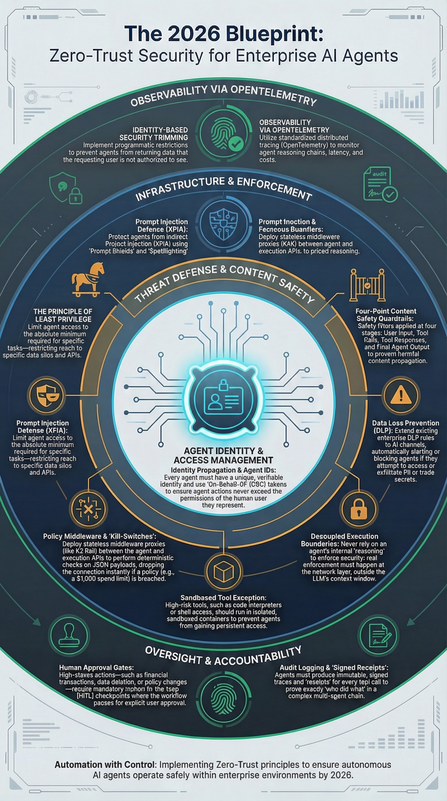
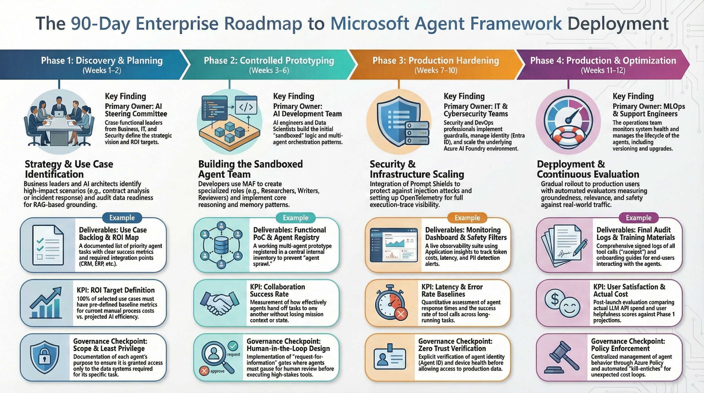

## Executive Summary

The big story of early 2026 is not just "better models". It is platform consolidation plus operational maturity for agent systems. Microsoft Agent Framework (MAF) is positioned as the convergence point of AutoGen-style multi-agent orchestration and Semantic Kernel-style enterprise integration, with explicit production concerns around identity, durability, observability, and governance. [S1](https://devblogs.microsoft.com/foundry/microsoft-agent-framework-reaches-release-candidate/) [S2](https://www.microsoft.com/en-us/research/blog/autogen-v0-4-reimagining-the-foundation-of-agentic-ai-for-scale-extensibility-and-robustness/) [S3](https://learn.microsoft.com/en-us/agent-framework/overview/)

## 1. Why This Matters in 2026

Three shifts changed the decision criteria for AI-agent platforms:

1. Teams moved from single-agent demos to multi-agent workflows that span multiple systems and approval points. [S4](https://learn.microsoft.com/en-us/azure/architecture/ai-ml/guide/ai-agent-design-patterns) [S5](https://learn.microsoft.com/en-us/agent-framework/workflows/orchestrations/)
2. Platform choice became an operational decision (identity, auditability, reliability), not only an SDK preference. [S6](https://learn.microsoft.com/en-us/agent-framework/agents/observability) [S7](https://learn.microsoft.com/en-us/agent-framework/agents/middleware/) [S8](https://devblogs.microsoft.com/foundry/whats-new-in-microsoft-foundry-dec-2025-jan-2026/)
3. Security teams started treating agents as a new attack surface, especially for indirect prompt injection and over-privileged tool execution. [S9](https://www.microsoft.com/en-us/security/blog/2026/01/21/new-era-of-agents-new-era-of-posture/) [S10](https://www.microsoft.com/en-us/security/security-insider/emerging-trends/cyber-pulse-ai-security-report)

## 2. What Microsoft Agent Framework Actually Standardizes

MAF provides a common runtime model around three primitives:

- `Agents`: LLM-backed workers with tools and explicit capabilities.
- `Threads/State`: managed conversational and workflow context.
- `Workflows`: explicit orchestration graphs for deterministic and non-deterministic paths.

In practice, this unifies what used to be split across AutoGen and Semantic Kernel and gives teams one migration target for production systems. [S1](https://devblogs.microsoft.com/foundry/microsoft-agent-framework-reaches-release-candidate/) [S2](https://www.microsoft.com/en-us/research/blog/autogen-v0-4-reimagining-the-foundation-of-agentic-ai-for-scale-extensibility-and-robustness/) [S3](https://learn.microsoft.com/en-us/agent-framework/overview/)

## 3. Orchestration Patterns You Should Use Intentionally

Microsoft documentation and ecosystem examples converge on five pattern families. Picking the wrong one is a common source of latency, cost, and reliability issues. [S4](https://learn.microsoft.com/en-us/azure/architecture/ai-ml/guide/ai-agent-design-patterns) [S11](https://learn.microsoft.com/en-us/agent-framework/workflows/)

| Pattern | Best For | Main Advantage | Main Risk |
| :--- | :--- | :--- | :--- |
| Sequential | Deterministic pipelines (draft -> review -> publish) | Predictable and easy to debug | Slow if every step blocks the next |
| Concurrent | Independent parallel analysis/review tasks | Throughput and latency improvement | Merge conflicts and inconsistent outputs |
| Group Chat | Brainstorming, debate, maker-checker loops | Strong ideation quality | Token drift and endless loops |
| Handoff | Triage + specialist delegation | Clean responsibility boundaries | Context loss across transfers |
| Magentic-style orchestration | Open-ended, long-horizon tasks | Adaptive replanning | Harder to bound cost and runtime |

### Practical Rule

Default to **sequential + bounded concurrency** for production-critical flows. Use group-chat and open-ended orchestrators only behind stricter termination and budget controls. [S4](https://learn.microsoft.com/en-us/azure/architecture/ai-ml/guide/ai-agent-design-patterns) [S11](https://learn.microsoft.com/en-us/agent-framework/workflows/)

## 4. Memory and Durability: Where Most Proofs-of-Concept Break

A prototype can survive with in-process memory. Production cannot.

### Durable Execution

Using durable workflows (Azure Functions integration in MAF docs) changes the operating model:

- Workflow state can survive host restarts.
- Long-running steps can pause and resume.
- Human-in-the-loop approvals can wait hours or days without burning compute.

This is fundamental for enterprise workflows that cross team boundaries and SLAs. [S12](https://learn.microsoft.com/en-us/agent-framework/integrations/azure-functions) [S13](https://learn.microsoft.com/en-us/agent-framework/workflows/human-in-the-loop)

### Long-Term Memory Strategy

Treat memory as tiered:

- Session memory for immediate reasoning.
- Summarized memory for cross-session continuity.
- Profile memory for durable user/context preferences.

Do not treat memory as a generic dump. Define retention, classification, and redaction policy before rollout. [S14](https://learn.microsoft.com/en-us/azure/ai-foundry/agents/concepts/what-is-memory?view=foundry) [S10](https://www.microsoft.com/en-us/security/security-insider/emerging-trends/cyber-pulse-ai-security-report)

## 5. Observability Must Be Designed Up Front

MAF observability guidance centers on OpenTelemetry and end-to-end tracing into Azure monitoring surfaces. [S6](https://learn.microsoft.com/en-us/agent-framework/agents/observability) [S15](https://learn.microsoft.com/en-us/azure/azure-monitor/app/agents-view) [S16](https://learn.microsoft.com/en-us/azure/ai-foundry/how-to/develop/trace-agents-sdk?view=foundry-classic)

Minimum telemetry contract for each workflow run:

- `agent_id`, `workflow_id`, `run_id`, `user_or_service_principal`.
- Step latency and tool latency percentiles.
- Prompt/completion token counts and cost attribution.
- Tool error classes and retry counts.
- Human-approval wait time and reject/approve outcomes.

If you cannot reconstruct "who did what, when, and why" from telemetry, you do not have production readiness yet.

## 6. Security Posture: Agentic Systems Need Zero-Trust Controls

Agent systems are dual-use. The same capability that accelerates internal automation can accelerate abuse if boundaries are weak. [S9](https://www.microsoft.com/en-us/security/blog/2026/01/21/new-era-of-agents-new-era-of-posture/) [S10](https://www.microsoft.com/en-us/security/security-insider/emerging-trends/cyber-pulse-ai-security-report)

Core controls to make non-optional:

- Identity propagation with least privilege (user or service scope, never blanket credentials). [S7](https://learn.microsoft.com/en-us/agent-framework/agents/middleware/)
- Tool-authorization checks in middleware and policy layers, not only in prompts.
- Prompt-shield and content safety controls for injection/unsafe instructions. [S9](https://www.microsoft.com/en-us/security/blog/2026/01/21/new-era-of-agents-new-era-of-posture/)
- Segmented tool networks and allowlists for high-impact actions.
- Full audit trail for every external side effect.

### Anti-Pattern to Avoid

Putting access rules only inside the system prompt is not security architecture. Enforce authorization outside the model path. [S7](https://learn.microsoft.com/en-us/agent-framework/agents/middleware/) [S17](https://www.digitalapplied.com/blog/mcp-vs-langchain-vs-crewai-agent-framework-comparison)

## 7. Framework Trade-offs in 2026 (MAF vs LangGraph vs CrewAI)

| Dimension | Microsoft Agent Framework | LangGraph | CrewAI |
| :--- | :--- | :--- | :--- |
| Enterprise governance | Strong native alignment with Microsoft identity, policy, and cloud controls [S1](https://devblogs.microsoft.com/foundry/microsoft-agent-framework-reaches-release-candidate/) [S7](https://learn.microsoft.com/en-us/agent-framework/agents/middleware/) | Usually custom-built per project [S18](https://www.turing.com/resources/ai-agent-frameworks) | Simpler role model, fewer enterprise defaults [S18](https://www.turing.com/resources/ai-agent-frameworks) |
| Orchestration control | Strong built-in patterns and workflow model [S4](https://learn.microsoft.com/en-us/azure/architecture/ai-ml/guide/ai-agent-design-patterns) [S11](https://learn.microsoft.com/en-us/agent-framework/workflows/) | Deep low-level graph/state control [S18](https://www.turing.com/resources/ai-agent-frameworks) | Fast role-based team setup, less flexible for edge cases [S18](https://www.turing.com/resources/ai-agent-frameworks) |
| Observability | OpenTelemetry + Azure monitoring surfaces [S6](https://learn.microsoft.com/en-us/agent-framework/agents/observability) [S15](https://learn.microsoft.com/en-us/azure/azure-monitor/app/agents-view) | Strong with LangSmith ecosystem [S18](https://www.turing.com/resources/ai-agent-frameworks) | Adequate but can become opaque in complex flows [S18](https://www.turing.com/resources/ai-agent-frameworks) |
| Security model | Better default story for enterprise on Microsoft stack [S7](https://learn.microsoft.com/en-us/agent-framework/agents/middleware/) [S9](https://www.microsoft.com/en-us/security/blog/2026/01/21/new-era-of-agents-new-era-of-posture/) | Depends heavily on custom controls [S18](https://www.turing.com/resources/ai-agent-frameworks) | Depends on deployment model and add-ons [S18](https://www.turing.com/resources/ai-agent-frameworks) |
| Lock-in profile | Reduced by MCP/OpenAPI/A2A integrations, but still Microsoft-centric [S1](https://devblogs.microsoft.com/foundry/microsoft-agent-framework-reaches-release-candidate/) [S19](https://www.softwareseni.com/model-context-protocol-and-the-battle-for-ai-agent-standardisation-across-frameworks-and-platforms/) | More model-agnostic, LangChain-centric abstractions [S18](https://www.turing.com/resources/ai-agent-frameworks) | Flexible for quick starts, less standardized for governance [S18](https://www.turing.com/resources/ai-agent-frameworks) |
| Time-to-first-production | Fast for Azure/.NET/Python teams with existing Microsoft footprint [S1](https://devblogs.microsoft.com/foundry/microsoft-agent-framework-reaches-release-candidate/) [S3](https://learn.microsoft.com/en-us/agent-framework/overview/) | Slower initial ramp, stronger for custom graph experts [S18](https://www.turing.com/resources/ai-agent-frameworks) | Very fast prototype velocity [S18](https://www.turing.com/resources/ai-agent-frameworks) |

## 8. 90-Day Enterprise Rollout Plan

| Phase | Timeline | Deliverables | Owner | KPIs |
| :--- | :--- | :--- | :--- | :--- |
| Discovery | Days 1-15 | Prioritized use cases, architecture boundaries, risk register | Enterprise Architect + Product | Signed target metrics (latency, quality, cost), approved control scope |
| Prototype | Days 16-45 | 1-2 workflow pilots with explicit orchestration and tool policy | AI Engineering Lead | Task success rate, mean step latency, first-pass quality score |
| Hardening | Days 46-75 | RBAC, safety controls, OTel traces, HITL checkpoints, chaos tests | DevOps + SecOps | 100% traced runs, zero critical policy bypasses, bounded retry behavior |
| Production | Days 76-90 | Staged rollout, SLO dashboards, cost guardrails, incident playbook | Platform Operations | SLO attainment, cost per successful run, incident MTTR |

## 9. Design Principles That Hold Up in Production

1. Keep orchestration explicit: graphs over pure conversational improvisation.
2. Separate reasoning from authorization: models decide intent, policy decides execution.
3. Design for pause/resume from day one: human approvals and external dependencies are normal.
4. Measure outcomes, not demos: quality, cost, latency, and incident behavior.
5. Make rollback a first-class feature: every workflow change needs safe fallback.

## 10. Common Failure Modes

- Unbounded tool-calling loops with no budget or step caps.
- Shared mutable state across concurrent agents without conflict strategy.
- No ownership split between platform team, domain team, and security team.
- Treating memory as unrestricted storage of sensitive context.
- Launching without red-team scenarios for injection and privilege escalation.

## Conclusion

Microsoft Agent Framework is not just another agent SDK. In 2026 it is best understood as a production operating model: workflow-first orchestration, cloud-native durability, standardized telemetry, and security controls aligned to enterprise governance. [S1](https://devblogs.microsoft.com/foundry/microsoft-agent-framework-reaches-release-candidate/) [S4](https://learn.microsoft.com/en-us/azure/architecture/ai-ml/guide/ai-agent-design-patterns) [S6](https://learn.microsoft.com/en-us/agent-framework/agents/observability) [S9](https://www.microsoft.com/en-us/security/blog/2026/01/21/new-era-of-agents-new-era-of-posture/)

Adoption success depends less on model quality and more on system discipline. Teams that define clear orchestration boundaries, enforce policy out-of-band, and instrument every run will scale safely. Teams that skip those foundations will ship fragile automation with hidden risk.

## Source Mapping

- **S1**: [Microsoft Agent Framework Reaches Release Candidate](https://devblogs.microsoft.com/foundry/microsoft-agent-framework-reaches-release-candidate/)
- **S2**: [AutoGen v0.4 (Microsoft Research)](https://www.microsoft.com/en-us/research/blog/autogen-v0-4-reimagining-the-foundation-of-agentic-ai-for-scale-extensibility-and-robustness/)
- **S3**: [Microsoft Agent Framework Overview (Microsoft Learn)](https://learn.microsoft.com/en-us/agent-framework/overview/)
- **S4**: [AI Agent Orchestration Patterns (Azure Architecture Center)](https://learn.microsoft.com/en-us/azure/architecture/ai-ml/guide/ai-agent-design-patterns)
- **S5**: [Workflow Orchestrations in Agent Framework](https://learn.microsoft.com/en-us/agent-framework/workflows/orchestrations/)
- **S6**: [Observability in Agent Framework (Microsoft Learn)](https://learn.microsoft.com/en-us/agent-framework/agents/observability)
- **S7**: [Agent Middleware (Microsoft Learn)](https://learn.microsoft.com/en-us/agent-framework/agents/middleware/)
- **S8**: [What's New in Microsoft Foundry (Dec 2025 & Jan 2026)](https://devblogs.microsoft.com/foundry/whats-new-in-microsoft-foundry-dec-2025-jan-2026/)
- **S9**: [A New Era of Agents, A New Era of Posture (Microsoft Security)](https://www.microsoft.com/en-us/security/blog/2026/01/21/new-era-of-agents-new-era-of-posture/)
- **S10**: [Cyber Pulse: An AI Security Report (Microsoft)](https://www.microsoft.com/en-us/security/security-insider/emerging-trends/cyber-pulse-ai-security-report)
- **S11**: [Microsoft Agent Framework Workflows](https://learn.microsoft.com/en-us/agent-framework/workflows/)
- **S12**: [Azure Functions Integration for Agent Framework](https://learn.microsoft.com/en-us/agent-framework/integrations/azure-functions)
- **S13**: [Human-in-the-Loop Workflows (Microsoft Learn)](https://learn.microsoft.com/en-us/agent-framework/workflows/human-in-the-loop)
- **S14**: [What is Memory? (Microsoft Foundry)](https://learn.microsoft.com/en-us/azure/ai-foundry/agents/concepts/what-is-memory?view=foundry)
- **S15**: [Monitor AI Agents with Application Insights](https://learn.microsoft.com/en-us/azure/azure-monitor/app/agents-view)
- **S16**: [Trace and Observe AI Agents in Microsoft Foundry](https://learn.microsoft.com/en-us/azure/ai-foundry/how-to/develop/trace-agents-sdk?view=foundry-classic)
- **S17**: [MCP vs LangChain vs CrewAI (DigitalApplied)](https://www.digitalapplied.com/blog/mcp-vs-langchain-vs-crewai-agent-framework-comparison)
- **S18**: [A Detailed Comparison of Top 6 AI Agent Frameworks in 2026 (Turing)](https://www.turing.com/resources/ai-agent-frameworks)
- **S19**: [Model Context Protocol and Standardization Across Frameworks](https://www.softwareseni.com/model-context-protocol-and-the-battle-for-ai-agent-standardisation-across-frameworks-and-platforms/)

