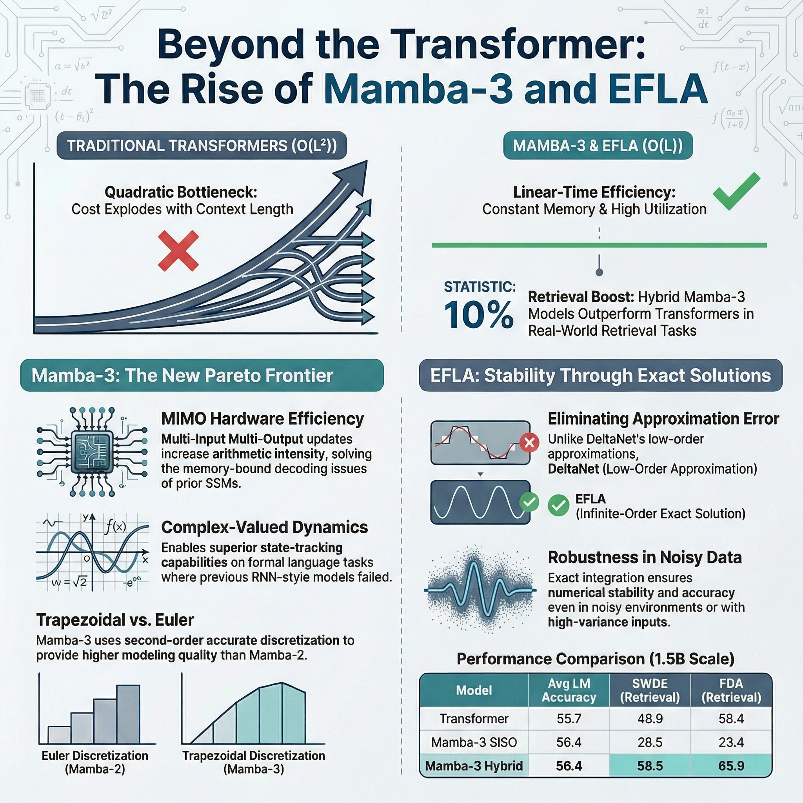

## Audio Version



[Play/download concise audio version](audio-brief.m4a)  
[Download full deep-dive audio](audio-overview.m4a)

### 1. Introduction: From Rio to the Future of Efficiency
The Fourteenth International Conference on Learning Representations (ICLR 2026) in Rio de Janeiro has solidified a paradigm shift that many of us in the AI architecture space have long anticipated: the transition from "approximate" efficiency to "exact" sub-quadratic modeling. For years, the industry accepted the quadratic compute and linear memory bottlenecks of standard Transformers as an unavoidable tax on quality. Rio 2026 has definitively challenged this notion. [S4] [S5]

The emergent theme of the conference is an "inference-first" design philosophy. We are seeing a move away from traditional low-order approximations—which often fail during long-context reasoning or under high-energy input—toward architectures like **Mamba-3** and **Error-Free Linear Attention (EFLA)**. By leveraging exact mathematical solutions to continuous-time dynamics, these models are effectively dismantling the quadratic bottleneck while matching or exceeding the reasoning fidelity of the Transformer. [S1] [S2] [S3]

### 2. Mamba-3: The Inference-First Evolution
Mamba-3 represents a deconstruction of the state-space bottleneck by returning to the first principles of control theory. It is no longer enough to merely scale; we must optimize for the Pareto-frontier of performance and inference budget. Mamba-3 achieves this through three foundational methodological shifts:

1.  **Generalized Trapezoidal Discretization**: Moving beyond the first-order Euler-style rules used in Mamba-2, Mamba-3 implements a second-order accurate recurrence. This reduces sequence approximation error and significantly improves the expressivity of the dynamics. [S1] [S2]
2.  **Complex-Valued Dynamics (The "RoPE Trick")**: Mamba-3 introduces complex state updates that are mathematically equivalent to data-dependent, Rotary Positional Embedding (RoPE)-like rotations. Crucially, this is implemented with high efficiency by maintaining a **cumulative sum of rotation angles** during the parallel scan, transitioning from a product of rotation matrices to a computationally lightweight sum of angles. [S1] [S2]
3.  **MIMO (Multi-Input Multi-Output) Update**: To mitigate memory-bound decoding, Mamba-3 utilizes matrix-matrix formulations. This increases arithmetic intensity without bloating the hidden state. Architecturally, we have identified specific "tipping points" where the kernel shifts from memory-bound to compute-bound decoding: at a rank $r \approx 18$ for FP32 on H100 hardware, and $r \approx 150$ when utilizing tensor cores with BF16. [S1] [S2]

Perhaps the most significant architectural simplification in Mamba-3 is the **integration of BC Bias**. By adding a learned offset to the data-dependent B and C projections, the model can effectively recover Linear Time-Invariant (LTI) performance. This breakthrough makes the traditional short convolution layer—long a staple of SSMs—entirely redundant, streamlining the pipeline without losing local signal processing capability. [S1] [S2]

### 3. The "Free Lunch": Error-Free Linear Attention (EFLA)
A standout contribution from researchers at Nanyang Technological University and Fudan University, **Error-Free Linear Attention (EFLA)**, identifies a critical flaw in current linear attention models like DeltaNet. These models treat continuous-time dynamics as a numerical integration problem solved via first-order Euler discretization. In high-energy or "stiff" dynamic scenarios, Euler methods suffer from catastrophic truncation errors and instability. [S3]

The "Aha! Moment" for EFLA lies in the **rank-1 structure** of the dynamics matrix ($A_t = k_t k_t^\top$). This property allows the infinite-order Runge–Kutta ($RK-\infty$) limit to be solved exactly in closed form while maintaining linear time complexity. [S3]

> "EFLA is a numerically stable, full parallelism, and generalized formulation of the delta rule that captures continuous dynamics perfectly while preserving linear-time complexity."

Unlike Euler-based methods that merely damp errors, EFLA eliminates them. The result is an exact saturation mechanism ($1 - e^{-x}/x$) that ensures the transition matrix eigenvalues are naturally bounded within (0, 1], guaranteeing numerical stability regardless of sequence length. [S3]

### 4. Comparative Analysis: Performance and Robustness
Benchmarks from ICLR 2026 demonstrate that these sub-quadratic models are now competitive with production-grade engines like vLLM and FlashDecoding. [S1] [S2] [S3]

| Model | Avg. LM Accuracy | Retrieval (SWDE) | Retrieval (FDA) | Scale |
| :--- | :--- | :--- | :--- | :--- |
| Standard Transformer | 55.7% | 48.9% | 58.4% | 1.5B |
| Mamba-2 | 53.4% | 30.7% | 23.7% | 820M |
| **Mamba-3 SISO** | 54.4% | 28.5% | 23.4% | 820M |
| **Mamba-3 MIMO ($r=4$)** | **55.3%** | 30.2% | 30.0% | 820M |
| **Mamba-3 Hybrid** | **56.4%** | **58.5%** | **65.9%** | 1.5B |
| **EFLA** | 43.6% | N/A | N/A | 340M |

Benchmark table is aligned with the downloadable `model-comparison-table.csv`.

**Numerical Stability and Robustness**
EFLA's exact integration provides a high-fidelity memory representation that excels in three critical interference scenarios where Euler-based models collapse:
*   **Image Pixel Dropout**: Maintaining long-range dependencies despite severe signal corruption.
*   **OOD Intensity Scaling**: Remaining stable even when input signals are amplified, whereas DeltaNet exhibits rapid performance collapse due to its linear (non-saturated) response.
*   **Additive Gaussian Noise**: Exhibiting a significantly slower degradation rate under random perturbations.

**The Retrieval Gap and State-Passing (SP)**
While pure SSMs have historically struggled with semi-structured information extraction, the conference highlighted **Hybrid Architectures** as the definitive solution. By combining Mamba-3 blocks with limited attention layers (5:1 ratio) and utilizing **State-Passing (SP)** post-training, these models achieve near-perfect NIAH (Needle In A Haystack) results and enable length extrapolation up to 32K, significantly outperforming standard Transformers.

### 5. Technical Deep-Dive: Hardware Efficiency and Scaling
The practical utility of these models is underpinned by a sophisticated software stack.

**Kernel Fusion and Arithmetic Intensity**
Mamba-3 and EFLA leverage **Triton** and **CuTe DSL** kernels to achieve state-of-the-art speeds. The move to MIMO is a strategic choice: while it increases training compute, it provides superior modeling performance at near-zero latency cost during inference. Because decoding is memory-bound, the additional FLOPs in a MIMO update are effectively "hidden" behind the memory I/O wall.

**The Learning Rate Paradox**
Architects must note the **Stability-Responsiveness Trade-off** in EFLA. Because EFLA's update magnitude is strictly sub-linear due to its exact gating, the model can experience "vanishing updates" as it approaches convergence. Consequently, a **larger global learning rate** is a structural necessity for EFLA; it is required to counteract this dampening effect and maintain the model's responsiveness during fine-grained optimization.

### 6. Conclusion: Takeaways for the AI Industry
The "Linear Revolution" at ICLR 2026 marks the end of the era where quadratic bottlenecks were the price of entry for high-fidelity AI. 

**Key Takeaways**
*   **The Shift to Exact Solutions**: Moving beyond Euler approximations via Trapezoidal rules and $RK-\infty$ integration is mandatory for high-fidelity reasoning in agentic workflows.
*   **The Rise of Hybrids**: The future belongs to hybrid SSM-Attention architectures. By incorporating State-Passing post-training, these models solve the retrieval gap while maintaining linear-time efficiency.
*   **Inference as a First-Class Citizen**: Hardware-aware designs (MIMO) and architectural simplifications (BC Bias removing convolutions) are making LLM deployment more sustainable and competitive with mature engines like vLLM.

Rio has shown us that the next generation of scalable, high-fidelity AI agents will be built on the foundations of exact dynamics and hardware-aware architecture. The quadratic bottleneck is no longer a limit—it is a relic.

## Additional Infographic Variant

## Data Tables

- [Model comparison table (CSV)](model-comparison-table.csv) - clean publication table aligned with the benchmark section above.
- [Adoption checklist table (CSV)](adoption-checklist-table.csv) - raw NotebookLM implementation guidance table (includes NotebookLM-internal citation tags).

## NotebookLM Study Assets

- [Quiz (Markdown)](/study/the-linear-revolution-at-iclr-2026/quiz.md) - editable text version.
- [Quiz (HTML)](/study/the-linear-revolution-at-iclr-2026/quiz.html) - browser-friendly version.
- [Quiz (JSON)](quiz.json) - machine-readable quiz data.
- [Flashcards (Markdown)](/study/the-linear-revolution-at-iclr-2026/flashcards.md) - editable text deck.
- [Flashcards (HTML)](/study/the-linear-revolution-at-iclr-2026/flashcards.html) - browser-friendly deck.
- [Flashcards (JSON)](flashcards.json) - machine-readable flashcard deck.
- [Mind Map (JSON)](mind-map.json) - structured graph for visualization tools.

## Source Mapping

- **S1**: [Mamba-3: Improved Sequence Modeling using State Space Principles (OpenReview)](https://openreview.net/forum?id=HwCvaJOiCj)
- **S2**: [ICLR 2026 Poster: Mamba-3](https://iclr.cc/virtual/2026/poster/10010352)
- **S3**: [Error-Free Linear Attention is a Free Lunch (arXiv PDF)](https://arxiv.org/pdf/2512.12602)
- **S4**: [ICLR 2026 Papers](https://iclr.cc/virtual/2026/papers.html)
- **S5**: [ICLR 2026 Conference on OpenReview](https://openreview.net/group?id=ICLR.cc/2026/Conference)

[S1]: https://openreview.net/forum?id=HwCvaJOiCj
[S2]: https://iclr.cc/virtual/2026/poster/10010352
[S3]: https://arxiv.org/pdf/2512.12602
[S4]: https://iclr.cc/virtual/2026/papers.html
[S5]: https://openreview.net/group?id=ICLR.cc/2026/Conference
