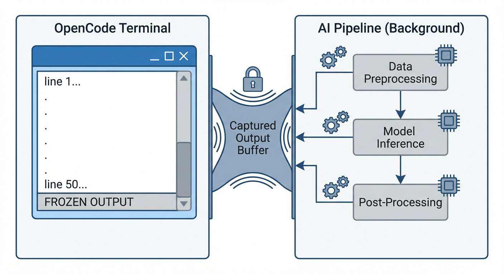
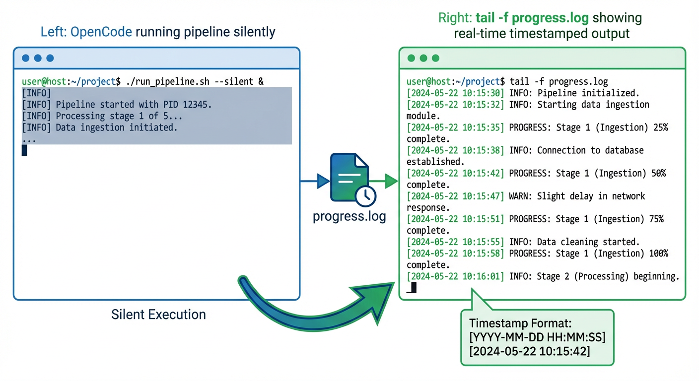

---
categories:
- open-source
- devops
- python
- ai-agents
- software-architecture
comments: true
Params:
  ShowReadingTime: true
  ShowToc: true
  TocOpen: true
date: "2026-03-01T00:00:00Z"
cover:
  image: "cover.png"
  relative: true
description: >
  OpenCode's bash tool captures subprocess stdout and returns it only after the command completes. For long-running AI agent skills, this means minutes of silence. The fix is simple: a plain-text progress log that users can tail -f from a second terminal.
tags:
- opencode
- ai-agents
- progress-tracking
- subprocess
- python
- software-architecture
- developer-tools
- cli
- logging
title: "Why Your OpenCode Skill Shows No Output (And How to Fix It)"
---

# Why Your OpenCode Skill Shows No Output (And How to Fix It)

**TL;DR:** OpenCode's `run` mode captures subprocess stdout and only returns it after the command finishes. If your skill launches a long-running pipeline, the user sees nothing for minutes — or hours. The fix: write a plain-text progress log that users can `tail -f` from a second terminal.

## The 30-Second Fix

If you just want the solution:

```python
from datetime import datetime
from pathlib import Path

def log_progress(output_folder: str, msg: str) -> None:
    log_path = Path(output_folder) / "progress.log"
    log_path.parent.mkdir(parents=True, exist_ok=True)
    with open(log_path, "a") as f:
        f.write(f"[{datetime.now().strftime('%H:%M:%S')}] {msg}\n")
        f.flush()  # Critical for tail -f!
```

Then tell users: `tail -f <output>/progress.log`

---

## The Setup

I've been building a multi-agent pipeline for testing — a long-running workflow that processes documents, builds a knowledge graph, runs multiple AI agents, and generates structured output. The whole thing takes 10–30 minutes depending on document volume and model latency.

The skill works great when launched manually from a terminal. Rich console output shows colorful banners, phase headers, agent progress, quality scores — the full experience. Time to test it via [OpenCode](https://opencode.ai), the open-source AI coding agent that can discover and execute skills autonomously.

## The Problem

I ran the skill through OpenCode:

```bash
opencode run "Generate a WBS from the documents in input/" --allow-all-tools
```

OpenCode found the skill, read the instructions, set up a virtual environment, installed dependencies, and launched the pipeline. Then... nothing. The output froze at 50 lines — the initial setup commands — and stayed there.

The pipeline was clearly running. `ps aux` showed two Python processes burning CPU. The GraphRAG index directory was growing. The LLM cache was accumulating. But OpenCode's output? Static.



## Root Cause: The Bash Tool Doesn't Stream

After digging through OpenCode's [CLI documentation](https://opencode.ai/docs/cli/) and [tools documentation](https://opencode.ai/docs/tools/), the answer became clear:

**OpenCode's bash tool captures subprocess stdout and returns it only after the command completes.**

This is by design. In interactive mode (`opencode` TUI), you'd see the output eventually. But in `run` mode — which is how CI/CD pipelines and automated workflows use OpenCode — the agent fires off your command and waits. The user sees nothing until the entire pipeline finishes and the bash tool returns its output buffer.

For a 20-minute pipeline, that's 20 minutes of silence. For a non-programmer user who was told "just run this command," that's 20 minutes of wondering if something broke.

## Bonus Bug: The Phantom Dual Launch

While debugging, I noticed something unexpected: OpenCode launched the pipeline command **twice**. Two separate Python processes, two separate PIDs, started within milliseconds of each other.

This turned a minor inconvenience into a data loss bug. My pipeline's log file was opened with `mode="w"` (truncate and write). The second process immediately truncated what the first had just started writing. Result: `pipeline.log` was perpetually 0 bytes.

The fix was simple — change to `mode="a"` (append) — but the lesson is important: **assume your skill's command may be invoked more than once concurrently.** Defensive file handling isn't optional.

## The Solution: A Plain-Text Progress Log

Since we can't change how OpenCode's bash tool works, we need a side channel. The approach: write a simple, append-only `progress.log` file that mirrors the key console events as plain timestamped text.

### Implementation

In the console module, I added a lightweight logging layer alongside the existing Rich output:

```python
from datetime import datetime
from pathlib import Path

_progress_path: Path | None = None

def init_progress_log(output_folder: str) -> None:
    global _progress_path
    _progress_path = Path(output_folder) / "progress.log"
    _progress_path.parent.mkdir(parents=True, exist_ok=True)

def _log(msg: str) -> None:
    if _progress_path is None:
        return
    ts = datetime.now().strftime("%H:%M:%S")
    with open(_progress_path, "a") as f:
        f.write(f"[{ts}] {msg}\n")
        f.flush()
```

Then sprinkled `_log()` calls into every key function — `banner()`, `phase_header()`, `agent_start()`, `agent_done()`, `quality_result()`, `final_summary()`, and so on.

The critical detail: **`f.flush()` after every write.** Without it, the OS may buffer writes and `tail -f` won't see updates in real time.

### What the User Sees

From a second terminal:

```bash
tail -f output/progress.log
```



```
============================================================
  Pipeline started at 2026-02-28 23:28:04
============================================================
[23:28:04] Pipeline v5.1 | docs=input | model=gpt-5.2-chat | provider=Azure OpenAI
[23:28:04] --- Phase 1: Document Ingestion (MarkItDown)
[23:28:17] --- Phase 2: Knowledge Graph (nano-graphrag)
[23:31:42] --- Phase 3: WBS Generation (10 agents)
[23:31:42] Agent [scope_analyst] started...
[23:32:15] Agent [scope_analyst] done (33s)
[23:32:15] Agent [wbs_architect] started...
...
```

No Rich markup, no ANSI codes — just clean, greppable, `tail`-able text.

### Telling the Agent to Tell the User

The final piece: update the skill's `SKILL.md` instructions so AI agents know to suggest monitoring:

```markdown
## Monitoring Progress

The pipeline writes real-time status to `<output>/progress.log`.
Suggest the user run in a **separate terminal**:

    tail -f <output>/progress.log

This is especially useful when running via `opencode run`, Copilot CLI,
or any non-interactive agent where subprocess stdout is not streamed.
```

Now OpenCode (or any agent using the skill) will proactively tell users how to watch progress — before they start wondering why nothing's happening.

## Lessons for Skill Authors

### 1. Don't Rely on stdout for Progress

If your skill runs anything longer than a few seconds, write progress to a file. Stdout may be captured, buffered, redirected, or simply not visible depending on the host agent's architecture.

### 2. Use Append Mode for Everything

You don't control how many times your command gets invoked. Use `mode="a"` for log files. Consider adding a PID or timestamp header so concurrent runs are distinguishable.

### 3. Flush After Every Write

`tail -f` depends on data being flushed to disk. Python's default file buffering won't cut it. Always `f.flush()` after progress writes.

### 4. Keep Progress Logs Plain Text

No ANSI escape codes. No Rich markup. No emoji (okay, maybe a few). The log should be readable by `cat`, `grep`, `tail`, and humans in equal measure.

### 5. Document the Monitoring Pattern

Put it in your `SKILL.md`. The agent using your skill doesn't know about your progress log unless you tell it. And the agent is the one who'll tell the user.

## Troubleshooting

**Log file not updating?** Check that `f.flush()` is called after every write. Python's default file buffering will delay writes until the buffer fills.

**Multiple entries per event?** You may have concurrent runs. Add PID to each line:

```python
import os
f.write(f"[{ts}] [PID:{os.getpid()}] {msg}\n")
```

**Still seeing silence?** Verify the log path is correct and the output directory exists. Use `mkdir(parents=True, exist_ok=True)` to create it automatically.

## The Bigger Picture

This isn't really an OpenCode bug — it's a fundamental tension in agent tool architectures. The bash tool needs to capture output to return it to the LLM. But long-running processes need to communicate progress in real time. These two requirements are inherently at odds when the communication channel is stdout.

The file-based progress log is a simple, universal escape hatch. It works across OpenCode, GitHub Copilot CLI, Claude Code, Cursor — any agent that runs commands in a subprocess. And it gives non-programmer users something tangible to watch while the AI does its work.

Sometimes the best solution to a complex problem is just writing to a file.

**What's next?** If you're building agent skills, consider adding structured logging (JSON format) for machine parsing alongside the human-readable progress log. This gives you both real-time visibility and post-run analytics.

---

*Found this useful? The progress logging pattern shown here is available for anyone building long-running AI agent skills. Feel free to adapt it to your own projects.*
