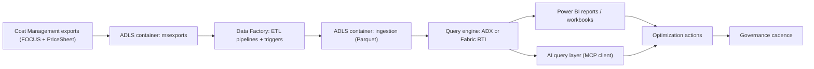

## Preface: Why This Version Exists

Most FinOps programs fail in the same place: they build good dashboards and still ship bad decisions.

The root cause is rarely tooling. It is usually one of these:

1. **Ingestion is not trustworthy** (missing prices, missing months, duplicates after scope changes).
2. **Ownership is fuzzy** (nobody is on the hook for a recommendation becoming a change).
3. **The loop is discontinuous** (big cost projects twice a year instead of an operating rhythm).

This playbook focuses on the parts that create trust: data contracts, scope design, versioning, and operational gates.

## Audio Version



[Play or download the audio version](audio-overview.m4a)

## Reality Check (March 1, 2026)

### 1) Tooling is moving, and the dates matter

- FinOps toolkit **v13 Update 1** shipped on **February 11, 2026** as a patch release to fix managed exports and `Deploy-FinOpsHub`. If you downloaded `finops-hub.bicep` before February 11, 2026, update to the latest version. [S1]
- That patch specifically fixes the **PriceSheet export dataset version** in managed exports to `2023-05-01`, which is one of those subtle issues that shows up later as "why are savings wrong?" [S1]

### 2) FOCUS is real, but implementations lag the spec

- The FinOps Foundation ratified **FOCUS 1.3** on **December 4, 2025**. [S20]
- Microsoft Cost Management exports FOCUS cost data as `FocusCost` and (at least in the documented schema) uses `1.2-preview` as the dataset version. Treat that as a compatibility boundary for automation and ingestion pipelines. [S21] [S6]

### 3) FinOps hubs is a platform, not a report

FinOps hubs exists to turn exports into a scalable, queryable cost platform (ADX or Fabric), so teams can build analysis and optimization loops on top. Microsoft also publishes a concrete cost estimate so you can forecast the platform overhead before the first architecture review. [S2]

The published estimate (useful for early stakeholder alignment): [S2]

- Starts around **$120/month + $10/month per $1M monitored** (with ADX single-node or Fabric capacity, plus storage/processing assumptions).
- Without Data Explorer/Fabric, the estimate is **$5 per $1M monitored** (but you also give up most of the scale and monitoring benefits).

## What This Playbook Covers (and What It Does Not)

### It covers

- Decision guide: raw exports vs FinOps hubs vs ADX vs Fabric.
- Concrete export and scope patterns (including how to avoid duplicates).
- Ingestion mechanics (containers, pipelines, triggers) and how to monitor them.
- AI-assisted analysis via MCP clients (Copilot etc) without bypassing governance.
- Optimization automation (FinOps alerts + Azure Optimization Engine) with practical guardrails.
- KPI definitions and KQL query templates that match the published data model.

### It does not cover

- Introductory FinOps definitions.
- Generic “how to write KQL”.

## 1. Choose Your Data Foundation (Before You Write a Single Query)

This is the decision that determines whether the rest of your program feels smooth or painful.

Microsoft’s own "help me choose" guidance can be translated into a simple decision table: [S3]

| Option | Start Here If | Hidden Cost | Best For |
| :--- | :--- | :--- | :--- |
| Raw exports + Power BI (storage) | you need something working fast | you will outgrow it as spend and questions grow | small orgs, quick visibility |
| FinOps hubs (storage only) | you want a standard platform, but keep complexity low | fewer capabilities than ADX/Fabric | centralized reporting, basic analytics |
| FinOps hubs + Azure Data Explorer | you need KQL performance and lower cost at scale | you need ADX ops skill | heavy analytics, large estates |
| FinOps hubs + Fabric RTI | you want best capabilities and a unified Fabric stack | Fabric capacity and governance | enterprise reporting + lakehouse workflows |

Two concrete decision thresholds from the docs:

- **If you plan to use KQL reports**, you need Data Explorer. [S4]
- Microsoft recommends Data Explorer for performance if you are monitoring **more than $1M/month** or spending **more than $100K/month**. [S3]

## 2. The Architecture You Actually Need (Export -> Ingest -> Model -> Act)

At a high level, it is four layers:



### 2.1 What’s in the box (so you can debug it)

The hub template is not a black box. It creates a predictable shape in storage and a predictable set of ADF assets.

- Storage containers:
  - `msexports` (landing zone for Cost Management exports)
  - `ingestion` (processed Parquet, partitioned by dataset/date/scope) [S5]
- ADF triggers you should know by name:
  - `msexports_ManifestAdded`
  - `ingestion_ManifestAdded` [S5]
- ADF pipelines you will end up staring at during incidents:
  - `msexports_ETL_ingestion`
  - `ingestion_ETL_dataExplorer`
  - plus the `*_ExecuteETLJobs` wrappers that orchestrate batch runs. [S5]

If you cannot name these assets, you will struggle to troubleshoot ingestion at 2am.

### 2.2 One easy-to-miss contract: exports must land in `msexports`

FinOps hubs expects Cost Management exports in the `msexports` container and uses manifests to drive ingestion. If you export somewhere else, the hub can look “healthy” while silently doing nothing. [S8] [S5]

## 3. Security and Networking (Private Access Is Not a Checkbox)

There are two different concepts that get conflated:

1. Private networking (private endpoints + DNS so traffic stays on the Azure backbone).
2. Public access controls (firewall posture for storage).

### 3.1 Private networking basics

When you enable private networking for a hub, you are signing up for:

- A hub virtual network that is **at least `/26`**.
- Multiple subnets (VM/compute, storage, Data Explorer) and the private endpoints/DNS plumbing. [S7]

The practical failure mode:

- You switch a hub to private networking.
- Suddenly your team cannot access storage or query the hub.
- The “fix” is not in the FinOps hub UI; it is in private DNS resolution and endpoint reachability.

If your network team is not in the loop, do not flip this in production.

### 3.2 Public access is a separate lever

The hub template has an `enablePublicAccess` parameter that controls whether the storage account allows public network access (firewall posture). That is separate from private networking. [S5]

## 4. Scopes and Exports: The Duplication Trap

If you want one rule to tattoo onto your rollout checklist, make it this:

**Avoid configuring overlapping export scopes or you will duplicate cost data.** [S9]

Microsoft calls this out explicitly:

- If you configure a billing-account export and also configure a subscription export for a subscription inside that billing account, that subscription will be duplicated in your hub. [S9]

### 4.0 Deploy the hub (PowerShell)

If you want a repeatable deployment path, deploy the hub with the toolkit PowerShell module and keep the command line under version control.

```powershell
# Install the module once (choose your org's standard for module pinning)
Install-Module FinOpsToolkit -Scope CurrentUser

# Deploy (or update) a hub instance
Deploy-FinOpsHub `
  -Name "finops-hub-prod" `
  -ResourceGroup "rg-finops" `
  -Location "westeurope"
```

Toolkit v13 Update 1 expanded `Deploy-FinOpsHub` to cover more Bicep template options (managed exports, Fabric settings, retention, etc). If you are using those features, treat the command line as production config, not a one-time setup script. [S1] [S22]

### 4.1 Export datasets and versions (what to use)

For a first hub, keep it boring:

- `FocusCost` for cost and usage.
- `PriceSheet` for prices (needed for many savings calculations).

The docs list multiple dataset versions, but the key operational point is consistency: pick versions you can support, then roll forward intentionally. [S9] [S21]

### 4.2 The PriceSheet gotcha (MCA)

For Microsoft Customer Agreement (MCA), Microsoft notes that the **Price sheet must be configured at the billing profile level**. Teams often set it at the wrong scope and only notice when savings math looks off. [S10]

Two more operational notes from the deployment guidance: [S10]

- FinOps hubs **does not automatically backfill**. If you want historical months, you must run historical exports (and any custom ingestion pipelines you rely on).
- Backfill order matters for savings: export **price data before cost data** so historical commitment discount calculations have the price baseline.

Example: backfill the last 13 months (price sheet first):

```powershell
# First: price sheet backfill (if available at your scope)
New-FinOpsCostExport `
  -Name "pricesheet-backfill" `
  -Scope "/providers/Microsoft.Billing/billingAccounts/<billing-account>/billingProfiles/<profile>" `
  -StorageAccountId $storageAccountId `
  -StorageContainer "msexports" `
  -StoragePath "pricesheet/<profile>" `
  -Dataset PriceSheet `
  -DatasetVersion "2023-05-01" `
  -Backfill 13 `
  -DoNotOverwrite `
  -Execute

# Then: cost backfill
New-FinOpsCostExport `
  -Name "focuscost-backfill" `
  -Scope $scope `
  -StorageAccountId $storageAccountId `
  -StorageContainer "msexports" `
  -StoragePath "focuscost/$($scope.Split('/')[-1])" `
  -Dataset FocusCost `
  -DatasetVersion "1.2-preview" `
  -Backfill 13 `
  -DoNotOverwrite `
  -Execute
```

### 4.3 Managed exports are useful, but pin your version

If you use managed exports, be aware that toolkit v13 had a bug around the PriceSheet dataset version and v13 Update 1 fixed it. Operationally that means:

- Track toolkit version as a production dependency.
- Treat export config as code (or at least as versioned configuration). [S1]

### 4.4 Concrete setup: export creation with PowerShell

The toolkit’s PowerShell module wraps the Cost Management exports API.

Example: create a daily `FocusCost` export into a hub storage account `msexports` container.

```powershell
# Replace these IDs with your environment
$scope = "/subscriptions/<sub-id>"
$storageAccountId = "/subscriptions/<sub-id>/resourceGroups/<rg>/providers/Microsoft.Storage/storageAccounts/<hubstorage>"

New-FinOpsCostExport `
  -Name "focuscost-daily" `
  -Scope $scope `
  -StorageAccountId $storageAccountId `
  -StorageContainer "msexports" `
  -StoragePath "focuscost/$($scope.Split('/')[-1])" `
  -Dataset FocusCost `
  -DatasetVersion "1.2-preview" `
  -DoNotOverwrite `
  -Execute
```

Notes worth calling out:

- `-DoNotOverwrite` is a tradeoff: it’s helpful when you are validating ingestion (you can see files by run), but it increases storage. The Data ingestion report docs explicitly recommend disabling overwrite for hubs when you want better monitoring. [S12]
- Export files should land under a unique `StoragePath` per scope to avoid collisions and to make troubleshooting sane. [S9]

Example: create a `PriceSheet` export.

```powershell
New-FinOpsCostExport `
  -Name "pricesheet" `
  -Scope "/providers/Microsoft.Billing/billingAccounts/<billing-account>/billingProfiles/<profile>" `
  -StorageAccountId $storageAccountId `
  -StorageContainer "msexports" `
  -StoragePath "pricesheet/<profile>" `
  -Dataset PriceSheet `
  -DatasetVersion "2023-05-01" `
  -DoNotOverwrite `
  -Execute
```

The supported datasets and default API versions are documented; don’t rely on tribal knowledge. [S11]

## 5. Data Model: Versioning Is Your Friend (If You Use It)

FinOps hubs exposes managed datasets with both versioned and unversioned functions.

- Unversioned functions (like `Costs()`) track the latest supported schema.
- Versioned functions (like `Costs_v1_2()`) stay backwards compatible and are designed to keep your reports stable across hub upgrades. [S6]

Practical guidance:

1. Use versioned functions in production semantic models.
2. Use unversioned functions for exploration.
3. When you upgrade the hub, validate the semantic model against both. If anything changes unexpectedly, that is your cue to pin harder.

Quick schema sanity check:

```kql
Costs()
| getschema
```

## 6. KPI Model + Query Templates (So Reviews Don’t Become Vibes)

A KPI is only useful if a team can compute it consistently.

The Costs dataset includes:

- `EffectiveCost`, `BilledCost`, `ListCost`, `ContractedCost`
- `ChargePeriodStart` / `ChargePeriodEnd`
- `Tags` (dynamic)
- `x_IngestionTime` (ingestion timestamp)
- cost allocation helpers like `x_CostCenter` (when present) [S6]

### 6.1 Data freshness (ingestion lag)

```kql
Costs()
| summarize LastIngest = max(x_IngestionTime)
| extend Lag = now() - LastIngest
```

### 6.2 Allocation coverage (tagged spend %)

This query treats tags as the contract. Adjust the tag keys to your governance standard.

```kql
let required = dynamic(["CostCenter","App","Environment"]);
Costs()
| where ChargePeriodStart >= startofmonth(now())
| extend CostCenter = tostring(Tags[required[0]]), App = tostring(Tags[required[1]]), Env = tostring(Tags[required[2]])
| summarize
    Total = sum(EffectiveCost),
    Allocated = sumif(EffectiveCost, isnotempty(CostCenter) and isnotempty(App) and isnotempty(Env))
| extend AllocationCoverage = iff(Total > 0, Allocated / Total, real(null))
```

### 6.3 Effective Savings Rate (ESR)

A simple ESR approximation is based on list vs effective cost. The toolkit also documents savings calculation nuances and edge cases; treat this as a starting point, not a final accounting model. [S13]

```kql
Costs()
| where ChargePeriodStart >= startofmonth(now())
| summarize List = sum(ListCost), Effective = sum(EffectiveCost)
| extend ESR = iff(List > 0, (List - Effective) / List, real(null))
```

### 6.4 Commitment utilization (reservations / savings plans)

```kql
CommitmentDiscountUsage()
| where ChargePeriodStart >= startofmonth(now())
| summarize
    Purchased = sum(PurchasedQuantity),
    Consumed = sum(ConsumedQuantity)
  by CommitmentDiscountName
| extend Utilization = iff(Purchased > 0, Consumed / Purchased, real(null))
| order by Utilization asc
```

### 6.5 Anomaly detection (cost spikes)

Use this to generate a review queue, then route ownership via your incident or ticket system.

```kql
let lookback = 90d;
let start = startofday(ago(lookback));
Costs()
| where ChargePeriodStart >= start
| summarize DailyCost = sum(EffectiveCost) by Day = startofday(ChargePeriodStart), RG = x_ResourceGroupName
| make-series CostSeries = sum(DailyCost) default=0 on Day from start to startofday(now()) step 1d by RG
| extend (Flags, Scores, Baseline) = series_decompose_anomalies(CostSeries, 1.5, -1, 'linefit')
| mv-expand Day to typeof(datetime), CostSeries to typeof(double), Flags to typeof(double), Scores to typeof(double), Baseline to typeof(double)
| where Flags > 0
| project Day, RG, Actual = CostSeries, Expected = Baseline, Score = Scores
| order by Score desc
```

## 7. AI Agents (MCP) Without Bypassing Governance

FinOps hubs supports AI-assisted querying via MCP clients.

The docs walk through a pragmatic starting point with GitHub Copilot Agent mode in VS Code, including:

- Copilot signup
- Node.js 20+
- VS Code + extensions (Copilot + Azure MCP server)
- a `.github` folder with hub-specific instructions so the agent understands your schema and tools. [S14]

The two safety rules I recommend enforcing:

1. Give AI clients **read-only** access to the hub databases first.
2. Treat AI output as analysis, not authorization. Remediation still goes through tickets, change control, or runbooks.

## 8. From Analysis to Action: Alerts and Optimization Engines

### 8.1 FinOps alerts (Logic Apps)

FinOps alerts is a Logic Apps-based solution that scans for idle resources and sends notifications. It is a good first automation step because it keeps humans in the loop by default. [S15]

### 8.2 Azure Optimization Engine (AOE)

AOE is a runbook-based optimization engine you can customize (scope, thresholds, schedules). The official documentation includes practical patterns:

- widening scope across subscriptions and workspaces
- configuring multi-tenant operation
- running on a Hybrid Worker when sandbox limits or private endpoints matter
- tuning thresholds via automation variables [S16] [S17] [S18]

If you deploy AOE, treat it like production software:

- start in notification-only mode
- prove recommendation quality for 2 cycles
- only then consider automation

## 9. Common Failure Modes (and What To Do)

### Failure mode A: Data Explorer ingestion fails with SEM0080

Symptoms:

- ADF pipeline fails with a semantic ingestion error.

Root causes and mitigations are documented, including empty exports, corrupted/invalid Parquet content, and schema mismatches between the export dataset and the hub's ADX/Fabric mapping. [S19]

Practical runbook (fast triage):

1. In the ADF pipeline run, identify the failing activity and capture the file path the pipeline attempted to ingest.
2. Check file size:
   - If the exported Parquet file is empty, it can be safely ignored (common when there is no usage for that slice). [S19]
3. Validate schema alignment:
   - Confirm your export dataset/version (for example `FocusCost 1.2-preview`) matches what your hub schema supports. [S9] [S6]
4. Re-run with clean inputs:
   - Export the missing months again and re-trigger ingestion for the affected partitions. When doing historical work, keep the backfill order (prices before costs) so savings calculations have the right baseline. [S10]

### Failure mode B: New exports are landing, but nothing updates

Checklist:

1. Confirm exports land in `msexports`.
2. Confirm the `msexports_ManifestAdded` trigger is running.
3. Confirm `msexports_ETL_ingestion` is succeeding.
4. If using ADX/Fabric, confirm `ingestion_ManifestAdded` and `ingestion_ETL_dataExplorer`. [S5] [S8]

A surprisingly common issue is triggers not starting after deployment; v13 includes fixes for trigger behavior. [S1]

### Failure mode C: Savings numbers look wrong (negative / zero savings)

This is usually a data contract problem (missing prices or mismatched price inputs) rather than a Power BI problem.

The savings calculations guide includes a concrete KQL query to identify conditions that cause negative savings and how to interpret them. Use that as your first diagnostic, not guesswork. [S13]

### Failure mode D: Duplicate cost after “just adding another scope”

This almost always comes from overlapping export scopes.

Fix:

- Make export scopes mutually exclusive.
- Remove the duplicate export.
- Re-backfill only the missing scope. [S9]

## 10. A 90-Day Execution Model (With Gates)

### Days 1-14: Trust the platform

- Deploy hub.
- Configure exports for one production scope.
- Validate freshness and schema.
- Prove you can re-run a backfill without creating duplicates.

Gate: `Costs()` returns expected rows for current month and `x_IngestionTime` lag is acceptable.

### Days 15-45: Make ownership real

- Publish tag contract and enforce it (Azure Policy).
- Start weekly review cadence (allocation + anomalies + top movers).
- Stand up the Data ingestion report if you are on ADX/KQL path. [S12]

Gate: allocation coverage is trending up, and anomalies have owners.

### Days 46-90: Move from reporting to action

- Add FinOps alerts.
- Add AOE in read-only mode.
- Track closure rates per team.

Gate: accepted recommendations become changes within one cycle.

Human-readable study links:

- [Quiz (HTML)](/study/finops-toolkit-framework-playbook/quiz.html)
- [Flashcards (HTML)](/study/finops-toolkit-framework-playbook/flashcards.html)

## Source Mapping

[S1]: https://learn.microsoft.com/en-us/cloud-computing/finops/toolkit/changelog
[S2]: https://learn.microsoft.com/en-us/cloud-computing/finops/toolkit/hubs/finops-hubs-overview
[S3]: https://learn.microsoft.com/en-us/cloud-computing/finops/toolkit/power-bi/help-me-choose
[S4]: https://learn.microsoft.com/en-us/cloud-computing/finops/toolkit/power-bi/reports
[S5]: https://github.com/microsoft/finops-toolkit/blob/main/src/templates/finops-hub/README.md
[S6]: https://learn.microsoft.com/en-us/cloud-computing/finops/toolkit/hubs/data-model
[S7]: https://learn.microsoft.com/en-us/cloud-computing/finops/toolkit/hubs/private-networking
[S8]: https://learn.microsoft.com/en-us/cloud-computing/finops/toolkit/hubs/data-processing
[S9]: https://learn.microsoft.com/en-us/cloud-computing/finops/toolkit/hubs/configure-scopes
[S10]: https://learn.microsoft.com/en-us/cloud-computing/finops/toolkit/hubs/deploy
[S11]: https://learn.microsoft.com/en-us/cloud-computing/finops/toolkit/powershell/cost/new-finopscostexport
[S22]: https://learn.microsoft.com/en-us/cloud-computing/finops/toolkit/powershell/hubs/deploy-finopshub
[S12]: https://learn.microsoft.com/en-us/cloud-computing/finops/toolkit/power-bi/data-ingestion
[S13]: https://learn.microsoft.com/en-us/cloud-computing/finops/toolkit/hubs/savings-calculations
[S14]: https://learn.microsoft.com/en-us/cloud-computing/finops/toolkit/hubs/configure-ai
[S15]: https://learn.microsoft.com/en-us/cloud-computing/finops/toolkit/alerts/finops-alerts-overview
[S16]: https://learn.microsoft.com/en-us/cloud-computing/finops/toolkit/optimization-engine/customize
[S17]: https://learn.microsoft.com/en-us/cloud-computing/finops/toolkit/optimization-engine/setup-options
[S18]: https://learn.microsoft.com/en-us/cloud-computing/finops/toolkit/optimization-engine/troubleshooting
[S19]: https://learn.microsoft.com/en-us/cloud-computing/finops/toolkit/help/errors
[S20]: https://focus.finops.org/focus-specification/
[S21]: https://learn.microsoft.com/en-us/azure/cost-management-billing/dataset-schema/cost-usage-details-focus
