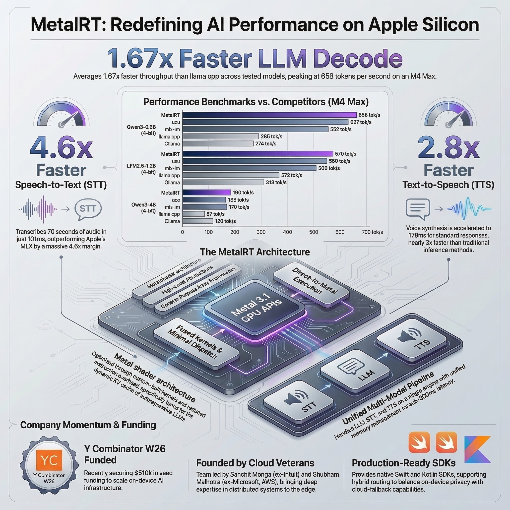

## Preface: How I Read This Research Pack

The local research bundle on RunAnywhere is broad, but it is not uniform. Some files are direct performance summaries, some are opinionated strategy memos, and some are clearly derivative study aids built from the same underlying source set. After reading the full bundle, then re-checking the public web evidence on **March 12, 2026**, my conclusion is narrower and more useful:

**RunAnywhere is not just a "fastest inference on Apple Silicon" demo. It is trying to become the runtime, packaging, and fleet-management layer for on-device AI, with MetalRT acting as the Apple-Silicon flagship proof point.** [S1] [S2] [S3] [S4]

That distinction matters. If you only look at the `658 tok/s` headline, you miss the larger business move. If you only look at the SDK and control-plane story, you miss why the Apple-Silicon narrative is getting attention in the first place. [S2] [S10]

## 1. Reality Check: What Is Public As of March 12, 2026

RunAnywhere is an **active Y Combinator Winter 2026** company, founded in **2025**, describing itself as "the production-grade infrastructure for running AI on every device." The YC launch copy is explicit that the company is not selling a single local model wrapper; it is selling a unified SDK plus rollout, routing, and observability infrastructure for on-device AI across mobile and edge environments. [S1]

The currently public stack breaks down like this:

| Public artifact | What it proves | Why it matters |
| :--- | :--- | :--- |
| YC company page | RunAnywhere positions itself as infrastructure plus hybrid routing and control plane | This is a platform story, not only a benchmark story [S1] |
| RunAnywhere website | SDK-first product across iOS, Android, web, React Native, Flutter, with OTA updates and policy-based routing | The company is chasing deployment pain, not just inference speed [S2] |
| RunAnywhere docs | Inference is local after model download, but anonymous analytics are collected by default | "On-device" does not automatically mean "zero network traffic under defaults" [S3] |
| `runanywhere-sdks` repo | Cross-platform SDKs with LLM, STT, TTS, VLM, voice agent, and diffusion support | The public developer surface is much broader than MetalRT alone [S4] [S6] |
| `RCLI` repo | macOS-native voice AI with local RAG, 38 macOS actions, and MetalRT integration | This is the clearest public Apple-Silicon reference implementation [S7] [S9] |
| RunAnywhere benchmark blogs | Vendor-run decode, STT, TTS, and first-audio benchmark claims | Useful evidence, but still vendor-controlled evidence [S10] [S11] [S12] |

Two datapoints are especially relevant for adoption timing:

- The public `runanywhere-sdks` repo had roughly **10.2k stars** and had been updated on **March 11, 2026**. [S6]
- The public `RCLI` repo had roughly **858 stars**, with **v0.3.4** released on **March 11, 2026**. [S8] [S9]

That makes RunAnywhere more than a pitch deck. There is real code, real docs, and a visible public surface area. The tradeoff is that the public story is split across multiple repos and product layers, which makes quick evaluation harder than the homepage suggests. [S2] [S4] [S7]

## 2. What RunAnywhere Actually Ships

The most important thing to understand is that RunAnywhere appears to have **two different product centers of gravity**:

1. A **cross-platform SDK and control-plane layer** for shipping on-device AI inside products.
2. A **macOS-first, Apple-Silicon-optimized runtime story** centered on `RCLI` and MetalRT.

The homepage and YC materials emphasize the first. The benchmark blogs emphasize the second. Both are true, but they solve different buyer problems. [S1] [S2] [S10]

### 2.1 The cross-platform SDK story

The docs and SDK repo present RunAnywhere as a developer platform for embedding AI directly into applications across **Swift**, **Kotlin**, **Web**, **React Native**, and **Flutter**. The stable/beta platform split is public, and the SDK surface spans:

- LLM chat
- speech-to-text
- text-to-speech
- voice agents
- tool calling
- vision-language models
- image generation / diffusion [S3] [S4]

That is a much bigger ambition than "we made one Mac inference kernel go faster."

The website also pitches the operational layer around those SDKs: **OTA model updates**, **fleet monitoring**, **real-time analytics**, and **policy-based routing between local and cloud**. The YC launch page says the future is not "local only" but **hybrid**, where the SDK tries local first and can route to the cloud when the device is too old, too hot, or otherwise unsuitable. [S1] [S2]

This is the first major tradeoff in the RunAnywhere story:

- **Strength:** the company is targeting the real operational pain of on-device AI, which is model lifecycle and device heterogeneity.
- **Weakness:** once you introduce a control plane, analytics, and hybrid routing, your story is no longer "purely offline magic." You are now a platform vendor with policy, telemetry, and fleet-governance questions to answer. [S2] [S3]

### 2.2 The licensing stack is more restrictive than the marketing suggests

This is the most important non-benchmark finding from the research.

`RCLI` is licensed under **MIT**. MetalRT binaries are under a separate **proprietary binary license**. But the flagship SDK repo, `runanywhere-sdks`, is not plain Apache 2.0. It ships under a **custom RunAnywhere License** that grants Apache-2.0-style rights only to individuals, non-commercial users, nonprofits, government, open-source projects, and organizations under **both** a **$1M funding** and **$1M annual revenue** threshold. Larger or commercial adopters need a separate license. [S5] [S13] [S14]

That means the public adoption model looks like this:

| Component | Public license posture | Adoption implication |
| :--- | :--- | :--- |
| `RCLI` | MIT | Easy to try, easy to fork, easy to inspect [S7] [S13] |
| `runanywhere-sdks` | Custom source-available commercial-threshold license | Fine for evaluation, but legal review is mandatory for serious product use [S5] |
| `MetalRT` binaries | Proprietary, redistribution-restricted binary license | Clear vendor lock-in around the Apple-Silicon acceleration layer [S14] |

If you are a startup or enterprise evaluating RunAnywhere, this is not a footnote. It changes procurement, legal review, and long-term platform strategy. The research bundle spends far more time on benchmark charts than on licensing. That is backwards.

## 3. MetalRT: Strong Vendor Evidence, Not Yet Independent Proof

The March 3, 2026 RunAnywhere benchmark post is better than most vendor benchmark posts because it actually discloses the essentials:

- **Hardware:** Apple M4 Max, 64 GB unified memory, macOS 26.3
- **Models:** Qwen3-0.6B, Qwen3-4B, Llama-3.2-3B, LFM2.5-1.2B
- **Method:** 5 runs per engine, **best reported**
- **Competitors:** `uzu`, `mlx-lm`, `llama.cpp`, `Ollama`
- **Fairness note:** MetalRT and `mlx-lm` use the exact same model files [S10]

That does not make the benchmark independent, but it does make it inspectable.

### 3.1 The vendor-reported decode table

Here is the disclosed decode comparison from RunAnywhere's own benchmark post:

| Model | MetalRT | uzu | mlx-lm | llama.cpp | Ollama | Takeaway |
| :--- | ---: | ---: | ---: | ---: | ---: | :--- |
| Qwen3-0.6B | 658 | 627 | 552 | 295* | 274 | MetalRT wins, but `llama.cpp` and Ollama use Q8 here, so this row is not fully apples-to-apples [S10] |
| Qwen3-4B | 186 | 165 | 170 | 87 | 120 | MetalRT wins on a model size that is more operationally relevant [S10] |
| Llama-3.2-3B | 184 | 222 | 210 | 137 | 131 | `uzu` wins this one, and RunAnywhere says so publicly [S10] |
| LFM2.5-1.2B | 570 | 550 | 509 | 372 | 313 | MetalRT wins again, but still within a closer band vs `uzu` and MLX than the headline suggests [S10] |

\* RunAnywhere's note: the Qwen3-0.6B `llama.cpp` and Ollama runs used `Q8_0`, making that row not directly comparable. [S10]



The best summary of the benchmark is not "RunAnywhere proved it is categorically fastest." It is this:

**RunAnywhere disclosed a credible vendor benchmark showing MetalRT winning decode on 3 of 4 tested models on one M4 Max setup, with the cleanest comparison being against MLX on the same model files.**

That is meaningful. It is also narrower than the marketing headline.

### 3.2 What is strong about the benchmark

- It uses current, recognizable baselines instead of weak straw-man comparisons. [S10]
- It discloses one case where MetalRT does **not** win (`uzu` on Llama-3.2-3B). [S10]
- It separates out the MLX comparison as a true engine-to-engine comparison on the same files. [S10]

### 3.3 What is still weak

- The benchmark is **vendor-run**.
- It reports **best-of-five**, not averages, variance, or P95.
- It covers **one hardware profile**.
- It does not publish a reproducible harness or raw run logs in the blog post. [S10]

Failure mode: teams mistake a strong benchmark blog for independent validation and standardize too early.

Mitigation: treat MetalRT as a **pilot candidate**, not as a default standard, until you reproduce it on your actual models, your actual prompts, and your actual device mix.

## 4. Voice Is Where the Story Gets More Interesting

Decode throughput is important, but it is not the best metric for voice products. RunAnywhere's February 22, 2026 **FastVoice** post makes a sharper point: for conversational agents, the user feels **first-audio latency**, not tokens per second. [S12]

Their definition is operationally useful: measure the time from the end of user speech to the first audible word of the response. In that post, RunAnywhere reports **63 ms first-audio latency** for an on-device voice pipeline built in C++, using:

- Silero VAD
- Whisper or Moonshine via `sherpa-onnx`
- `llama.cpp` for the LLM stage
- Piper for TTS
- CoreAudio output [S12]

That matters because it shows the company can optimize the **pipeline**, not only a single LLM kernel. The most interesting idea in the article is not vendor bragging; it is the claim that **word-level streaming flush** keeps first-audio latency nearly constant even as responses get longer. That is the kind of systems-level detail that usually comes from engineers who actually built the hot path. [S12]

Then, on March 9, 2026, RunAnywhere published the next step: MetalRT as a speech engine, claiming:

- **101 ms** to transcribe **70 seconds** of audio
- **714x** real-time STT factor
- **178 ms** for short-form Kokoro TTS
- **4.6x** faster STT than `mlx-whisper`
- **2.8x** faster TTS than `mlx-audio` [S11]

Again, these are vendor numbers. But there is a technically interesting sequence here:

1. First, RunAnywhere showed a strong **voice-pipeline latency** story with open components. [S12]
2. Then it showed a faster **Apple-Silicon-specific acceleration** story for LLM decode. [S10]
3. Then it folded STT and TTS into the same MetalRT narrative. [S11]

That sequence is coherent. It suggests RunAnywhere understands that voice agents live or die by the entire latency chain:


Tradeoff: voice optimization creates the strongest user experience moat, but it is also the easiest place to hide benchmark shortcuts.

Failure mode: you optimize one stage in isolation, then discover your user-perceived latency is still poor because TTS flushing, buffer management, or device thermals dominate.

Mitigation: benchmark **first-audio latency**, **TTFT**, **decode**, and **end-to-end tool completion** together, not separately.

## 5. Where RunAnywhere Fits Relative to MLX and llama.cpp

The public competitor set is clearer when you stop treating everything as one category.

MLX is Apple's array framework for machine learning on Apple Silicon. It offers Python, C++, C, and Swift APIs and is deeply aligned with Apple's unified-memory model. It is a framework choice as much as an inference choice. [S15] [S16]

`llama.cpp`, by contrast, is the universal local inference workhorse. Apple Silicon remains a first-class target in that project, but its mission is portability and breadth, not Apple-only vertical optimization. [S17] [S18]

That makes the decision model look like this:

| If your real goal is... | Start with... | Why | Main tradeoff |
| :--- | :--- | :--- | :--- |
| Researching, prototyping, or fine-tuning on Apple Silicon | MLX / MLX-LM | Native Apple framework with broad researcher-oriented APIs [S15] [S16] | Less opinionated product scaffolding |
| Running almost any local model, anywhere, with maximum portability | `llama.cpp` or Ollama | Broad model/runtime support and huge ecosystem [S17] | Less vertical optimization for one hardware family |
| Shipping AI features inside a mobile app with model delivery and runtime abstraction | RunAnywhere SDKs | Cross-platform SDK + lifecycle + control-plane pitch [S2] [S3] [S4] | Mixed licensing and product-vendor dependency |
| Building a macOS-native voice agent with deep Apple integration | `RCLI` + MetalRT on M3+ | Strongest public RunAnywhere reference stack [S7] [S10] [S11] | Mac-only, M3+ for MetalRT, proprietary binary |

My synthesis after reading both the local pack and the public sources:

**RunAnywhere's moat is probably not "we are 1.19x faster than MLX forever."**

It is more likely a combination of:

- packaging multiple local AI capabilities behind one developer surface,
- solving OTA and lifecycle issues across device fleets,
- exposing hybrid routing as a policy problem instead of an app-level rewrite,
- and proving that an Apple-specific fast path can materially improve user experience on high-end Macs. [S1] [S2] [S10]

That is a stronger and more defensible story than raw benchmark theater.

## 6. Three Concrete Implementation Patterns

### 6.1 Privacy-first mobile copilot

This is the cleanest RunAnywhere use case: put LLM, STT, and TTS inside a mobile app without rebuilding the runtime plumbing from scratch. The public Swift example is deliberately simple:

```swift
import RunAnywhere
import LlamaCPPRuntime

LlamaCPP.register()
try RunAnywhere.initialize()
try await RunAnywhere.downloadModel("smollm2-360m")
try await RunAnywhere.loadModel("smollm2-360m")

let response = try await RunAnywhere.chat("What changed in our policy?")
```

This pattern makes sense when latency, privacy, and offline capability matter more than frontier-model quality. [S4]

Tradeoff: once you adopt the SDK surface, you are also adopting RunAnywhere's packaging and licensing model. [S5]

Failure mode: teams assume all devices behave the same way and ignore memory, thermal, and fallback behavior.

Mitigation: use device-tier policies from day one and measure local success rate versus fallback rate across your real hardware fleet. The YC launch copy is explicit that device heterogeneity is the problem they are trying to solve. [S1] [S2]

### 6.2 macOS operator assistant

`RCLI` is the most convincing public demo because it is not abstract. It is a concrete macOS assistant with local RAG, tool calling, and 38 macOS actions:

```bash
rcli
rcli listen
rcli ask "open Safari"
rcli ask "play some jazz on Spotify"
rcli metalrt
rcli llamacpp
```

The public README also claims:

- local RAG over PDFs, DOCX, and text
- roughly **4 ms** hybrid retrieval over **5K+ chunks**
- automatic `llama.cpp` fallback on M1/M2
- MetalRT requiring **M3 or later** [S7]

Tradeoff: this is a highly opinionated, Mac-native surface. That is good for UX and bad for portability.

Failure mode: you fall in love with the demo on an M4 Max and then try to roll it out to an M1/M2-heavy fleet.

Mitigation: treat M3+ as a premium tier, keep `llama.cpp` fallback operational, and benchmark per cohort before rollout. [S7]

### 6.3 Hybrid mobile-and-edge fleet

This is where the platform story becomes more important than MetalRT itself.

The public website and YC page both describe a future where teams define routing policies across local and cloud, push OTA model updates, and monitor a fleet from a control plane. [S1] [S2]

This pattern fits teams building:

- privacy-sensitive mobile copilots,
- edge agents in patchy-network environments,
- or products that want "local first, cloud when needed" behavior without hand-rolling every lifecycle edge case. [S1] [S2]

Tradeoff: hybrid routing gives you resilience, but it also makes governance harder because you now need a clear policy for when user data stays local and when it can leave the device.

Failure mode: the product team markets "fully on-device" while the platform team quietly enables analytics or cloud fallback under defaults.

Mitigation: define routing policy, telemetry policy, and legal copy together. The docs are clear that inference can be local while anonymous analytics are still enabled by default. [S3]

## 7. Operational Risks That Matter More Than Another Benchmark

The local research reports spend a lot of time on TCO and strategic impact tables. Some of that is directionally useful, but the more important risks are simpler and closer to the product surface.

### 7.1 Mixed licensing risk

The SDK is source-available with commercial thresholds, `RCLI` is MIT, and MetalRT is proprietary. That is manageable, but only if procurement and engineering both understand it before implementation begins. [S5] [S13] [S14]

### 7.2 Hardware-fragmentation risk

MetalRT currently requires **M3 or later**. That is fine if you are targeting high-end Apple-Silicon users, but it is a real fleet-segmentation constraint for broader enterprise rollouts. [S7]

### 7.3 Benchmark-independence risk

The public benchmark evidence is strong enough to justify a pilot, not strong enough to justify a category conclusion. If your use case is economically sensitive to a 10-20% speed gap, rerun it yourself. [S10] [S11]

### 7.4 Messaging-versus-operations risk

RunAnywhere says "No cloud. No latency. No data leaves the device" on the SDK marketing surface, but the docs also say anonymous analytics are collected by default, and the broader product story includes hybrid routing and a control plane. Those can all be true at once, but only if the implementation and customer messaging are precise. [S2] [S3]

## 8. The Observability Model I Would Require Before Production

RunAnywhere's public site emphasizes analytics and fleet monitoring, which is the right direction. But if I were operating this stack in production, I would insist on a minimum telemetry contract like this:

| Metric | Why it matters | Suggested target |
| :--- | :--- | :--- |
| On-device success rate | Measures how often requests finish locally without fallback | `>95%` for the device tier you are targeting |
| Fallback rate by device class | Detects thermal, memory, or compatibility failures | Stable and explainable by hardware cohort |
| P95 TTFT | Protects perceived responsiveness for chat | `<75 ms` for small local models on premium devices |
| First-audio latency | The real UX metric for voice | `<150 ms` for short assistant turns |
| P95 local retrieval latency | Keeps RAG from becoming the hidden bottleneck | `<10 ms` if you are claiming "instant" document workflows |
| Crash-free session rate | Detects runtime instability faster than anecdotal bug reports | `>99%` |
| Model download failure rate | Validates OTA and lifecycle reliability | trending toward zero after initial rollout |
| Per-model adoption and abandonment | Shows which models users actually trust | measured weekly, not quarterly |

These are **proposed operating targets**, not public RunAnywhere SLOs.

Failure mode: teams measure only tokens per second and ignore fleet health.

Mitigation: treat latency, crash rate, fallback rate, and user trust as first-class metrics from pilot day onward.

## 9. A Practical 90-Day Rollout Plan

If I were advising a team evaluating RunAnywhere today, I would not start with procurement. I would start with proof.

### Days 0-30: Prove the workload

- Pick one use case only: mobile copilot, Mac operator assistant, or voice workflow.
- Benchmark your current baseline with MLX or `llama.cpp`.
- Re-run the critical path on the exact devices you plan to support.
- Add legal review immediately for the SDK license. [S5]

Checkpoint:

- You know whether the problem is really inference speed, lifecycle pain, or fleet heterogeneity.

### Days 31-60: Pilot the platform

- Test `RCLI` separately from the SDK if Apple-Silicon voice is part of the roadmap.
- Validate local-first behavior and document any fallback conditions.
- Decide whether anonymous analytics are acceptable under your policy posture. [S3]
- Confirm whether M3+ segmentation is a feature or a blocker. [S7]

Checkpoint:

- You have real latency, fallback, and failure data by device cohort.

### Days 61-90: Productize or walk away

- If the SDK reduces integration time materially, negotiate commercial terms.
- If MetalRT actually moves your user-facing latency enough to matter, keep it in scope.
- If the platform benefits are real but the proprietary pieces are too constraining, fall back to MLX or `llama.cpp` and keep the operational lessons.

Checkpoint:

- You have an adoption decision based on product fit, legal fit, and measured performance, not GitHub stars or hype.

## 10. Final Take

RunAnywhere is interesting because it is aiming at the part of on-device AI that most teams underestimate: not the model itself, but the runtime, lifecycle, fallback, routing, and fleet problem around the model.

MetalRT is part of that story, and the public vendor benchmarks are credible enough to take seriously. But the stronger thesis is not "RunAnywhere has a magic Apple-Silicon kernel." It is:

**If RunAnywhere can make on-device AI feel operationally boring to ship, then the benchmark advantage becomes a multiplier instead of the whole product.**

That is a better business. It is also a better reason to pay attention.

## Source Mapping

[S1]: https://www.ycombinator.com/companies/runanywhere
[S2]: https://www.runanywhere.ai/
[S3]: https://docs.runanywhere.ai/
[S4]: https://raw.githubusercontent.com/RunanywhereAI/runanywhere-sdks/main/README.md
[S5]: https://raw.githubusercontent.com/RunanywhereAI/runanywhere-sdks/main/LICENSE
[S6]: https://api.github.com/repos/RunanywhereAI/runanywhere-sdks
[S7]: https://raw.githubusercontent.com/RunanywhereAI/RCLI/main/README.md
[S8]: https://github.com/RunanywhereAI/RCLI/releases/tag/v0.3.4
[S9]: https://api.github.com/repos/RunanywhereAI/RCLI
[S10]: https://www.runanywhere.ai/blog/metalrt-fastest-llm-decode-engine-apple-silicon
[S11]: https://www.runanywhere.ai/blog/metalrt-speech-fastest-stt-tts-apple-silicon
[S12]: https://www.runanywhere.ai/blog/fastvoice-on-device-voice-ai-pipeline-apple-silicon
[S13]: https://raw.githubusercontent.com/RunanywhereAI/RCLI/main/LICENSE
[S14]: https://raw.githubusercontent.com/RunanywhereAI/metalrt-binaries/main/LICENSE
[S15]: https://raw.githubusercontent.com/ml-explore/mlx/main/README.md
[S16]: https://github.com/ml-explore/mlx/releases/tag/v0.31.0
[S17]: https://raw.githubusercontent.com/ggml-org/llama.cpp/master/README.md
[S18]: https://github.com/ggml-org/llama.cpp/releases/tag/b8278
